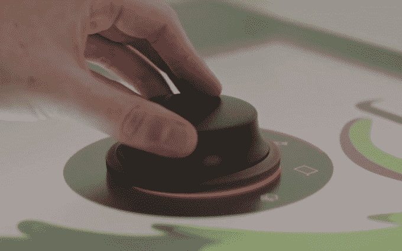

# 戴尔凭借其双屏智能办公桌概念与 Surface Studio 展开较量——它甚至还有一个表盘 

> 原文：<https://web.archive.org/web/https://techcrunch.com/2016/11/02/dell-is-making-a-dual-screen-surface-studio-like-device-and-it-even-has-a-dial/>

# 戴尔凭借其双屏智能桌面概念与 Surface Studio 展开较量——它甚至还有一个表盘

**更新**:哇，这个概念来自 [2014](https://web.archive.org/web/20221208212854/http://en.community.dell.com/dell-blogs/direct2dell/b/direct2dell/archive/2014/11/05/smart-desks-and-ultrasharp-monitors-are-the-future-of-workplace-productivity) 。但戴尔告诉我，它现在确实存在，我们将在 1 月份的 CES 上看到它。敬请期待！

微软上周在[发布了 Surface Studio](https://web.archive.org/web/20221208212854/https://beta.techcrunch.com/gallery/everything-announced-at-microsofts-windows-10-and-surface-event/) ，给很多人留下了深刻的印象，这是一款桌面和平板电脑的混合体，具有巧妙优雅的[表盘界面](https://web.archive.org/web/20221208212854/https://beta.techcrunch.com/2016/10/26/surface-dial-hands-on/)。显然，戴尔一直在沿着同样的思路思考，因为他们只是戏弄了一些非常非常相似的东西-一直到表盘。

在 Adobe Max 大会的主题演讲之前播放的一段视频(由 MS Power 用户拍摄)显示了[智能桌面](https://web.archive.org/web/20221208212854/http://en.community.dell.com/dell-blogs/direct2dell/b/direct2dell/archive/2014/11/05/smart-desks-and-ultrasharp-monitors-are-the-future-of-workplace-productivity?dgc=SM&cid=907&lid=642277811)在与 Surface Studio 类似的情况下使用:插图、照片和视频编辑以及多手媒体操作。

[https://web.archive.org/web/20221208212854if_/https://www.youtube.com/embed/wKzXRMn9Vfs?feature=oembed](https://web.archive.org/web/20221208212854if_/https://www.youtube.com/embed/wKzXRMn9Vfs?feature=oembed)

视频

“我们的思想自然转移到纸上。但是在自然产生的东西和我们如何数字化创造之间有一条鸿沟，”视频解释道。“戴尔改变了这一点。”

这有点为时过早，因为戴尔的设备仍然是一个概念，微软的设备已经在早期测试人员的手中，但他们可能没有时间重做画外音，所以我们会给他们一个通行证。

当然，这并不完全相同:虽然微软的解决方案是一个可以转换为高清触摸和笔输入平板电脑的桌面，但戴尔将两者分开。从视频只显示双屏设置这一事实来看，这个触摸屏似乎是一个附件，而不是一台独立的计算机。

上面的视频显示了智能书桌与特定显示器的配合，但第二个视频显示了不同的显示器，因此很明显它是作为一个附件，而不是一个完整的系统。毫无疑问，Adobe 是一个合作伙伴，两家公司很可能在工作流程和布局方面进行了合作，利用了这一点。

很明显，这利用了 Windows 10 Creators 更新中的新功能，戴尔在发布之前就已经知道了，但除此之外，我们不能确定戴尔对微软的 Surface Studio 和 dial 界面了解多少。

戴尔的一份新闻稿将智能办公桌描述为“未来概念的工作场所”，因此不幸的是，没有关于规格、价格等方面的硬性细节。也许他们在等着看是否有人会上钩。