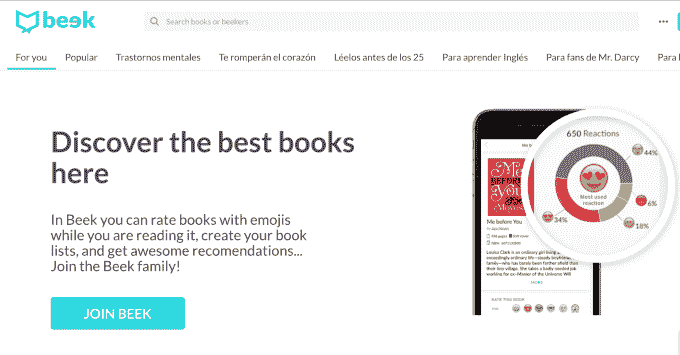
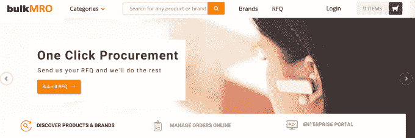
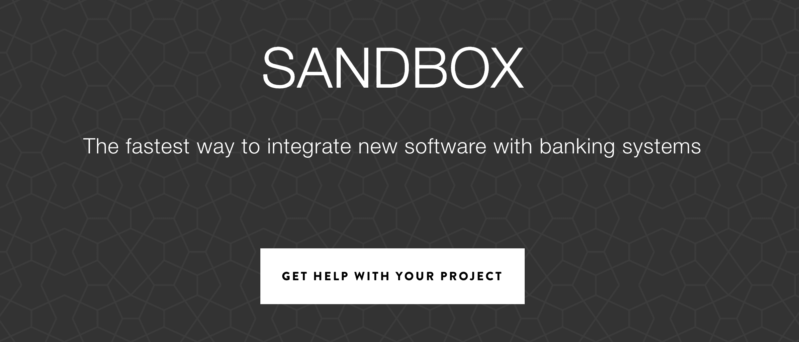

# 所有在 Y Combinator W17 演示日 2 首次亮相的 51 家初创公司 

> 原文：<https://web.archive.org/web/https://techcrunch.com/2017/03/21/demo-day-y-combinator/>

来自 7200 家创业公司的 15000 多名创始人申请了这批 Y Combinator。它选择了来自 22 个国家的 100 多名创始人参加加速器项目。今天，这些公司的后半部分在舞台上推出，我们有所有 51 项业务的细目分类。

哦，还有美国公民自由联盟。这家有着 97 年历史的法律行动主义非营利组织远非初创公司，但[在 YC 学到了更多的成长策略](https://web.archive.org/web/20221205132303/https://beta.techcrunch.com/2017/01/31/ycaclu/)。

如今的公司专注于核心后端工程工具和零碎的社交应用。由于 YC 最近开发的投资者匹配系统，它能够将彼此最感兴趣的初创公司和风投引向会议。

昨天[我们报道了首批来自 YC 的 52 家创业公司](https://web.archive.org/web/20221205132303/https://beta.techcrunch.com/2017/03/20/yc-demo-day-winter-2017/)，并分享了我们在[挑选的最有前途的 7 家公司。](https://web.archive.org/web/20221205132303/https://beta.techcrunch.com/gallery/y-combinator/)稍后我们会有[第二天](https://web.archive.org/web/20221205132303/https://beta.techcrunch.com/gallery/yc-startups/)的最佳选择，但现在这里是我们今天展示的 51 家创业公司的报道。

—

**[巫毒教制造](https://web.archive.org/web/20221205132303/https://voodoomfg.com/)——机器人 3D 打印工厂**

伏都教想成为制造业的 AWS。它正在建立一个 3D 打印机的机器人工厂，这样客户可以发送一个数字文件，并获得一个物理产品作为回报，没有模具，劳动力，启动成本或最小订单规模。这极大地促进了制造业的民主化，就像 AWS 对云计算所做的那样。它已经与耐克、微软、威瑞森和英特尔合作，有望在本季度赚到 33 万美元，利润率为 65%。Voodoo 正试图颠覆价值 500 亿美元的塑料注射成型市场，并通过使制造像旋转服务器一样灵活来发展它。

[在 TechCrunch 上阅读更多关于巫毒制造的信息](https://web.archive.org/web/20221205132303/https://beta.techcrunch.com/2017/01/24/voodoo-manufacturing-raises-1-4-million-to-make-a-factory-full-of-3d-printers/)

**[伏特健康](https://web.archive.org/web/20221205132303/https://www.volthealth.com/)——一种电刺激医疗器械**

Volt 是一种可穿戴的电刺激装置，用于治疗失禁等疾病。这位创始人已经将六种医疗设备推向市场，包括售价高达数十亿美元的酷炫雕刻设备。尿失禁影响着 2500 万人，是一个 250 亿美元的市场。该设备刺激肌肉，使其向受体反馈信息。这有助于那些患有尿失禁的人在不想撒尿的时候不撒尿。该设备还可以针对其他疾病，如偏头痛，并拥有专有技术。

**[Terark](https://web.archive.org/web/20221205132303/http://www.terark.com/)——让数据库更快**

“我们是数据库的吹笛者，但我们是真正的那个，”Terark 的联合创始人说，暗指 HBO 的硅谷秀。Terark 使用一种特殊的技术从数据库中挖掘数据，以提高内存和硬盘的效率。它声称比谷歌的 LevelDB 和脸书的 RocksDB 数据库技术更快，并从阿里巴巴获得了 100 万美元的合同。随着地球上所有信息的数字化，Terark 拥有 10 年的数据库经验，希望在 350 亿美元的数据库市场中分得一杯羹。

**[莱特电气](https://web.archive.org/web/20221205132303/https://weflywright.com/)——电动飞机的波音**

莱特电气公司想制造世界上第一架电动飞机。像西南航空这样的航空公司可以提供低价机票的一个主要原因是他们预先购买了汽油，但是莱特看到了通过使用电动飞机来使航班更加便宜的机会。该公司的目标是 300 英里或更少的所有航班中的 30%，并与 EasyJet 合作开始。随着技术的进步，它相信它的飞机将能够追逐 260 亿美元的短途飞行市场。

[在 TechCrunch 上阅读更多关于莱特电气的信息](https://web.archive.org/web/20221205132303/https://beta.techcrunch.com/2017/03/21/wright-electric-planes/)

**[说话](https://web.archive.org/web/20221205132303/http://usespeakeasy.com/)——艾英语导师**

人们每年花费 900 亿美元在昂贵而低效的人类英语教师身上。Speak 提供了一个移动应用程序，你可以用手机进行英语对话，谈论真实世界的场景，比如求职面试或问路。它使用语音识别通过浓重的口音识别英语单词，并教人们说得更清楚。与此同时，它正在建立一个巨大的口音英语语音数据库，可以用来改进其系统和其他语音识别系统。Speak 的团队以前建立了口音检测系统，并向 Chegg 出售抽认卡+。尽管人工智能翻译可能会降低人们了解其他语言的需求，但说英语仍然是人们愿意花钱购买的一项宝贵技能。

**[纳米网](https://web.archive.org/web/20221205132303/https://nanonets.ai/)——一个机器学习 API**

机器学习将改变做生意的方式，但是，像数据库一样，大多数公司不会从零开始建立自己的数据库。NanoNets 的 API 使得任何企业使用机器学习都很容易。他们只是上传数据，等待 10 分钟进行分析，然后添加几行代码。然后，他们可以开始通过 ML 看到自动数据挖掘的结果，例如能够在照片中识别鞋子的品牌。NanoNets 能够从以前的工作中回收知识，以减少未来任务所需的数据量。它已经看到每周 100 万次 API 调用，并出售每月 99 美元的订阅，最多可调用 1 万次 API。通过与多个客户合作，它可以比任何单个客户自己构建 ML 技术更快地改进其系统。

**[书记员](https://web.archive.org/web/20221205132303/http://tryscribe.com/)——自动化销售开发代表**

企业很难区分高潜力销售线索和浪费时间的人。Scribe 为公司网站构建了一个智能集客销售表单，该表单使用它接收的数据和外部数据源来立即确定它是应该立即发送给正确销售代表的“热门线索”，还是应该搁置的“冷门线索”。Scribe 说，这比雇佣销售发展主管要便宜 50 %,而且能多产生 20%的销售线索。仅在发布后 3 周，它就已经有 10，000 美元的月经常性收入，在 40 亿美元的入境销售市场之后，它希望抓住巨大的出境销售机会，

**[断路器](https://web.archive.org/web/20221205132303/https://breaker.audio/)——让播客成为真正的生意**

大多数播客是免费的，但严肃的出版商正在花费大量预算来制作高质量的音频内容，如 Serial，它的下载量达到了 1 亿次，使播客成为主流。事实上，每月已经有 6700 万美国人在听播客。Breaker 希望签署独家协议来分发最好的优质播客，并向用户收取每月 6 美元的费用。首先，它的目标是通过制作最好的播客消费应用程序来建立庞大的听众受众。它于今天发布，将为播客提供联系和获得社区反馈的方式，并分析哪些内容表现最好。对于测试版用户来说，一个月后它有着惊人的 67%的保留率。如果它能说服人们为通常免费的东西付费，它可能会成为播客的首选谈话场所。

**[bit rise](https://web.archive.org/web/20221205132303/https://www.bitrise.io/)–移动应用的自动化构建/测试/部署**

Bitrise 声称，通过自动化单元测试，将测试分发给测试人员，并在每次应用程序代码更改时将应用程序上传到应用程序商店，它每天可以为开发人员节省一个小时。由于其开源集成，你可以连接任何应用程序，如通知的 Slack 和测试版测试的 Hockey。Bitrise 已经将微软和 Xamarin 视为付费客户，并拥有 66 万美元的年度经常性收入，每月增长 20%。如果一切顺利，它可能会成为一个中心，开发者可以在这里发现让他们的工作更容易的服务。

**[Fibo](https://web.archive.org/web/20221205132303/https://www.fiboapp.com/)–M施工队移动工作跟踪**

Fibo 的移动应用程序让施工现场团队保存工作日志和时间表，拍摄进度照片并提交给老板的办公室。该公司表示，它每周可以为员工节省 4 个小时的现场文书工作，每年可以为雇主节省 4000 美元。每个工人每月 30 美元的价格点，客户保持率很高。美国有 1000 万现场工作人员，那里有 40 亿美元的机会。但利用其建筑工人参与度和数据，下一步它可以围绕 workers comp 和更多内容追加销售服务。建筑业适应技术的速度很慢，但现在每个工人都有一部智能手机，这给像 Fibo 这样的初创公司带来了新的机遇。

**[典范一](https://web.archive.org/web/20221205132303/https://www.paragonone.com/)——来自真正专业人士的职业指导**

许多家庭花了一大笔钱送他们的孩子上大学，许多学生最终背上了债务，但他们仍然没有为就业市场做好准备。大学就业中心通常没有帮助。Paragon One 认为答案是已经在苹果和谷歌等顶级公司找到工作的专业人士提供的技能和面试准备指导。家庭预付 7500 美元，孩子们通过视频聊天获得指导。Paragon One 表示，完成该项目的学生 100%获得了工作或实习机会。它现在的月收入为 55，000 美元，扣除客户获取成本后的单位利润率为 56%，并且每月增长 40%。虽然价格可能看起来很高，但每年有 200 万学生没有经济援助，他们的家庭最终要为大学支付大约 20 万美元，这并不能保证一份工作。Paragon One 可以使用一些额外的职业指导和面试准备来利用沉没成本投资，并为孩子们找到赚钱的工作。

**[Tress](https://web.archive.org/web/20221205132303/https://www.tressapp.co/)——黑人女性发型的社交社区**

特雷斯说，黑人女性在头发上的花费是其他人群的 9 倍，全球黑发护理市场估计每年高达 5000 亿美元。改变发型的过程包括社交网络上的灵感、YouTube 教程、预约造型师和购买护发产品。Tress 希望将所有这些整合到一个产品中。它表示，现在它每周有 30，000 名活跃用户，并且每周增长 20%。由于用户经常分享他们在 Tress 上发现的发型，它有一个内置的增长机制。

**[自行车人工智能](https://web.archive.org/web/20221205132303/http://bicycleai.com/)——自动化人工智能客户支持**

Bicycle 是一种全栈式的客户支持服务，使用 AI 全天候回答客户问题。这家初创公司表示，它可以减少 60-80%的 1 级支持案例，每个案例只需 3 美元，从而获得 80%的利润。它已经以 30 秒的响应时间处理了与 5 个测试客户的 75，000 次对话，并且每周增长 20%。由于这是一个全栈服务，而不仅仅是一个工具，它可以收取更多的费用，人工智能确保错误的答案不会到达客户手中。支持是一个巨大的市场，人工智能可以取代昂贵的呼叫中心工作人员。

**[Vize 软件](https://web.archive.org/web/20221205132303/http://www.vize.io/)–自助 Palantir**

可视化数据比想象的要困难。Vize 开发的软件可以创建漂亮的交互式数据可视化，可以随时编辑。企业可以直接在图表中更改数据的值。这对研究假设情景的企业非常有用。它在 3 个月内积累了 45 万美元的年度经常性收入，并拥有像毕马威会计师事务所和法国国防部这样的客户。每个企业都在变得数据驱动，Vize 让他们看到他们在做什么。

**[简单习惯](https://web.archive.org/web/20221205132303/https://www.simplehabit.com/)——网飞静心**

美国人 2015 年花费 10 亿美元用于冥想，2016 年花费 20 亿美元。这是一个正念运动的开始，Simple Habit 希望将其货币化。Simple Habit 的创始人 Yunha Kim 在出售了她的上一个创业公司 Locket 后，已经筋疲力尽了。她发现，大多数冥想应用程序只提供少数冥想程序或教师。因此，她离开了斯坦福大学商学院，创建了“简单习惯”项目，该项目有 60 名教师，1000 个主题。这样，你可以获得有针对性的内容来帮助你入睡、缓解压力或准备公开演讲。自六个月前推出以来，它的年经常性收入已经增长到 60 万美元。瑜伽在几年内从一项小众活动变成了一项大生意，现在冥想也开始了同样的曲棍球运动。

**——按需专业摄影师**

摄影服务是一个 300 亿美元的市场，但这种体验包括恼人的比较购物、令人沮丧的日程安排和延迟以及高昂的价格。相反，Snappr 可以让你在一分钟内通过其应用程序预订预先审查的摄影师，并很快以每小时 59 美元的价格拍摄照片。Snappr 的收费如此之低，是因为大多数摄影师浪费了大量时间试图预订演出，而不是工作，但 Snappr 会自动将工作分配给他们。由于优步和 Groupon 等客户使用它来拍摄产品照片，它每月增长 75%，并有 100 万美元的运行率。Snappr 希望成为摄影界的优步，占领一个由个体工作者组成的高度分散的市场，并为他们提供一个物流工具，以最大限度地延长他们获得报酬的时间。

**[IQBoxy](https://web.archive.org/web/20221205132303/https://www.iqboxy.com/)——取代人类记账员的软件**

簿记是一个 570 亿美元的行业，但它充满了人为错误和低效率。IQBoxy 开发了一款移动应用，它使用机器学习来扫描物理或数字收据和发票，解析数据，并与银行进行财务对账。它在没有人工参与的情况下处理端到端记账，而不仅仅是处理费用链的一小部分。IQBoxy 每月增长 30 %,已经处理了 120 万张收据和发票。现在它有一个名为 IQBoxy For Accountants 的产品，通过免费为客户注册 IQBoxy 的付费服务，让会计师避免繁忙的工作。这项技术最终将簿记的苦差事留给了机器。

**[Beek](https://web.archive.org/web/20221205132303/https://www.beek.io/)——拉美书评网站**

Beek 自称是拉丁美洲最大的书评网站，每周有超过 150，000 名活跃用户平均每周提交五篇书评。用户评论不再是一条推文，而是使用表情符号，还允许读者在阅读时留下评论，因此许多评论书籍会多次出现。今天，该公司专注于书评，但计划扩展到其他类型的媒体和体验，成为拉丁美洲一切的评论网站。

**[散装 MRO](https://web.archive.org/web/20221205132303/https://www.bulkmro.com/)——印度工业用品**

散装 MRO 希望成为印度企业的阿里巴巴，为他们可能需要的所有工业工具提供一站式商店。该公司已经达到了 430 万美元的 GMV 年运营率，下一季度有 110 万美元的订单，并且是盈利的。散装 MRO 的客户中有 22 家是财富 500 强公司，超过 89%的订单是回头客。该公司正在追求每年销售 200 亿美元的工业产品市场，预计到 2022 年将翻一番。

**[soom go](https://web.archive.org/web/20221205132303/https://soomgo.com/)–图钉给南朝鲜**

Soomgo 创建了一个市场，帮助韩国的本地服务提供商寻找新客户。美国有 Yelp、Angie's List 和其他面向本地服务提供商的市场，与此不同，韩国有超过 150 万家企业，平均每月广告支出为 500 美元。通过 Soomgo，他们可以提前购买积分，与潜在客户建立联系，并努力赢得业务。Soomgo 已经有超过 30，000 家服务提供商注册，每月净收入超过 50，000 美元。

**[cart cam](https://web.archive.org/web/20221205132303/https://www.cartcam.com/)——Snapchat 一代的购物应用**

Cartcam 是一个购物平台，为创建短视频评论的人提供折扣。该公司希望利用消费者在观看视频后购买商品的可能性增加 85%的趋势。Cartcam 通过向移动创作者提供他们想要购买的商品的折扣来激励他们查看商品。已经有 12%的用户通过该平台下订单，他们都在为 Cartcam 制作内容。该公司通过与品牌合作来赚钱，这些品牌为折扣付费，以换取将为他们出售更多商品的内容。

**[peer 5](https://web.archive.org/web/20221205132303/https://www.peer5.com/)–P2P 无服务器 CDN**

Peer5 是一个用于视频直播的点对点 CDN，已经吸引了索尼和 Dailymotion 等客户。该公司正在努力解决如何向超过 100 万的并发用户进行流式传输的问题。与传统的流媒体解决方案不同，点对点视频流媒体随着连接的人越来越多而变得更好。该公司也通过 JavaScript 完成所有这些，不依赖任何插件或下载。经过五年的迭代和超过 14 亿次的视频会议，Peer5 现在有 25 个付费客户注册。因为他们不购买服务器，Peer5 可以收取一半的价格，仍然可以在流媒体上获得 98%的利润。

**[pit . ai](https://web.archive.org/web/20221205132303/https://www.pit.ai/)——自动挖掘交易策略**

Pit.ai 是一个人工智能驱动的对冲基金，不收取管理费。该公司开发了人工智能来创建新的交易策略，使其能够削减其他对冲基金支付给交易员的资金。Pit.ai 没有收取管理费，只是从它代表客户产生的利润中抽取一部分。这意味着它只有在客户赚钱的时候才赚钱。

**[smart alto](https://web.archive.org/web/20221205132303/http://www.smartalto.com/)——商业地产软件套件**

SmartAlto 帮助商业房地产业主更快地赢得和完成交易。SmartAlto 不是将所有文件和通信保存在电子邮件和电子表格中，而是允许这些客户拥有一个用于所有人员、通信和交易的单一中心。该平台帮助他们组织潜在客户，进行尽职调查，并跟踪所有流程，直至达成交易。美国有 200 多万商业房地产专业人士在一个价值 36 亿美元的行业中工作，但 SmartAlto 希望在此之后扩展到银行和政府机构。

**[XIX . ai](https://web.archive.org/web/20221205132303/http://xix.ai/)——预测你需求的预测助手**

XIX 由来自 OpenAI、谷歌研究院和伯克利大学的人工智能研究人员创建，旨在随时主动预测用户想要做什么。根据用户行为，该服务有 90%的预测率——这意味着 10 次中有 9 次它在用户之前就知道他们想做什么。一旦达到 99 %, XIX 相信用户将永远不必点击各种应用来完成各种任务，只要他们有一部 Android 手机。

**[Zestful](https://web.archive.org/web/20221205132303/https://zestful.com/)——作为订阅服务的员工活动**

Zestful 提供订阅服务，公司每月向每位员工支付 100 美元。然后，员工进入平台，对他们想做的一些活动进行投票，Zestful 的软件为他们预订这些活动。团队活动是提高生产力的最佳方式，去年公司在团队活动上花费了 30 亿美元。但是很多公司即使有预算也不做活动，因为没人愿意策划。Zestful 为他们解决了这个问题。尽管 Zestful 刚刚在旧金山推出，但它已经拥有 16 家公司。

**[阿瑟纳](https://web.archive.org/web/20221205132303/https://arthena.com/)——人人艺术投资**

Arthena 建立了一个平台，围绕投资艺术品做出明智的决定——它知道买什么、什么时候卖以及如何赚钱。去年有 700 亿美元的艺术品交易，但这是一个非常低效的市场。Arthena 利用其对艺术市场的了解，让投资者将艺术作为多元化投资组合的另一部分，并在过去 10 周内筹集了 2000 万美元的资金进行投资。

**[The Mednet](https://web.archive.org/web/20221205132303/https://www.themednet.org/)——肿瘤学家的堆栈溢出**

Mednet 是一个致力于治疗癌症的肿瘤学家网络。这让他们可以互相分享知识，帮助 80%的肿瘤学家，他们是通才，以改善治疗。这家公司通过帮助加快临床试验、让制药公司和治疗特定疾病的肿瘤学家建立联系来赚钱。如今，70%的临床试验因为注册问题而延期，Mednet 认为这种情况可以改变。

**[佩妮](https://web.archive.org/web/20221205132303/https://www.pennyapp.io/)——移动个人理财教练**

Penny 提供了一个 app，帮助正常人了解自己的财务状况，并加以改善。在后端，Penny 跟踪你的收入和支出，在前端，它使用一个聊天界面为其用户提供个人辅导。它可以以每条 2 美元的价格获得新用户，并推出了已经有数百名用户付费的高级会员。用户在目标类别上平均削减了 16%的支出，15%的用户点击了它建议的分支机构，以帮助他们降低债务。

**[money tis](https://web.archive.org/web/20221205132303/https://moneytis.com/)——往国外汇款最便宜的方式**

Moneytis 希望为客户在两国之间汇款提供一种更便宜的方式。用户只需说出他们想汇多少钱，想汇去哪里，Moneytis 就会找到汇钱的最佳方式。仅在过去 10 周内，Moneytis 就为其用户转账 300 万美元。每年，2.5 亿人向国际汇款 6000 亿美元，企业汇款 25 万亿美元。这是 Moneytis 想要拥有的巨大市场。

**[霍加鲁](https://web.archive.org/web/20221205132303/https://www.hogaru.com/)——为拉丁美洲的中小企业清洗**

Hogaru 为拉丁美洲的中小型企业提供专业的清洁服务。在拉丁美洲获得一名清洁工的成本比在美国低得多，Hogaru 通过雇用他们作为实际员工来留住这些清洁工。因此，它可以吸引和雇用清洁工人，其成本只是美国的一小部分。由于他们被视为员工，这些清洁工人不太可能流失，公司可以控制他们的时间表。客户的终身价值是收购成本的 14 倍，公司每月收入超过 24 万美元。  

**[公告](https://web.archive.org/web/20221205132303/https://bulletin.co/#/bulletin/home)–我们为零售空间工作**

Bulletin 找到优质零售点，将它们设置成苹果商店的样子，然后允许品牌预付空间费用。各大品牌已经在 Bulletin 的 8 平方英尺的空间里每月预付 2000 美元。该公司可以在短短五天内发布品牌，并出售他们的产品。Etsy、Shopify、Squarespace 和亚马逊上有 1000 万个品牌，弹出式商店是一个 200 亿美元的产业。通过降低价格，使其交钥匙，并使优质房地产可及，公报希望改变行业的运作方式。

**[西克莫](https://web.archive.org/web/20221205132303/https://www.mysycamore.com/)——按需工作的入职司机**

Sycamore 允许任何公司在不到 5 分钟内添加一个驱动程序。这很重要，因为司机们挣得很少，有些人睡在自己的车里。Sycamore 为优秀的驾驶员删除不必要的步骤和池。公司降低了 70%的采购成本。该公司 3 周前成立，已完成 640 个工作岗位，每周增长 2 倍，司机佣金为 14%。任何公司也可以部署高峰定价，为司机提供更好的骨干。

**[Aella Credit](https://web.archive.org/web/20221205132303/https://www.aellacredit.com/)——消费和低收入借贷平台**

Aella 努力给予非洲低收入人群信贷。超过 90%的非洲大陆无法获得信贷，4.25 亿人无法获得中等规模的贷款。原因是多方面的，但与批准信贷有很大关系。然而，麦肯锡表示，这在非洲是一个潜在的 100 亿美元的产业。Aella 建立了一种获得中等规模贷款(500 美元及以上)的方法，允许通过人力资源数据和生物识别等数据合作关系获得信贷。迄今为止，Aella 已经贷款 147 万美元，并表示还款率很高。目前为止进展如何？目前有 300 家公司在等待 Aella，总收入为 3600 万美元。

**[Tolemi](https://web.archive.org/web/20221205132303/http://www.tolemi.com/)——帮助城市寻找不良房产的软件**

Tolemi 自称是市政府的 Palantir，正在建立一个数据中心，连接所有的城市财产数据，从空置的财产开始。Tolemi 的工作原理是接入城市内的政府数据，并将这些数据连接起来，向市政府显示潜在的问题在哪里。自推出以来的 11 个月中，Tolemi 已经有 130 万美元的合同和 80 万美元的 ARR。它目前正在 54 个城市使用，Tolemi 说，只有四个人的团队已经开始盈利。过去需要雇用承包商花费大量时间和数千美元才能完成的事情现在可以在瞬间完成，并有助于城市规划，确定火灾隐患，空房和城市可能想知道的其他事情。

**[奈尔斯](https://web.archive.org/web/20221205132303/https://niles.ai/)——商务对话维基**

奈尔斯是一个你可以在 Slack 中与之交谈的维基。这个机器人回答内部团队的问题，而不是通过谷歌文档或 SharePoint 来获取这些问题。例如，如果你想知道企业客户的折扣是多少，你只需问奈尔斯。奈尔斯将在你的电子表格和其他材料中找到答案，以节省你的时间和挫折。团队来自 Google、Palantir 和公寓列表。该公司表示，上周它也在 TechCrunch 上发布，但很快就爆炸了(这是作者第一次听说该产品)。这是一个 270 亿美元的市场，据称一周内有 700 个团队注册。

**[Upcall](https://web.archive.org/web/20221205132303/https://www.upcall.com/en)–呼出呼叫即服务**

给某人打电话比发电子邮件有效 16 倍，但是如果你不得不自己打电话，你会花很长时间给一群人打电话。Upcall 将您连接到一个在家工作的呼叫代理网络，使您可以轻松呼叫他人。你可以监听电话，并获得实时反馈。目前，Upcall 拥有一个由 100 名代理人组成的网络，已经开展了超过 85，000 分钟的活动。它还声称有 350 多个客户，如 LG、Coldwell Banker 和其他客户，可以打电话给人们进行讨债、调查等活动。在美国，这是一个价值 230 亿美元的行业，该公司计划以不同的语言扩展到几个国家。自创办 YC 以来，它的收入增长了两倍，并表示正在打造“通话革命”

**[kid pass](https://web.archive.org/web/20221205132303/https://kidpass.com/)—“儿童奇妙活动”一张通行证**

KidPass 是儿童活动的课堂通行证，这是一个 300 亿美元的产业。但它是高度分散的。KidPass 通过为孩子们建立一个发现和预订活动的地方来解决这个问题。它于今年在纽约推出，如今在网站上有数千项活动，并声称有超过 3000 个家庭使用这项服务，价值 18 万澳元。该公司表示，下个月将实现盈利，但也计划扩大服务范围，增加新的专属通行证。它还与新的供应商和库存合作，以扩大体验。它是目前纽约最大的儿童活动市场。

**[热闹](https://web.archive.org/web/20221205132303/https://livelyme.com/)——现代医疗储蓄账户(HSA)**

HSA 是一个三重优势的储蓄账户，是储蓄的“未来”，创始人说，它将冲击 4350 亿美元的市场。Lively 是一个现代化的 HSA，让您可以轻松存取银行存款。它已经得到了银行的许可，所以你可以得到你所需要的钱。Lively 还创建了一个医疗保健市场，是一个支付和银行平台。

**[靛蓝博览会](https://web.archive.org/web/20221205132303/https://www.indigofair.com/)——当地零售商的亚马逊**

Indigo Fair 是一个免费的人工智能平台，零售商可以在这里为他们的商店找到新产品。它允许零售商对商品进行 A/B 测试，他们也可以免费退货。该团队建立了 Square Cash，其中一人领导了 Square Capital。美国的本地零售是一个巨大的市场，“本地购物”是一个不会消失的口号。大多数小企业主会去商展或通过独立销售代表购买，但迄今为止还没有人知道如何让他们在网上购物。该公司自推出以来的过去八周内已有 30 家零售商，并表示其回报率很高，在 LTV 的潜在价值为 45 万美元，并已有 6000 家制造商入驻。

**[催收](https://web.archive.org/web/20221205132303/https://collectly.co/)——医疗讨债条纹**

Collectly 帮助医生收集比以前多两倍的债务。这是一个有 2800 亿美元债务的行业，但收债人平均只收了 20%。创始人是一家讨债机构的前首席执行官，之前收过 1 亿多美元。他的新公司通过在线支付和建立支付计划，让债务人更容易支付欠款。3 周前发布，每周增长 20%。它已经与 14 名医生签约，支付 15%的费用。到目前为止，这家初创公司已经能够筹集到 65，000 美元，并表示与债务机构相比，成功率为 56%。

**[Tetra](https://web.archive.org/web/20221205132303/https://asktetra.com/)——商务会议自动笔记**

Evernote 中记录了许多会议笔记，但 Tetra 通过自动拨号将您合并到通话中，然后向您发送整个对话的完全可搜索记录，来为您记录通话笔记。它只有自动语音或人工编辑，使用快速转录功能，每分钟从人类那里收取 50 美分。围绕记录他人可能存在一些道德挑战，每个使用该服务的人都需要告知电话中的人他们正在被记录，但鉴于每年 20 亿小时的电话会议，Tetra 计划利用其人工智能和数据占领该市场。这家初创公司一周前推出了 Product Hunt，现在有两名付费月用户。

**[FloydHub](https://web.archive.org/web/20221205132303/https://www.floydhub.com/)——深度学习的 Heroku**

深度学习在科技行业是一件大事，但真的很难让它发挥作用。这位创始人自 2009 年早期以来一直在进行深度学习，并计划通过帮助你训练和部署深度学习模型来减少使用深度学习的痛苦。到目前为止，自 4 周前推出以来，已有超过 2，500 名用户和 6，000 名用户在等待中。Udacity 太爱弗洛伊德了，据创始人说，他们正在从 AWS 转投弗洛伊德。这家初创公司还在建立一个拥有 3000 个数据集和 1.5 万亿字节数据的市场。

**[return base](https://web.archive.org/web/20221205132303/https://returnbase.com/)****——为零售商解决退货**

根据全国零售联盟的数据，美国人在 2015 年向零售商退回了 2600 亿美元的商品，占总购买量的 8%。据报道，假期期间，这一数字将跃升至 10%。嘉德研究公司表示，由于不到 50%的产品以全价转售，这些退货可能会使零售商损失 10%的销售额。事实上，其中一些最终被填埋，如果不是在折扣仓库。

总部位于加州的初创公司 ReturnBase 正着手通过一个据称可以提高销售和定价效率的平台来解决零售商的这一“运营噩梦”，从评估需求、拍摄商品到检查。事实上，该公司表示，尽管它对每笔交易收取 35%的佣金，但它可以为零售商创造三倍于他们目前从退货中榨取的利润。该公司认为，从规模上看，这是一个 1000 亿美元的机会。

[**总账投资**](https://web.archive.org/web/20221205132303/https://ledgerinvesting.com/)**——帮助保险公司降低风险**

“保险证券化”的概念可以追溯到 40 多年前，但最终抓住华尔街想象力的是其他证券化产品——比如抵押贷款支持证券。加州山景城成立一年的初创公司 Ledger Investing 认为，这是有充分理由的。该公司将责任归咎于每天买卖的各种复杂类型的保险。(多想想风险小的承销。)有什么变化？至少，根据莱杰的说法，它最终找到了如何创建一个 B2B 在线市场的方法，在这个市场上，保险公司和投资者可以放心地大规模买卖与各种保险相关的不同类型的证券。当然，该公司的首席执行官可能会给那些对此类金融产品感兴趣的人灌输信心。去年 9 月加入公司的萨米尔·沙阿曾是 AIG 保险资本市场的负责人。

**[军械库](https://web.archive.org/web/20221205132303/http://www.armory.io/)——部署和回滚软件**

Armory 是一家将 Spinnaker 商业化的公司，Spinnaker 是一个开源的、多云的持续交付平台，用于快速(并且希望是自信地)发布软件更改。该公司的明显想法是:所有酷孩子都在使用 Spinnaker，包括网飞，它使用它来构建和持续集成到它在 50 多个国家的全球部署中。为此，网飞甚至开源了它。但是根据 Armory 的说法，Spinnaker 仍然是“一个非常复杂的软件”，所以它已经在这个平台上建立了专有软件，并希望在未来十年内将其出售给每一家全球 2000 强公司。(换句话说，它打算卖给他们所有人。)它已经为其初露头角的企业客户群提供了一些功能？安全、安保和合规。

**[rank science](https://web.archive.org/web/20221205132303/https://www.rankscience.com/)–软件自动化 SEO**

RankScience 的直接口号是“软件自动化 SEO”，据其首席执行官 Ryan Bednar 称，该公司的技术对客户来说几乎同样简单易用。“只要插入 RankScience，搜索流量就会上升，”他在今天的 YC 演示日告诉人群。这是一个很好的机会。值得注意的是，谷歌每年从搜索中获利 500 亿美元。不幸的是，Bednar 对 RankScience 的工作方式知之甚少(除了销售自动测试和持续优化网页的订阅软件)。但他坚持认为，在 RankScience 参与 YC 项目的三个月时间里，早期客户的平均搜索流量增加了 68%。他没有透露该公司对其结果收取多少费用，但补充说，RankScience 目前每月的经常性收入为 8 万美元。

在 TechCrunch 上阅读更多关于 RankScience 的信息。

**[MD acne](https://web.archive.org/web/20221205132303/https://www.mdacne.com/)——皮肤科远程医疗 app**

mdacrobat 是一款移动应用，它的作用就像你猜的那样——尽量远程治疗痤疮患者。为什么要费心呢？据该公司说，有 5 亿人患有痤疮，但 90%从来没有看过皮肤科医生，因为它太昂贵。mdacront 的解决方案是用一款简单、易访问、价格更实惠的计算机视觉驱动型应用来取代这些访问量。只需拍一张自拍照，mdacorn 就会分析你的皮肤，然后根据你的具体情况提出一套日常护理方法，并建议你使用哪些产品。(你好，联属资金。)该公司两个月前成立，表示目前已有 5 万名注册用户。该公司没有说明其中有多大比例的人愿意按照目前的收费标准，每月向他们支付 13 美元。

**[沙盒](https://web.archive.org/web/20221205132303/http://www.sandboxbanking.com/)——银行应用商店**

Sandbox 是一家公司，其软件集成平台旨在连接银行和信用社的遗留系统，并为他们提供一个标准化的 API，他们的金融科技供应商可以使用该 API 与他们无缝集成。换句话说，它正在为银行建立一个应用程序商店。该公司表示，迄今为止，已有 17 家金融科技公司同意使用该平台；不足为奇的想法是达到临界质量，之后“每一个新的金融机构都将通过沙盒消费最新的技术。”该公司指出，像所有应用商店一样，这是一个“赢家通吃的市场”(至于它是如何赚钱的，它显然也从苹果那里获得了灵感，计划从每笔销售中抽取 30%的收入。)

**[lv15](https://web.archive.org/web/20221205132303/http://lvl5.ai/)–自动驾驶汽车地图**

你可能最近已经读到过建设自动驾驶技术的最大障碍之一是缺乏像激光雷达这样的特殊激光传感器，这些传感器可以帮助汽车了解周围的情况。这些传感器可以发射短脉冲激光，这样车辆中的软件就可以创建周围环境的 3D 图像，价格也非常昂贵，从 8 万美元到 8000 美元不等。现在，lvl5 认为它有一个更好、更便宜、更丰富的解决方案:计算机视觉软件提取停车标志和座机等视觉地标，然后将数据聚合成一种 3D 世界地图，使汽车能够在一英寸内对其位置进行三角测量。基本上，该公司表示它可以达到与激光雷达相同的精度水平。但更好的是，它声称，其系统将其软件与廉价相机相结合，为自动驾驶汽车的大规模生产开辟了可能性。这里更有趣的是:lvl5 认为软件将成为一种商品，所以它现在甚至不收费。相反，它在自己的地图数据中看到了大钱(这不是免费的)。

**[美国公民自由联盟](https://web.archive.org/web/20221205132303/https://www.aclu.org/)——一个你可能知道的非营利组织**

美国公民自由联盟(American Civil Liberties Union)出人意料地加入了 YC 阵营，但它处于反对特朗普政府和捍卫美国价值观的最前沿。美国公民自由联盟主任安东尼·罗梅罗(Anthony Romero)上台讲述了 97 年来美国公民自由联盟如何捍卫个人权利，包括在诸如 Scopes(教授进化论的权利)、Miranda rights、避孕权、Loving(跨种族夫妇结婚的权利)等许多艰难的审判中，赢得了热烈的掌声。美国公民自由联盟有 300 名诉讼律师和 1300 名工作人员，致力于推动一系列广泛的问题。但它仍然是大卫和歌利亚，因为特朗普政府拥有超过 1.9 万名律师。它需要我们的帮助，继续为移民、妇女、同性伴侣和其他弱势群体争取权利。平均每份礼物是 70 美元，美国公民自由联盟需要我们的帮助，跨越党派界限，灌输美国价值观，捍卫核心民权，为美国人民挺身而出。

