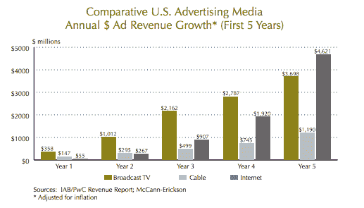
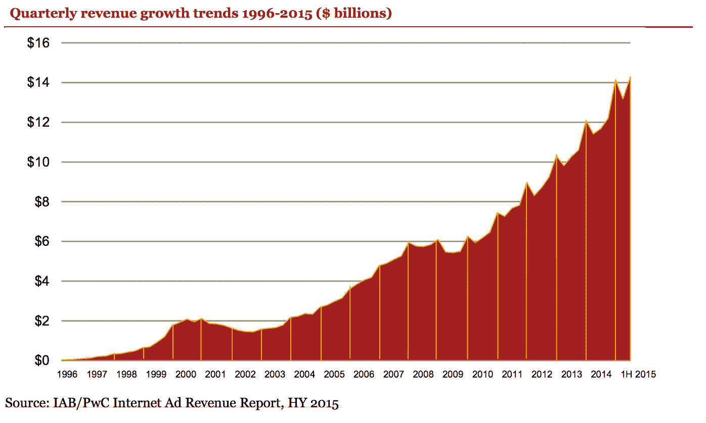
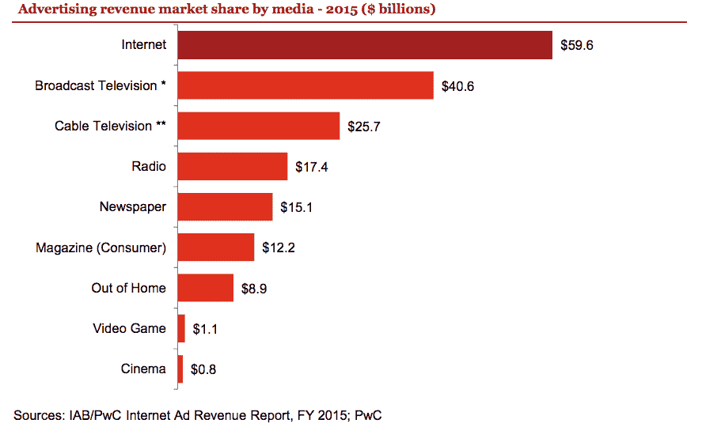
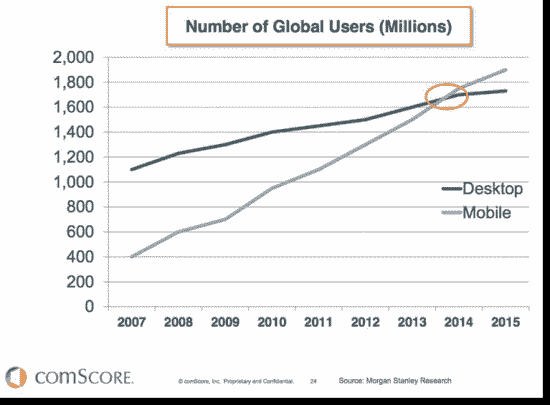
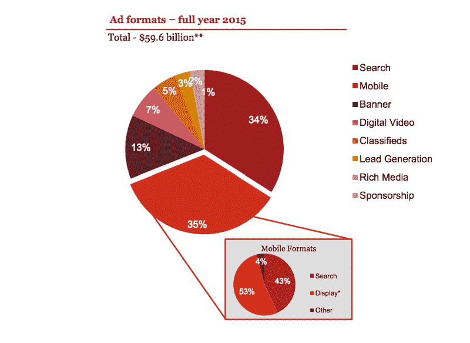
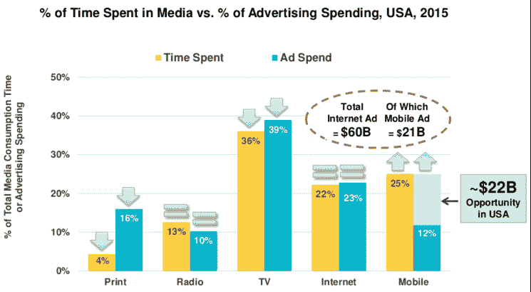

# 揭秘蓬勃发展的移动广告市场 

> 原文：<https://web.archive.org/web/https://techcrunch.com/2016/08/06/demystifying-the-booming-mobile-advertising-market/>

埃里克·斯坦是

[Branch.io](https://web.archive.org/web/20230129060331/https://branch.io/)

.

我们正处于另一场数字革命的边缘。1997 年我在双击公司的时候，我就已经看到了这一点，现在我看到的是手机开始占据营销人员、广告商和公司的心灵。

在 DoubleClick，我帮助启动了我们的国际业务，并瞄准了大品牌，让他们相信互联网广告的好处——“有史以来最有针对性的媒体”这是一项艰巨的工作:这个想法很新颖，而且比当时的市场稍微超前一点。(联系上下文来说，[第一面横幅广告](https://web.archive.org/web/20230129060331/http://www.wired.com/2010/10/1027hotwired-banner-ads/)1994 年 10 月 27 日才卖出。)我还记得 1998 年，一家财富 500 强科技公司的 CMO 甚至连电子邮件都没有。

但消费者的注意力很快转移到了互联网上，媒体支出也随之而来。我们过去常常告诉自己，当 10 大在线广告客户与任何一个国家的 10 大广告客户相同时，我们就已经成功了。

进入网络热潮。这些新公司中的许多都有巨额预算，很少提问，只是在他们认为可能有意义的任何渠道投入营销资金来获取用户——其中网络广告最受欢迎。在这些公司疯狂消费的推动下，到 1999 年底，来自互联网广告的收入飙升至令人震惊的 46.2 亿美元。

然而，支撑这项支出投资回报率的基础还没有真正形成。未达到所需的客户获取水平；没有足够的顾客来维持支出水平。仅仅依靠单一渠道获取用户是不可持续的。记得[Kozmo.com](https://web.archive.org/web/20230129060331/https://en.wikipedia.org/wiki/Kozmo.com)吗？还有很多。

*互联网广告增长的前五年(1995-1999 年)与广播(1949-1953 年)和有线电视(1980-1984 年)相对照，以现值美元表示(经通胀调整)。来源:IAB/普华永道收入报告；麦肯-埃里克森公司

到 2001 年夏天，网络泡沫破裂，DoubleClick 不再从事媒体业务(9 月份会发生更糟糕的事情)。从 2000 年的顶峰开始，网络广告直到 2004 年才开始复苏。

当然，那些暗地里希望这种新媒体消失的人会非常失望。互联网“规模化”，渗透率和带宽增加，下载速度和技术成本大幅下降，互联网演变成我们今天的样子。消费者的注意力继续转移到数字格式，整个互联网媒体已经占据了广告中最大的市场份额(33%)。

## 第二波广告市场增长——移动广告

广告 市场在 2009 年再次加速增长，这一次移动正在推动新一波广告- 美元消费。苹果在 2008 年 6 月推出了 App Store，而我们今天所知的移动应用开始腾飞。消费者在移动设备上花费的时间比例越来越大，移动设备用户在媒体和网站消费上已经超过了桌面用户。

同样，移动 广告支出现在代表了总广告收入的最大份额。

此外，手机消费和手机T4 广告美元之间的差异，这是玛丽·米克尔从互联网广告早期就开始跟踪的指标，已经为市场在未来几年的进一步快速增长做好了准备。

套用马克·吐温的话，2016 年，早期互联网广告的历史会押韵吗？

早期专注于移动业务的公司已经建立了庞大的业务，为这些广告商服务。以脸书为例。移动 广告收入约占[2016 年脸书在 Q1 所有广告收入的 82%](https://web.archive.org/web/20230129060331/https://investor.fb.com/investor-news/press-release-details/2016/Facebook-Reports-First-Quarter-2016-Results-and-Announces-Proposal-for-New-Class-of-Stock/default.aspx),同比增长 73%。2015 年，应用安装广告已经占到其移动收入的一半以上，而且这个比例还会上升。

正如你所知，这个数字代表了比整个行业更高的比例。谷歌声称其应用安装广告产品，通用应用活动，已经推动了[20 亿个应用安装](https://web.archive.org/web/20230129060331/http://www.adweek.com/news/technology/google-expanding-universal-app-campaigns-ios-developers-171546)。每安装一次 T4 估计为 1.5 美元，总收入约为 30 亿美元。两家公司都有很好的理由对谁构成这笔支出保持沉默。即使是一个偶然的猜测也不会让你进入这个国家的十大广告商中的任何一个。(这个想法最近得到了 Snapchat 创始人埃文·斯皮格尔的回应，他表示风投资金正在推高应用安装市场。)

同样，传统营销的商业基础也不存在。我所说的基本面是什么意思？它是客户获取、保留和参与的混合体。营销人员为每个应用安装支付 2 到 4 美元不等的费用，然而，只有 10%的新用户在下载后一周内使用该应用。这意味着品牌需要在 7 天内 为每个被收购的用户 赚 30 美元。没有多少企业能够承受这种性质的客户购买成本。

## m obile a 广告基础

与此同时，移动的增长以及该应用是一种更受青睐的用户体验的证据，正导致传统营销者越来越重视这一点，他们意识到他们需要利用这一渠道来充分吸引当今的消费者。

消费者[在移动应用中以比在移动网络中更高的比率](https://web.archive.org/web/20230129060331/http://www.criteo.com/resources/mobile-commerce-report/)——在漏斗的每一步——参与(甚至比桌面更好),并且在任何地方的转化率都比移动网络高 100%到 300%。此外，根据 comScore 的一项研究，应用程序用户每月在排名前 1000 的应用程序上花费超过 3 个小时，比移动网站访问者在排名前 1000 的网站上花费的时间多 18 倍。

移动应用广告的早期资金被那些在应用营销方面几乎没有其他选择的公司花掉了。当你是一家只使用应用程序或大量使用应用程序的公司时，应用程序安装广告是获得新用户的唯一快速简单的方法。事实上，这些类型的公司在这类广告上花费最多。

以下是 5000 万到 1 亿之间增长最快的 10 款应用(作为移动应用广告支出的代表):

1.  Opera 迷你网络浏览器

2.  优步

3.  文件管理器-文件管理器

4.  唱吧！Smule 的卡拉 ok

5.  simsimi 公司生产的 SimSimi。

6.  Kika 键盘–表情符号、gif

7.  Slither.io

8.  皇家冲突

9.  卓越的清洁剂(提升和清洁)

10.  微软 Word

来源: [IronSource](https://web.archive.org/web/20230129060331/http://www.ironsrc.com/resources/industry-intelligence/) ，专注于移动 app 广告和分析

事实上，IronSource 的移动业务和品牌合作伙伴全球负责人克里斯·康宁汉说，“推动移动预算的不是可口可乐这样的品牌，而是游戏公司和生活应用。”

随着越来越多的传统营销人员认识到通过应用吸引消费者的机会，他们将不再依赖单一渠道。他们将开始多元化战略，继续通过各种渠道获得新客户，并专注于通过这些传统渠道将现有客户转化为新的应用程序用户(和更多参与的客户)。寻找将他们的应用无缝集成到他们的其他营销渠道的方法将变得越来越重要，他们将能够发展他们的移动业务，而无需花费许多早期采用者需要的高昂价格。

不要指望我做空脸书或谷歌(我拥有这两家公司)；他们有太强大的业务和惊人的增长机会。但我确实认为他们对应用安装广告的依赖是不成比例的，随着市场向前 10 名移动 广告商和前 10 名广告商相匹配，这种依赖将得到重新调整。就像早期互联网广告一样。