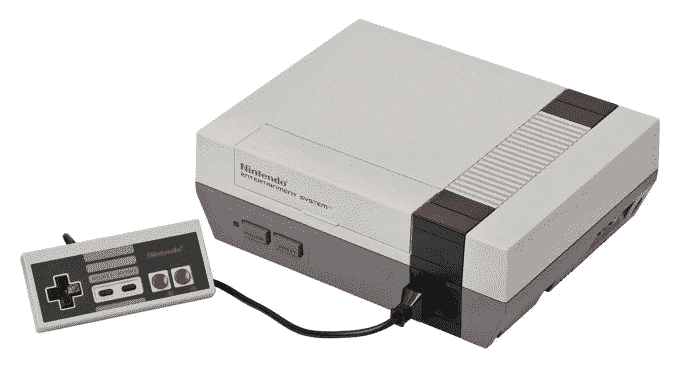
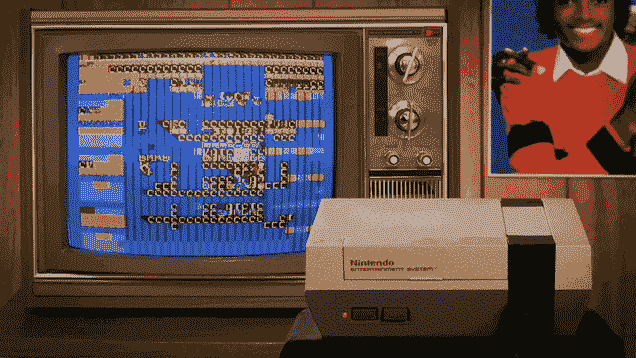

# 任天堂娱乐系统(NES)迎来 30 岁生日 

> 原文：<https://web.archive.org/web/https://techcrunch.com/2015/10/18/denim-denim-denim/>

# 任天堂娱乐系统(NES)迎来 30 岁生日

好吧，我老了。你可能觉得自己老了。让我们把它弄清楚。完成了。

今天，NES(任天堂娱乐系统)迎来了 30 岁生日，它于 1985 年 10 月 18 日在北美正式推出，只在美国有限的地区发售。我是说，我们从哪里开始说起 NES 有多棒，现在依然如此？我衣柜里有一把猎鸭枪。

最难忘的游戏是《超级马里奥兄弟》，它改变了一切。我以前有朋友过来，我们会玩几个小时试图打败它。我们不是在竞争，我们是一起的。这不是关于图形或制作游戏的人，这是关于游戏性。这是我迄今为止最身临其境的经历。忘了 VR，忘了 AR，原来任天堂的玩法只是……抓住了你:

我闭着眼睛都能打第一关，我就打了这么多次。在这一点上，它已经植入我的大脑，我可以像一个精心编排的芭蕾舞剧一样完成它。

[民意测验调查=9133174]

我曾经在当地的 Erol(后来变成了大片)排队租《双龙》。我不知道为什么我们不干脆买下它，因为我租得太多了，我本可以买 10 本的。不过，这并不重要。抓住它并跑回家玩的兴奋是我永远不会忘记的记忆。

此外，当我想到 NES，独特的，但有点相同的，打开屏幕卡住了我。我能记起这么多，但这里有一个可能会给你感觉:

此外，老化系统带来的所有怪癖都无关紧要。我不在乎多少次我不得不猛敲 NES 的顶部，吹进游戏盒或快速闪烁它的开关来实际工作。

作为一代人，NES 过去是，现在也是我们的。生日快乐，NES……我等不及向我的孩子们炫耀你了。即使是 Xbox 超级粉丝纳尔逊少校也非常爱你:

我相信你有很多你自己的 NES 记忆，所以在推特或脸书上向我们开火吧。