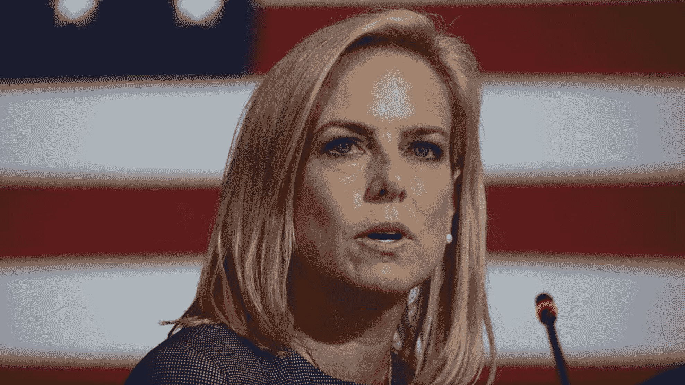

# 国土安全部最终废除了国际企业家规则

> 原文：<https://web.archive.org/web/https://techcrunch.com/2018/05/28/department-of-homeland-security-moves-to-finally-rescind-the-international-entrepreneur-rule/>

经过近一年的抗议和诉讼，国土安全部终于在上周晚些时候宣布[正在推进废除国际企业家规则](https://web.archive.org/web/20230405185707/https://s3.amazonaws.com/public-inspection.federalregister.gov/2018-11348.pdf)的计划，该规则允许创业公司的移民创始人在美国停留最长五年。

奥巴马时代的计划旨在允许在美国创建新公司(和新工作)的移民留在美国两年半(有可能再延长两年半)，只要他们达到公司增长和发展的里程碑。

这是为了吸引更多的移民企业家(这一群体占美国初创公司的一半以上，目前估值超过 10 亿美元)到美国，并在法国和新加坡等国家正在采取更多措施吸引初创公司创始人回国的时候，让美国更具竞争力。

该规则是在唐纳德·特朗普(Donald Trump)就职典礼前两天起草的，被许多共和党人视为高管办公室越权的一个例子。据奥巴马的官员说，这当然是对国会无法通过移民改革立法的回应，当时其他国家正在让精通创业的移民更容易在他们的边境定居。

“这非常具有企业家精神，非常以自由市场为导向，所以我认为任何认真对待商业的共和党人都必须认真对待这项规定，”奥巴马总统时期美国公民和移民服务局前局长莱昂·罗德里格兹告诉雅虎，[监督了这项规定的制定！今年早些时候的新闻。](https://web.archive.org/web/20230405185707/https://www.yahoo.com/news/trump-rule-hits-startups-foreign-entrepreneurs-need-not-apply-144235033.html)

对于特朗普政府的支持者来说，废除这项规定是更广泛打击移民的一部分，它称之为试图确保美国的就业机会，结束行政人员滥用移民漏洞的行为——特别是给予“假释”，这是一个允许短期留在美国的技术术语。

(图片由 Cheriss May/NurPhoto 通过 Getty Images 提供)

“假释应该是为短期和紧急目的而保留的，”移民研究中心的马克·克里科里安说，该中心是一个与现任政府有联系的保守派智库。“前几届政府已经推进了假释的极限，而奥巴马政府则突破了极限，声称假释权的存在意味着总统可以接纳任何人。”

Krikorian 和其他保守的经济学家在更严格的移民政策和为美国工人提供更多的工作之间建立了一种联系。但是大多数经济学家不同意移民越少意味着就业越多的假设。

加州大学戴维斯分校的经济学教授 Giovanni Peri 在去年的一次采访中告诉《纽约时报》“普通美国工人更有可能从移民限制中得不偿失。

许多经济学家认为，创业雄心和技术技能越来越被视为全球竞争经济的必要组成部分，通过最近的一系列法规(包括废除国际企业家规则)，特朗普政府正在阻止美国建立最佳的经济增长引擎。

 美国国家风险投资协会(National Venture Capital Association)主席兼首席执行官鲍比·富兰克林(Bobby Franklin)在周五的一份声明中表示，“初创企业和风险投资界对 DHS 的短视决定感到非常失望，他拒绝了国际企业家规则可以创造的美国就业机会。”。“事实很清楚:我们的国家需要更多的企业家精神，这正是国际企业家规则所能带来的。我们将继续向政府解释为什么移民创业有益于我们的国家，必须得到政策制定者的支持。”

 在接下来的 30 天里，公众被邀请对规则的改变发表意见。

在该规定本应于 2017 年 7 月 17 日生效的不到一周前，DHS 表示，该规定将被推迟，司法部首次表示打算取消该规定。

NVCA 和其他原告在 DHS 没有征求公众意见的技术细节上成功地反对了该规则的延迟。去年 12 月，一名法官做出了有利于 NVCA 的裁决，DHS 应该取消拖延，开始实施该规则，但没有迹象表明 DHS 曾经遵守过。

法律程序仍在进行中——甚至在 DHS 公开征求公众对废除该规则的意见时。2018 年 5 月 9 日， NVCA 及其共同原告提出了一项请求发现的动议，以查明 DHS 是否完全遵守了法院命令。

正如国家风险资本协会在声明中指出的，加拿大、法国、德国和新加坡都有旨在吸引企业家的签证。美国移民的历史经验表明了更加开放边境的价值。

事实上，根据 2016 年的一项研究，最近在美国成立的估值超过 10 亿美元的科技公司中，超过一半是由移民企业家创立的。

> 移民创办了超过一半(87 家中的 44 家)价值 10 亿美元或以上的美国初创公司，并且是超过 70%的这些公司(87 家中的 62 家)的管理或产品开发团队的关键成员。研究发现，在价值十亿美元的初创公司中，移民创始人平均为美国每家公司创造了大约 760 个工作岗位。44 家移民创办的公司的总价值为 1680 亿美元，接近俄罗斯或墨西哥股票市场价值的一半。

批评人士说，这些公司创始人中有许多是在学生时代来到美国的，随着美国继续收紧边境，为从学生到初创企业创始人的所有人的移民设置更多艰难的路障，这正在侵蚀曾经的核心优势。

像[要求社交媒体负责人审查签证申请人的社交媒体历史](https://web.archive.org/web/20230405185707/https://www.cnn.com/2018/03/29/politics/immigrants-social-media-information/index.html?sr=fbCNN032918immigrants-social-media-information0127PMVODtop)这样的步骤；[收紧 H-1B 签证规定](https://web.archive.org/web/20230405185707/http://www.newsweek.com/h-1b-visa-program-trump-administration-824688)；像废除企业家规则这样的事情都塑造了潜在移民看待美国的方式。在全球竞争的市场中，路障和障碍将说服潜在的就业创造者到其他地方创业。

科斯珍·尼尔森，国土安全部部长。照片:埃文·伍奇/美联社

正如政治上个月报道的那样，根据国际教育研究所对近 500 所学院和大学的初步调查，2017 至 2018 学年，美国国际学生入学率平均下降了 7%。与此同时，加拿大的学生申请数量激增。

正如 Stripe 创始人、27 岁的亿万富翁约翰·科利森对 BBC 说的，“人们不太愿意移居美国，他们甚至不想进入签证程序，因为他们认为政治气候和这个国家对移民的欢迎程度。”