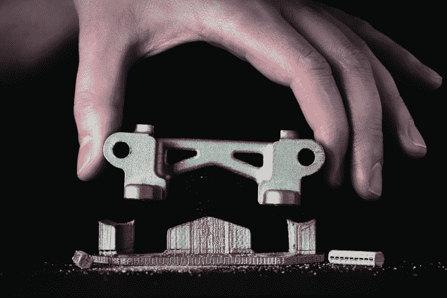

# Desktop Metal 揭示了其 3D 打印机如何快速生产金属物品

> 原文：<https://web.archive.org/web/https://techcrunch.com/2017/04/25/desktop-metal-reveals-how-its-3d-printers-rapidly-churn-out-metal-objects/>

桌面金属公司今天透露了其 3D 打印机的定价和其他细节，这种打印机可以用数百种不同的合金制造物体，包括钢、铝、钛和铜。这家初创公司的首席执行官兼联合创始人里克·富洛普表示，就质量而言，桌面金属系统生产的零件比得上注塑产品。

虽然金属 3D 打印机已经存在了几十年，但它们在材料、速度和可访问性方面受到限制。这在一定程度上是因为金属的熔点很高。例如，塑造它们不像塑造塑料那样容易。

桌面金属称其核心技术为“微波增强烧结”。该公司的打印机将混合在软聚合物中的金属和陶瓷粉末分层打印出来。打印机使用的墨盒和合金由 Desktop Metal 和其他主要的添加剂制造商制造。一旦一个混合媒体项目被打印出来，它就被放进一个炉子里，在那里被快速地烹饪。热量烧掉了聚合物。气体被木炭过滤。

与此同时，金属融合在一起，但温度不会使其熔化并失去形状。在印刷设计中，无论陶瓷放在哪里，金属都保持分离，不会融合。桌面金属机器制造的碎片可以用手分开。

视频 

早期使用激光和高热的金属 3D 打印机已被用于航空航天、国防、工业和汽车制造，尤其是用于制造医疗设备、植入物和其他小型零件。它们通常由像通用电气这样财力雄厚的公司拥有和运营，例如，通用电气[通过其风险投资部门投资了桌面金属](https://web.archive.org/web/20220818231943/https://beta.techcrunch.com/2017/02/06/bmw-and-lowes-among-investors-pouring-45-million-into-desktop-metal-the-3-d-printer-startup/)，还有 GV(前谷歌风险投资)、宝马 iVentures、劳氏公司和其他公司。

实际上，通用电气去年以超过 10 亿美元的价格收购了这一领域的两家公司:Arcam 和 Concept Laser。其他在添加制造领域提供金属打印机的公司有 [3D 系统](https://web.archive.org/web/20220818231943/https://www.crunchbase.com/organization/3d-systems)、[雷尼绍](https://web.archive.org/web/20220818231943/https://www.crunchbase.com/organization/renishaw#/entity)、 [EOS](https://web.archive.org/web/20220818231943/https://www.eos.info/en) 和 [Stratasys](https://web.archive.org/web/20220818231943/https://beta.techcrunch.com/2016/08/24/stratasys/) 。但即使有这些活动，根据富洛普的说法，金属 3d 打印只占全球每年生产和销售的 1 万亿美元金属产品的 10 亿美元。

根据 2016 年沃勒报告，更广泛的增材制造业去年仅创造了 51 亿美元的收入。出于速度和安全原因，许多制造商希望采用 3D 金属打印机。

采用传统工艺(如注射成型)进行金属制造可能会产生噪音，产生焊接烟雾和废气，并且需要工人使用大量化学品，他们还会因操作重型机械而受伤。添加剂制造可以保护工人免受很多危险。

桌面金属 3D 打印机制造的金属部件可以用手分离。

桌面金属公司设计了新的生产机器，可以快速安全地大规模生产金属零件，而不需要专门的工程师一直操纵机器。该公司表示，其桌面金属生产设备的工作速度比早期的机器快 100 倍，每小时生产 8200 立方厘米的金属物体。

更令研究实验室、设计师和工程师兴奋的是，桌面金属还创造了一种桌面金属工作室机器，可以在办公室使用，不需要呼吸器、外部通风设备、为机器提供动力的大型气罐或任何其他工厂式的住宿设施。

桌面金属工作室和生产系统都可以制作无需后期处理即可使用的金属物品。它们不同的支架和部件可以用手拆开。大多数 3-D 打印机，无论是金属的还是聚合物的，都需要一些锉、铣或其他工具来去除多余的材料，并磨平打印对象的粗糙边缘。

桌面金属工作室系统售价 12 万美元，将于 9 月份发货，包括打印机和烧结炉。办公室或实验室也可以以每月 3250 美元的价格租用该系统。桌面金属生产系统将于 2018 年发货，一次性购买价格为 42 万美元。

更正:这个故事的前一个版本说通用电气收购了 SLM Solutions。通用电气竞购 SLM，但交易从未达成。