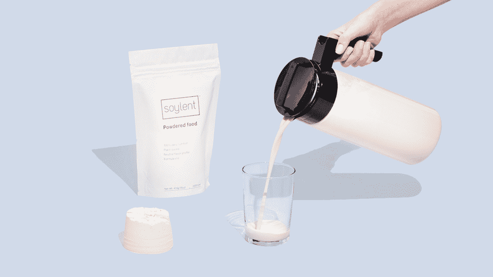

# 尽管遇到挫折，Soylent 饮料公司获得了 5000 万美元的新资金

> 原文：<https://web.archive.org/web/https://techcrunch.com/2017/05/04/despite-setbacks-soylent-drinks-up-50-million-in-fresh-funding/>

Soylent 是一家成立四年、总部位于洛杉矶的公司，主要致力于它所谓的代餐饮料，最近几年受到了冲击。但是一群投资者打赌 Soylent 的好日子就在公司前面；他们刚刚为其提供了 5000 万美元的新资金，使 Soylent 的总资金达到 7450 万美元。

GV 的安迪·惠勒(Andy Wheeler)部分专注于 GV 的食品和农业相关投资，他领导了这轮融资，并作为交易的一部分加入了 Soylent 的董事会。新基金的其他参与者包括 Tao Capital Partners 和早期支持者 Lerer Hippeau Ventures 和 Andreessen Horowitz。

硅谷因资助成为 T2 嘲笑对象的公司而臭名昭著。尽管如此，这笔新资金可能会让一些行业观察人士大吃一惊。

从一开始，Soylent 就很容易成为喜欢美食的人的目标。几年前，当 Soylent 的首席执行官罗布·莱因哈特出现在喜剧演员史蒂芬·科拜尔的节目中时，科尔伯特问道:“这个节目的灵感是什么？你有没有看到一个昏迷的人插着饲管，然后你想，'[我要和他一样的](https://web.archive.org/web/20230320122608/http://www.cc.com/video-clips/2kgoki/the-colbert-report-rob-rhinehart)'”

去年，当消费者在食用了 Soylent 的混合粉和蛋白质棒后，变得严重不适时，他们失去了幽默感。该公司确定原因是[藻类成分](https://web.archive.org/web/20230320122608/https://www.bloomberg.com/news/articles/2016-11-07/soylent-thinks-it-found-what-was-making-people-sick-algae)，并迅速重新配制奶粉。它还没有重新引进它的酒吧。

就在上周，Soylent 在发布了一份自愿召回声明后，受到了更多不必要的关注。原因，公司说；它发现少量的奶制品可能混入了一些批次的奶粉中，这些奶粉被宣传为不含乳糖和奶制品。

在昨天与 TechCrunch 的对话中，莱茵哈特表示，该公司已经从错误中吸取了教训，并“在改善我们的成分和供应商尽职调查方面取得了很大进展。”

他解释道，Soylent——对非科学头脑的人来说，它的构成有些难以理解；它的粉末包括葡萄糖酸亚铁、盐酸硫胺素和 38 种其他成分——还拥有新的成分和一个“更大、更强大的质量团队”,以“确保类似(以前的灾难)不再发生”

看起来，负面新闻并没有像人们想象的那样拖累公司。莱茵哈特不愿讨论具体数字，但被问及公司的销售额时，他说第一季度的净收入比去年同期几乎翻了一番。

他说，事实上，该公司已经筹集了这一大笔新资金来推动几项新举措。

首先是通过扩大 Soylent 的销售范围，让更多的消费者能够买到 Soylent。目前，Soylent 购物者只能在其网站和亚马逊上购买产品，Rhinehart 表示，Soylent 将很快在杂货店、便利店和“大众市场”零售商中销售。(我们怀疑他指的是塔吉特(Target)和好市多(Costco)，尽管被问及此事，他只会说 Soylent“正在进行一些合作。”)

莱茵哈特说，Soylent 目前销售其原始粉末，以及四种口味的饮料，包括更多新的可可和花蜜口味的产品，也正在走向全球。

这家 50 人的公司目前在密苏里州的一个“FDA 认证的工厂”生产产品，假设有更新、更广泛的客户群在他们的零售货架上发现 Soylent，它将寻找备用工厂，以便生产更多的产品。

至于 Soylent 召回的巧克力棒是否会卷土重来，或者该公司是否计划很快推出任何新产品，答案是肯定的。莱茵哈特说，他每天早上仍然会狂饮“一到两杯”Soylent 饮料，他说，该公司目前正致力于一些“产品类别的新创新”。