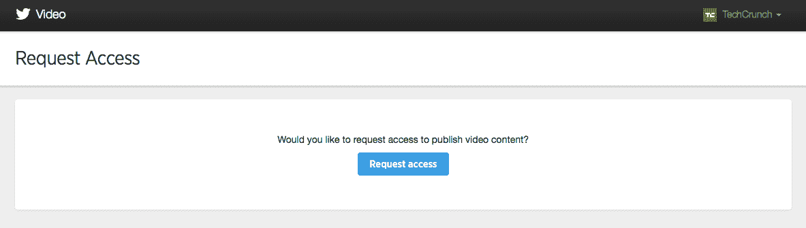

# Twitter 原生视频播放器与 YouTube 竞争的细节揭晓？[更新 

> 原文：<https://web.archive.org/web/https://techcrunch.com/2015/01/02/details-unveiled-for-twitters-native-video-player-to-rival-youtube/>

**更新**:Twitter 发言人告诉我们，常见问题和条款指的是[为 Amplify 用户推广的视频服务](https://web.archive.org/web/20230123111931/https://blog.twitter.com/2014/introducing-promoted-video-on-twitter)，而不是它计划在 2015 年上半年为消费者推出的新视频播放器。另一名发言人表示，目前没有新的消息可以分享。下面是原文。

早在 2014 年 11 月，Twitter 宣布将于 2015 年上半年[推出原生视频服务](https://web.archive.org/web/20230123111931/https://blog.twitter.com/2014/coming-soon-to-twitter)，作为其将自己定位为媒体平台的更大战略的一部分。现在，关于这将如何工作的更多细节已经被披露。

Twitter 视频播放器将播放长达 10 分钟的视频，文件大小没有限制，最初支持 mp4 和 mov 文件。在播放器中没有编辑视频或安排视频的功能——至少在第一次迭代中没有。而且，很明显，Twitter 视频播放器将不支持 YouTube 或其他任何地方的视频，只支持自己服务上的视频。

一名好奇 http://video.twitter.com 网址上可能有什么的推特用户[偶然发现了推特原生视频服务的细节。(目前这是一个限制访问的页面，您可以在这里请求访问以发布视频内容。一个 angular JS 文件提供了关于服务条款的细节以及关于 Twitter 视频的 FAQ。](https://web.archive.org/web/20230123111931/https://twitter.com/danielraffel/with_replies)

早在 11 月，Twitter 就提出了它希望从一项新的视频服务中获得什么的雄心壮志——超越用户已经可以用 Twitter 的 Vine 应用程序做的事情，或者通过 Twitter 的 card 功能观看嵌入的视频。

“除了在 Twitter 上更容易地观看视频，你还应该能够在 Twitter 上录制、编辑和分享你自己的视频，”产品副总裁凯文·韦尔写道。“除了短循环[藤蔓](https://web.archive.org/web/20230123111931/https://vine.co/)视频，我们认为你会很高兴通过本地视频分享你的世界发生的事情。”

例如，虽然 Twitter 视频播放器可能会被广告商或其他商业合作伙伴使用，但 Twitter 不允许第三方出售视频播放器的使用权，也不允许在视频播放器上嵌入其他广告、赞助或促销活动。

用户可以通过定制的缩略图来控制视频在时间轴上的呈现方式。看起来虽然时间限制是 10 分钟，但 Twitter 希望这是一个高质量的 10 分钟。

在回答是否有视频大小限制时，Twitter 写道，“目前我们在上传时没有文件大小限制。因此，我们鼓励合作伙伴使用最高分辨率的源视频，以创造最佳的用户体验。但是，请记住，源文件越大，上传和处理的时间就越长。它鼓励用户将源视频比特率尽可能高，“至少 5000k 比特，音频比特率应为 128k。每秒帧数应按照原始源素材进行保存。”

当然，视频可以在视频播放器的仪表盘上发布，但“目前”不可能安排时间。考虑到商业合作伙伴对该工具的使用，Twitter 指出，这些视频推文“可以立即发送给所有关注者，也可以对你的关注者隐藏起来，作为 Twitter 广告活动的一部分。”

扩大 Twitter 视频服务的举措，对于该公司以及更广泛的流媒体视频市场来说，恰逢一个有趣的时刻。对于 Twitter 来说，该公司一直在努力寻找能够为其平台带来更多观众和更多优质广告商的模式。事实证明，视频是让用户在网站上停留更长时间的更有吸引力的格式之一，而且它也是一种比常规互联网内容更接近电视的广告格式，因此对传统上喜欢电视作为大部分广告支出的优质品牌广告商来说更具吸引力。

如今在线视频领域最大的玩家是 YouTube，它自己也在尝试各种格式来扩大向用户和广告商提供的视频服务的种类——从 [GIF](https://web.archive.org/web/20230123111931/https://twitter.com/waxpancake/status/543230698706857984/photo/1) 创作(小心，Vine)到[自动播放](https://web.archive.org/web/20230123111931/https://techcrunch.com/2014/12/11/youtube-is-testing-an-autoplay-feature-that-streams-suggested-videos-automatically/)视频(模拟电视观看)。通过推出自己的本地视频播放器，Twitter 也希望能从中分一杯羹。

禁止使用 YouTube 视频的决定是一个有趣的决定，它指出了 Twitter 如何希望建立自己的视频库存——让这些视频旁边的广告在商业上更有利可图，并将 Twitter 定位为一个独立的平台。

“为了给用户提供最佳体验，我们要求所有视频都由 Twitter 上传和托管。上传到 YouTube 的同一视频也可以上传到 Twitter，但你不能用 Twitter 视频播放器重复使用 YouTube 的 URL，”Twitter 指出。同样，鼓励那些使用其他视频播放器的人使用播放器卡。

在没有看到视频播放器本身的情况下，很难说它是否会有足够的吸引力来吸引用户，而不是简单地通过卡片的方式嵌入视频。看起来 Twitter 将试图让那些上传视频的人使用自己的视频播放器。具体来说，它将为用户提供关于这些视频的分析，跟踪视频开始和四分位数完成率(跟踪人们是否观看了 25%，50%，75%或 100%的内容)。