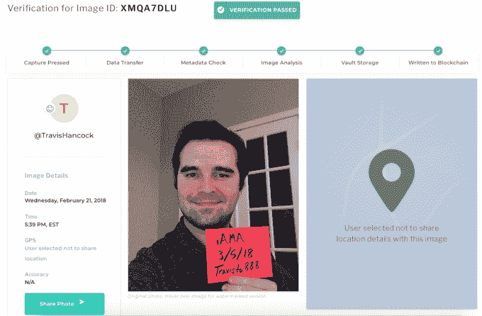
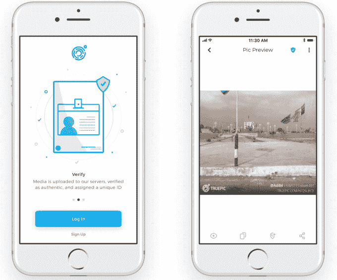
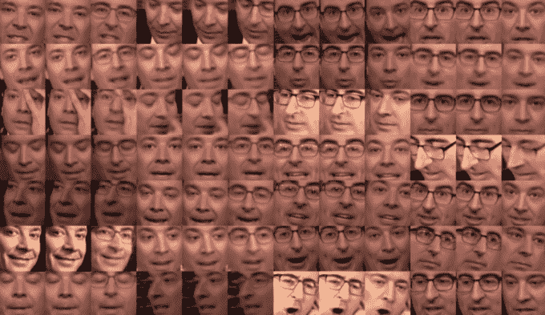
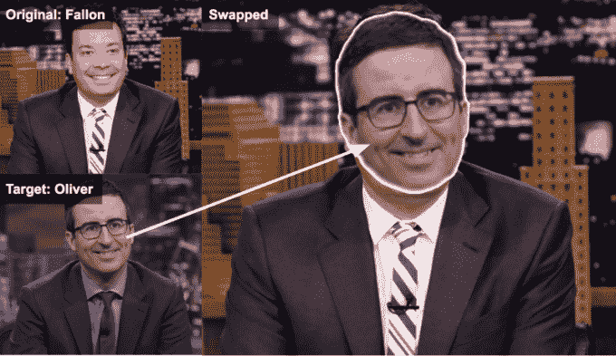

# Truepic 筹集 800 万美元揭露 Deepfakes，为 Reddit TechCrunch 验证照片

> 原文：<https://web.archive.org/web/https://techcrunch.com/2018/06/20/detect-deepfake/>

你怎么能确定一张图片不是 PS 过的？确定是用 [Truepic](https://web.archive.org/web/20221208031640/https://truepic.com/) 拍摄的。这家初创公司开发了一种相机功能，可以拍摄照片，并添加一个水印 URL，指向它保存的图像副本，这样观众就可以将它们与[进行比较，确保他们看到的版本没有被更改](https://web.archive.org/web/20221208031640/https://techcrunch.com/2017/05/11/truepic-photo-verification/)。

现在，Truepic 的技术正在得到其最重要的部署，作为 Reddit 将[验证“问我任何问题”Q & As](https://web.archive.org/web/20221208031640/https://www.reddit.com/r/IAmA/comments/826xgm/im_a_dad_who_quit_his_job_3_years_ago_to) 由广告中的真实人物——通常是名人——进行现场直播的一种方式。[更新:虽然需要澄清的是，这里没有 Reddit 范围或企业合作伙伴关系。Reddit 的独立 R/iAMA subreddit 版主选择建议人们使用 Truepic。]

但是，除了用于验证 AMAs、约会档案和 P2P 电子商务清单之外，Truepic 还在应对其最大的挑战:识别人工智能生成的 Deepfakes。这些是人工智能令人信服地用别人的脸替换视频中一个人的脸的地方。目前，这项技术正被用来制作假色情作品，在未经成人电影明星同意的情况下，将他们的身体和一个无辜的名人的脸结合在一起。但最大的担忧是，它可能被用来冒充政客，让他们看起来像是在说或做他们没有说过的事情。

对清除 Deepfakes 方法的需求为 Truepic 吸引了新一轮 800 万美元的投资。这些现金来自非传统的初创公司投资者，包括道林资本合伙人、前汤姆森金融(现为路透社)首席执行官杰弗里·帕克、哈佛商学院教授威廉·萨尔曼等。首轮融资为 Truepic 带来了 1050 万美元的资金。

Truepic 创始人和首席运营官·克雷格·斯塔克说:“早在操纵的图像影响全球民主选举、暴行和侵犯人权的数字证据经常被破坏，或者网上身份被伪造以推进政治议程之前，我们就开始了 Truepic ,但现在我们完全认识到它对社会的影响。”。“这个世界需要 Truepic 技术来帮助纠正滥用数字图像造成的错误。”

【Truepic 是这样工作的:

1.  在 Truepic 的 iOS 和 Android 应用程序中抓拍照片，或者在他们自己的应用程序中嵌入 SDK 的付费应用程序中抓拍照片
2.  Truepic 验证图像没有被修改，并用时间戳、地理编码、URL 和其他元数据对其进行水印处理
3.  Truepic 的安全服务器存储了一个版本的照片，分配有一个六位数字的代码和它的网址，加上一个不可改变的区块链上的位置
4.  用户可以在应用程序中发布他们的真实照片，以证明他们没有在约会网站上钓人，没有在电子商务网站或其他地方出售坏掉的东西
5.  观众可以访问照片上水印的网址，将其与保险库保存的版本进行比较，以确保它在事后没有被修改

例如，r/iAMA Wiki 推荐 [AMA 的创作者使用 Truepic](https://web.archive.org/web/20221208031640/https://www.reddit.com/r/IAmA/wiki/truepic) 应用程序给[拍一张他们拿着手写签名](https://web.archive.org/web/20221208031640/https://www.reddit.com/r/IAmA/comments/826xgm/im_a_dad_who_quit_his_job_3_years_ago_to)的照片，上面有他们的名字和日期。“ Truepic 的技术让我们能够快速安全地验证一些最古怪客人的身份和声明，”Reddit AMA 版主、林奇 LLP 知识产权律师布莱恩·林奇说 Truepic 是一个完美的工具，可以用来研究互联网上不断发展的隐私法律和社会结构。"

图像处理的弊端也在演变。Deepfakes 可能会让名人尴尬…或者引发一场战争。“我们将投资于离线图像和视频分析，并且已经发现了一些微妙的取证技术，我们可以用它们来检测像 deepfakes 这样的伪造，”Truepic 首席执行官杰夫·麦格雷戈告诉我。“特别是，人们可以分析头发、耳朵、眼睛的反射率和其他细节，这些细节几乎不可能在典型视频的数千帧中逼真地呈现。即使识别出几帧是假的，也足以宣布一个视频是假的。”

这将永远是一场猫捉老鼠的游戏，但从新闻编辑室到视频平台，Truepic 的技术可以让内容创作者保持诚实。这家初创公司还开始与叙利亚美国医学协会(Syrian American Medical Society)等非政府组织合作，帮助它提供该国冲突地区暴行的经核实的文件。人权基金会还在 2018 年奥斯陆自由论坛上培训人道主义领导人如何使用 Truepic。

麦格雷戈对脸书大加挞伐，总结道“互联网已经迅速成为虚假信息的垃圾场。欺诈者充分利用了不知情的消费者，社交平台促进了虚假叙述的快速传播，让超过 32 亿人在互联网上自行决定什么是可信的，什么是虚假的……我们打算通过给互联网带来一层信任来解决这一问题。”