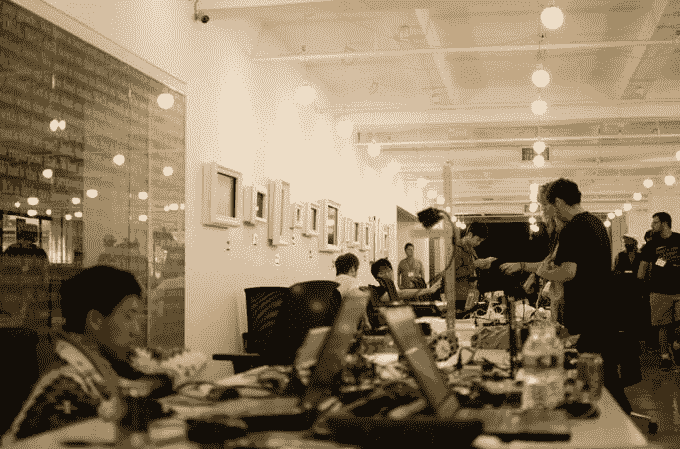

# 开发人员希望通过微软 Kinect V2  创造透明度

> 原文：<https://web.archive.org/web/https://techcrunch.com/2014/06/23/developers-look-to-create-transparency-with-microsoft-kinect-v2/>

在 [NUI 中央](https://web.archive.org/web/20230315095316/http://www.nuicentral.com/)的[Kinect for Windows Hackathon](https://web.archive.org/web/20230315095316/http://kinectforwindowshackathon.challengepost.com/)上，天花板上的投影仪在地面上创建了一个沙子和灌木的图像。地形应该是阿富汗。在狭小的投影空间里走来走去，期待什么都不会发生，一声巨响和一道白光击中了我的感官。我踩到了一颗地雷，或者至少这个应用程序 [Sweeper](https://web.archive.org/web/20230315095316/http://getsweeper.com/) 希望我这么认为。Sweeper 只是上周末在纽约市微软赞助的活动中创造的一个黑客。

微软为开发人员提供了一个开放的空间，让他们可以修改其最新的 Kinect V2 软件开发工具包和 Kinect 中可能即将推出的两项实验技术:近场传感器和纹波。

**涟漪穿过大地**

来自 Critical Mass 的一组开发人员用微软的 Ripple 开发了 Sweeper，它可以运行 JavaScript 和 HTML5。Ripple 使用双屏投影仪设置:一个投影在地面上，另一个在用户面前。

Sweeper 将用户放置在投影的瓷砖上，在一个描绘有地雷问题的特定国家的地面上行走。当用户踩上隐藏的地雷时，屏幕会闪烁，然后是爆炸的声音。

根据联合国的说法，一旦用户踩上地雷，该应用程序就会提供地雷类型的详细信息和其他统计数据，例如部署一枚地雷需要 3 美元，但拆除一枚地雷需要 300 至 1000 美元。

该小组认为，这一令人震惊的因素将有助于在这个问题上教育人们，同时也有助于为联合国排雷行动处等组织筹集捐款，以帮助这些地雷失效。

**使用 Kinect V2 探索自然的用户界面**

Kinect V2 注册了更多的关节，可以映射六个骨骼，而不是 V1 的两个骨骼。参加黑客马拉松的用户体验设计师 Laureano Batista 希望 V2 将为开发者提供更多探索、艺术和创意实验，而不是娱乐。

“[自然用户界面]不是许多前进战略中的一个；NUI 将成为我们处理技术的方式，”他说。

这也是 NUI 中心(一个为对开发和创造自然用户界面技术感兴趣的人建立的社区)举办为期两天的黑客马拉松的原因之一。该团队被“自然界面”所困扰——自然界面被定义为人类用来表达自己的任何方式:从手势到面部表情和身体运动。对他们来说，触摸屏设备不是一个自然的界面。

NUI 是“一种更人性化的与计算机和设备交流的方式”，NUI 中心的联合创始人[黛布拉·本克勒](https://web.archive.org/web/20230315095316/http://screenplayinteractive.com/debra-benkler-digital-creative-architect-and-co-founder)说。

这种方法关注的是技术对人类的反应，而不是人类对技术的反应。本克勒认为这种转变已经发生，并希望 NUI 社区能够帮助改变人们的生活方式。

这种想法启发了其他几个黑客，包括一个物体回避机器人。开发者 John Yeh 在一个底盘上安装了一个 Kinect V2 来创造一个机器人，它使用来自 V2 的传感器来操纵路径上的物体。

Yeh 说，这可能适用于医院的药物输送机器人，它可以在人们周围移动，这样人们就不必对它做出反应。这个想法是让我们周围的技术变得透明。

**近场传感器和你的下一个医生预约**

想象一下，用点击 Windows 商店中的一个应用程序来取代去医生办公室的标准访问。这就是[德怀特·戈因斯](https://web.archive.org/web/20230315095316/http://dgoins.wordpress.com/)想要做的。

来自科罗拉多州科罗拉多斯普林斯的戈因斯是 Nimbo 的系统架构师，但在另一方面，他正在为一个虚拟医生应用程序创建一个框架，该应用程序可以使用近场传感器读取生命体征，该传感器在距离 Kinect V2 1 厘米的地方工作。到目前为止，它只能检查个人的脉搏。

他仍在调整该应用的用户界面，但他表示，该应用的框架可以实现许多强大的算法，因为该应用使用传感器来读取皮肤色素的变化。可以对算法进行编程，以寻找黄疸、血液含量并检查呼吸频率。他不打算免费提供源代码，但是他想给开发者一些如何使用这个框架的例子。

NUI 中心的联合创始人 Ken Lonyai 说，波纹和近场传感器都是 Kinect V2 的实验技术，目前还不清楚微软是否会正式发布它们。