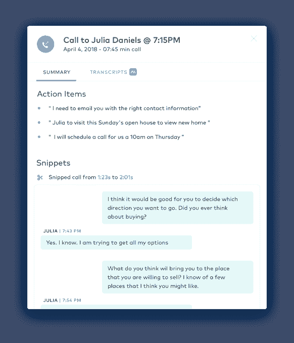

# Dialpad 拨号高达 5000 万美元由 Iconiq  领导的 D 系列

> 原文：<https://web.archive.org/web/https://techcrunch.com/2018/07/17/dialpad-dials-up-50m-series-d-led-by-iconiq/>

# Dialpad 拨号高达 5000 万美元由 Iconiq 领导的 D 系列

今天，Dialpad 宣布获得 5000 万美元的 D 轮投资，这为该公司提供了充足的资金来继续扩大其商业通信平台。

这轮融资由 Iconiq Capital 牵头，现有投资者 Andreessen Horowitz、Amasia、Scale Ventures、Section 32 和 Work-Bench 提供了帮助。通过今天的这轮融资，该公司现已融资 1.2 亿美元。

随着人工智能和物联网等技术的进步，这给了该公司一个扩展平台的机会。Dialpad 产品包括 UberConference 会议软件和用于语音转录应用的 VoiceAI。

该公司正在一个拥挤的市场中竞争，其中包括谷歌和思科这样的巨头以及许多较小的公司，如 GoToMeeting(由 LogMeIn 所有)、Zoom 和蓝战士。所有这些公司都致力于提供基于云的会议和通信服务。

这越来越多地涉及到人工智能，如自然语言处理(NLP)，以提供即时转录服务。虽然这些服务都不完美，但它们正变得越来越准确。

VoiceAI 是在 [Dialpad 于 5 月收购 TalkIQ 后不久推出的](https://web.archive.org/web/20230306212345/https://techcrunch.com/2018/05/16/dialpad-acquires-talkiq-to-bring-ai-to-its-platform/)，通过将情感分析和分析应用于语音转录，将这一想法向前推进了一步。该公司计划利用这笔现金继续投资 Dialpad 平台的人工智能。

VoiceAI 生成的通话后文字记录。截图:拨号盘

首席执行官克雷格·沃克(Craig Walker)当然看到了人工智能对公司发展的潜力。“聪明的首席信息官知道，人工智能不仅仅是另一种时髦的技术工具，它还是工作的未来。沃克在一份声明中说:“通过用 VoiceAI 的实时人工智能和洞察力武装销售和支持团队，坦率地说是组织中的每个人，企业可以大幅提高客户满意度，最终提高他们的底线。”。

Dialpad 还与亚马逊 Alexa 等语音驱动设备合作，并于 4 月宣布 [Alexa 与 Dialpad](https://web.archive.org/web/20230306212345/https://techcrunch.com/2017/04/25/with-dialpad-amazon-echo-integration-alexa-can-make-phone-calls-for-you/) 集成。这使得 Alexa 用户可以通过说一些类似于“Alexa，用 Dialpad 打电话给 Liz Green”的话来打电话，Echo 将使用 Dialpad 软件代表你打电话。

据该公司网站称，它拥有超过 5 万名客户，包括 WeWork、Stitch Fix、优步和 Reddit。该公司表示，自 2017 年 9 月的上一轮融资以来，它已经增加了 10，000 多名新客户。