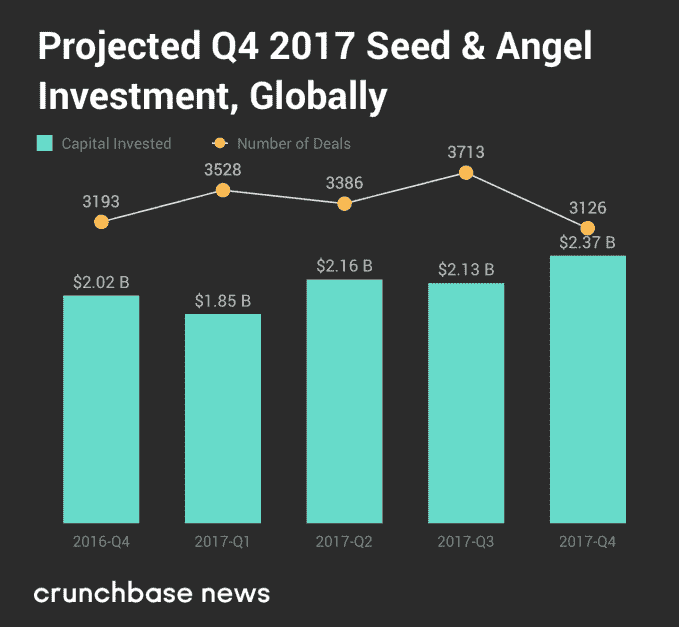
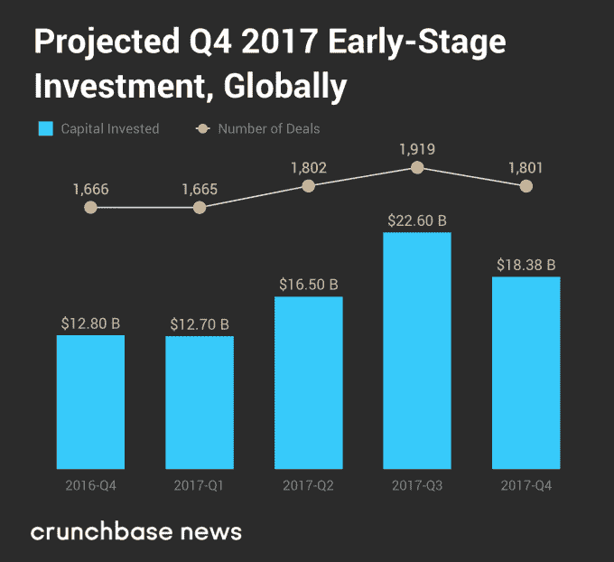

# 2017 年 Q4 全球 VC 的大潮开始转向了吗？

> 原文：<https://web.archive.org/web/https://techcrunch.com/2018/01/10/did-the-tide-of-global-vc-start-to-turn-in-q4-2017/>

杰森·罗利是

[Crunchbase](https://web.archive.org/web/20221210060836/https://about.crunchbase.com/news/)

的风险投资和科技记者。

更多帖子由本投稿人

在上一个季度，风险资本行业的观察家们注意到，一些东西正在溜走——即种子和早期阶段的风险活动。

随着 2017 年接近尾声，讨论量有所增加。去年后几个月，AVC 的弗雷德·威尔森 [提到](https://web.archive.org/web/20221210060836/http://www.businessinsider.com/fred-wilson-seed-early-stage-angel-investing-market-has-cooled-2017-12) 回应维克多·巴斯塔的文章，该文章描述了种子和早期风险投资 活动中的一次“内爆”。回到 10 月份，TechCrunch 的撰稿人乔恩·埃文斯(Jon Evans)提出了一个令人不安的令人信服的案例，解释为什么种子期和早期风险企业可能会面临更艰难的开始。Crunchbase News团队也为早期创业公司 [亮起了](https://web.archive.org/web/20221210060836/https://news.crunchbase.com/news/venture-capital-peaked/) 的灯。

但是事情是这样的:所有这些喧嚣主要涉及美国市场，只有少数人明确指出了全球趋势。根据Crunchbase News、 [报道的来自 Crunchbase 的预测，2017 年第三季度在全球范围内创造了新的 90 后记录](https://web.archive.org/web/20221210060836/https://news.crunchbase.com/news/q3-2017-global-report-vc-deal-dollar-volume-projected-reach-post-dot-com-highs/) 。在一年的最后一个季度，没有那么多。

Crunchbase 新闻[第四季度报告](https://web.archive.org/web/20221210060836/https://news.crunchbase.com/news/q4-2017-global-report-vc-sets-annual-records-back-strong-late-stage-results/) 发现，全球风险投资活动经历了长达一年的井喷式增长，在某些关键指标上，种子和早期交易导致了下滑。尽管与去年同期相比，交易量和交易额有所上升，但第四季度出现了一年来的首次季度下滑。

## 种子和天使交易量被夹了翅膀

下面，我们绘制了 Crunchbase 对种子和天使阶段交易以及美元规模的预测，其中也包括股权众筹轮和其他几轮融资。

这是一个小而强大的资产类别。虽然种子和天使阶段的交易仅占 2017 年第四季度美元总额的 4.4%，但它们占交易总额的 58.5%。

对比第四季度和第三季度的表现，天使投资和种子期交易也是全球风险投资生态系统中唯一的亮点。种子和天使阶段交易的美元量是早期融资活动中为数不多的亮点之一，季度增长率为 11.3%。对于所有其他阶段，美元交易量按季度计算都有所下降。与 2016 年第四季度相比，预计美元交易量增长约 17.5%。

然而，这一亮点因交易量的下降而有些黯然失色。与 2017 年第三季度的高点相比，种子和天使阶段的交易量环比下降了 15.8%。与去年同期相比，交易量也下降了 2.1%，从 2016 年第四季度预计的 3，193 轮种子和天使阶段交易降至 2017 年第四季度的 3，126 轮。

## 全球早期交易和美元量被掏空

接下来是早期阶段——主要是 A 轮和 B 轮融资，也包括少量其他融资。尽管今年早些时候交易量和交易额大幅增长，但第四季度交易量和交易额均有所下降。

下面，我们绘制了 Crunchbase 对早期交易和美元交易量的预测。

现在，我们开始看到更能代表整个市场的趋势。在第四季度，早期投资占融资总额的 33.7%，占美元总额的 34.2%，足以影响整个市场的表现。

那么，这些变化是怎么回事呢？与上一季度相比，交易和美元交易量均从之前的高点分别下降了 6.15%和 18.7%。

## 这是什么意思？

显然，一个季度的下跌并不意味着全面的下跌趋势。

但是还有其他一些信号表明未来的逆风将会加强。

尽管交易量明显下降，但自上一季度以来，全球种子和天使阶段的平均规模增长了近 60%。这可能意味着全球种子投资者市场开始将目光转向更下游的领域，转向更成熟的公司，这些公司需要更多资本才能进入首轮融资或更高阶段。

早期融资的下降——占全球交易总额和美元数量的很大一部分——伴随着平均交易规模适度但仍值得注意的 6.2%的下降，结束了一年的持续增长。

美国以多种方式引领世界风险投资，但美国市场是否也是世界其他地区的领先指标？这是未来几个季度需要关注的事情。低迷可能会传染，即使它们需要一些时间来酝酿。

*关于这些和其他发现的更多信息，请查看* [*第四季度全球风险投资报告*](https://web.archive.org/web/20221210060836/https://news.crunchbase.com/news/q4-2017-global-report-vc-sets-annual-records-back-strong-late-stage-results/) *。*