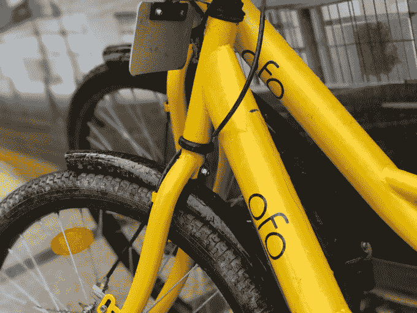

# 滴滴出行向中国自行车共享初创公司宣战 

> 原文：<https://web.archive.org/web/https://techcrunch.com/2018/01/09/didi-declares-war-on-chinas-bike-sharing-startups/>

继上周[收购巴西 99](https://web.archive.org/web/20221208073258/https://beta.techcrunch.com/2018/01/03/didi-confirms-it-has-acquired-99-in-brazil-to-expand-in-latin-america/)之后，中国打车巨头滴滴出行[宣布](https://web.archive.org/web/20221208073258/http://www.didichuxing.com/en/press-news/fp0vdxpk.html)又一重大举措，披露了其自有自行车共享平台的计划。

该平台将整合 Ofo——滴滴是该公司的投资者——以及[陷入财务困境的服务 Bluegogo](https://web.archive.org/web/20221208073258/https://beta.techcrunch.com/2017/11/16/bluegogo-is-reportedly-go-go-going-under/) —滴滴已与其建立联系——以及其他“潜在合作伙伴”。

重要的是，滴滴将推出自己的自行车共享服务——但没有时间表。

这是相当多的消化，但在现实中，一些酝酿的迹象已经显示出来。

去年[滴滴的应用整合了 Ofo](https://web.archive.org/web/20221208073258/https://beta.techcrunch.com/2017/04/27/didi-chuxing-adds-ofo-bike-sharing-to-its-main-app/) 的骑行服务 Ofo 与摩拜单车是世界上最大的自行车共享公司——但中国媒体报道称，两家公司在最近几个月闹翻了。据说这是在滴滴派遣高管到 Ofo 内部工作后，不料他们又回来了，而摩拜单车和 Ofo 通过提供比等待司机更简单的选择，窃取了滴滴的一部分短途乘车服务。

事实上，在 Ofo 的案例中，该公司甚至已经扩展到提供一些类似滴滴的打车服务。

这似乎是 Bluegogo 可能出现的情况。该公司曾是价值 10 亿美元的 Ofo 和 Mobike 的第三大公司，尽管筹集了约 9000 万美元，但在 2017 年底遭遇了金融危机。

该公司在即将关闭的报道中保持沉默，但最近几周有传言称其与滴滴达成协议。滴滴并没有像一些人声称的那样收购该公司，事实上，财务关系并不明确。

我们要求滴滴澄清，但正在等待回音。

> 上海的一辆 Ofo 自行车

该公司今天发布的简短声明称，它已经“与 Bluegogo 就合作安排达成协议。”最明显的部分是将其服务整合到广受欢迎的滴滴应用中，该应用声称拥有 4.5 亿注册用户，服务范围不仅仅是打车，但鉴于 Bluegogo 的问题，你可能会认为它也有一些财务支持。

至于 Bluegogo 的现有用户，他们为这项服务支付了押金，可能认为已经失去了这项服务，滴滴提出将这笔钱转化为其服务的信用。该公司表示，在其新平台上，不会向用户收取自行车服务押金。

当你考虑到一直有 Ofo 和 Mobike 合并的传言时，这一举动是一个耐人寻味的举动。这似乎是推动滴滴此举的原因，滴滴此举对 Ofo 相当有敌意。

否则，滴滴——让我们记住，滴滴是一家据称根据去年 12 月的 40 亿美元融资估值为 560 亿美元的公司——为什么要通过增加一家濒临倒闭的公司来提供更多竞争，从而结束 Ofo 在其应用程序中的独家整合。显然，滴滴担心 Ofo-Mobike 的整合行动，并且已经收购了其最大的竞争对手优步中国，自行车共享可能已被视为其在中国本土业务的主要风险。

你可能会说，整合自行车共享服务有利于公司，当它们出现时，这是真的。但私下里，摩拜单车和 Ofo 会承认，让用户通过自己的应用使用这项服务会让他们有更多的控制权，更不用说进入可能挑战滴滴的新垂直市场的潜力了。有了这样一个包罗万象的平台，滴滴正在争取成为控制局面的守门人。它更希望 Ofo、Mobike 和 Bluegogo 成为其应用程序中的功能，而不是全面竞争，这正是该计划让它们成为的。

我们将不得不看看这个平台如何发展——在这个阶段，滴滴省略了许多重要的细节——但很明显，自行车共享已经从一个很好的补充变成了敌人。

*文章更新更正滴滴投资 Ofo*