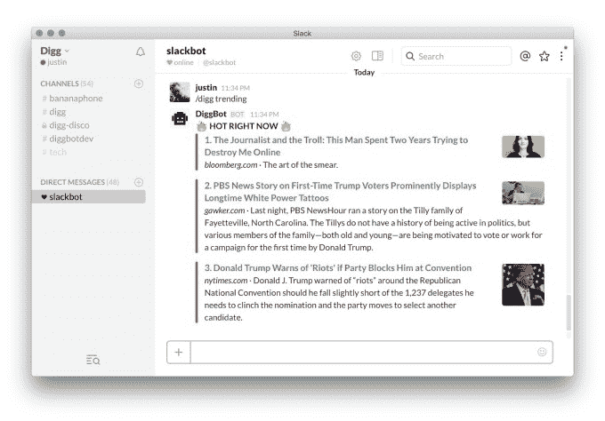
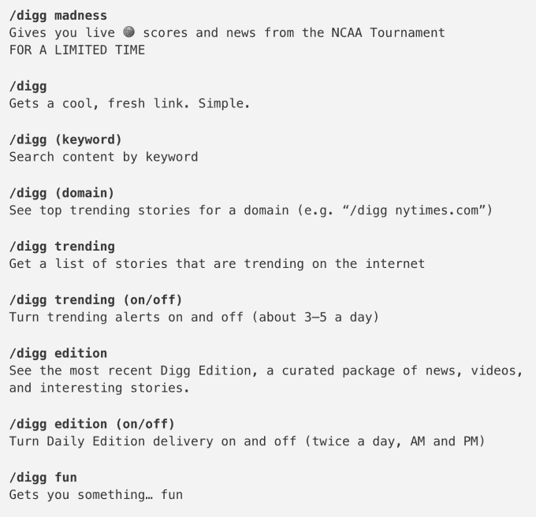

# Digg 为 Slack 发布了一个新闻机器人，很快将应用于其他消息平台 

> 原文：<https://web.archive.org/web/https://techcrunch.com/2016/03/17/digg-unveils-a-news-bot-for-slack-coming-soon-to-other-messaging-platforms/>

# Digg 为 Slack 发布了一个新闻机器人，很快将应用于其他消息平台

新闻聚合器 Digg 可能不再是曾经的互联网力量，但它仍然提供了一个有趣和引人入胜的精选新闻文章和视频，涵盖多个类别，从科学和技术到病毒式互联网迷因。现在，该公司将从 Slack 开始，在消息和通信应用程序中向用户提供这些文章，而不是要求人们直接访问 Digg 的主页。

这项新功能被称为 Digg bot T1，它的推出是新闻和媒体机构([包括 TechCrunch)更大趋势的一部分。](https://web.archive.org/web/20221207182754/https://beta.techcrunch.com/2016/03/15/check-out-the-new-ai-powered-techcrunch-news-bot-on-telegram-messenger/))以更像短信的形式发布新闻。部分受移动用户对短格式内容消费的偏好和消息应用程序的流行的启发，这些机器人的想法是将新闻带到用户在移动设备上花费大部分时间的地方:消息应用程序。

如今，聊天平台上有许多新闻机构的例子，包括 Viber 公共聊天平台上的[赫芬顿邮报、Kik 上的](https://web.archive.org/web/20221207182754/http://chats.viber.com/huffingtonpost) [《华盛顿邮报》、WhatsApp 上的](https://web.archive.org/web/20221207182754/http://blog.kik.com/2015/04/27/washington-post/) [BBC、](https://web.archive.org/web/20221207182754/http://www.bbc.com/news/world-africa-29573964)、 [BuzzFeed on LINE、](https://web.archive.org/web/20221207182754/http://www.buzzfeed.com/bryanthua/chat-with-buzzfeed-on-line)等等。与此同时，Quartz 推出了一款独立的应用程序,感觉就像一个移动信使，以一种互动的、类似聊天的格式传递故事。

那么，看到像 Digg 这样的组织现在加入竞争也就不足为奇了。

该公司表示，其 DiggBot 仍处于早期阶段，但目前它可以根据关键词找到内容，并将全天向您发送它认为有趋势或重要的项目。此外，DiggBot 每天会发送两次文章和视频的摘要包，如果你一直在埋头工作，这会帮助你赶上进度。

要使用这个机器人，你输入“/digg”(无引号)，然后输入一个命令，比如你想搜索的关键词，“趋势”(开/关)，“版本”，“乐趣”，或者其他。它还可以使用关键字“Madness”跟踪 March Madness(见下图)。

该机器人的工作原理是利用 Digg 的聚合内容，包括超过 1000 万个 RSS 源，2 亿条推文，其中 4000 万条包含链接。这导致每天有 750 万篇文章和视频被 Digg 的算法排序，然后由内部编辑团队策划。

发布时，该机器人可以在 Slack 的通信平台上使用，但 Digg 表示，它将“很快”在其他消息服务上推出