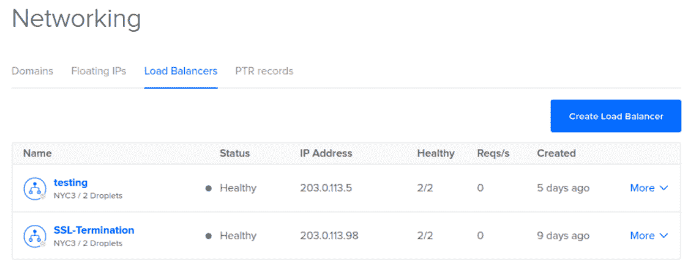

# 数字海洋发布负载平衡器

> 原文：<https://web.archive.org/web/https://techcrunch.com/2017/02/14/digitalocean-launches-load-balancers/>

# 数字海洋推出负载平衡器

DigitalOcean 今天宣布为在其平台上运行应用程序的开发者推出新的负载平衡服务。在很大程度上，这是一个非常简单的产品。像任何负载平衡器一样，DigitalOcean 的版本允许您在多个服务器之间分配连接，从而确保您的应用程序有更好的正常运行时间。这意味着，当流量激增时，横向扩展应用程序变得更加容易，并且没有单点故障(除非您的一个数据库出现故障)。【T2

到目前为止，DigitalOcean 的用户不得不在服务上推出自己的负载平衡设置。现在，这项功能每月收费 20 美元，可以通过公司的仪表板和 API 访问。它支持多种协议，包括 HTTP、HTTPS 和 TCP。至于负载平衡本身，你可以在两种算法中选择:[循环调度](https://web.archive.org/web/20230405201827/https://en.wikipedia.org/wiki/Round-robin_DNS)和[最少连接](https://web.archive.org/web/20230405201827/https://www.citrix.com/blogs/2010/09/02/load-balancing-least-connections/)。

设置这些负载平衡器只需点击几下鼠标。该公司告诉我，配置它们应该不到一分钟。它们还将在 DigitalOcean 全球所有数据中心区域提供。

DigitalOcean 表示，它现在拥有近 100 万注册用户，超过 4 万个团队在积极使用这项服务。该公司早年推出新服务的速度是出了名的慢(主要是因为它花了大部分时间简单地扩展现有服务)，现在开始更加关注满足客户的需求。虽然该公司开始提供基本和廉价的虚拟专用服务器，但现在它正在实现其提供更完整的云计算平台的雄心。在产品方面，这包括去年推出的专用[块存储服务](https://web.archive.org/web/20230405201827/https://www.digitalocean.com/products/storage/)，以及浮动 IP 的引入，这使得在平台上托管更复杂和高可用性的应用程序变得更容易。该公司最近还推出了改进的监控服务[。](https://web.archive.org/web/20230405201827/https://www.digitalocean.com/company/blog/improved-graphs/)