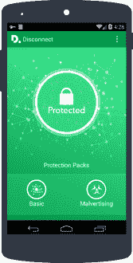

# 断开连接。Me 在欧洲就被禁反恶意软件 Android 应用 TechCrunch 对谷歌提起反垄断诉讼

> 原文：<https://web.archive.org/web/https://techcrunch.com/2015/06/02/disconnect-me-files-antitrust-case-against-google-in-europe-over-banned-anti-malware-android-app/>

随着欧盟委员会[因](https://web.archive.org/web/20221027210307/https://beta.techcrunch.com/2015/04/15/google-shopping-so-android-probe/)[指控](https://web.archive.org/web/20221027210307/http://europa.eu/rapid/press-release_MEMO-15-4782_en.htm)谷歌滥用其在搜索和移动等领域的主导市场地位，为其他在线业务创造反竞争环境，对谷歌施加压力，又一家小初创公司加入了叫嚣犯规的行列。

[Disconnect Inc .](https://web.archive.org/web/20221027210307/http://www.disconnect.me/)——一家由前谷歌员工共同创立的 [B 公司](https://web.archive.org/web/20221027210307/https://beta.techcrunch.com/2013/06/17/disconnect-an-ex-googlers-social-enterpriseprivacy-startup-raises-3-5m-extends-to-more-browsers/)初创公司，旨在开发软件，帮助互联网用户屏蔽广告和其他跟踪他们或可能释放恶意软件的第三方服务——对谷歌提起反垄断诉讼，声称这家安卓巨头滥用其市场地位，禁止 Disconnect 的最新安卓应用程序 [Disconnect Mobile](https://web.archive.org/web/20221027210307/https://disconnect.me/mobile/disconnect-malvertising) 在谷歌 Play 商店上架。

Disconnect.me 在一份声明中表示:“Disconnect 指控谷歌通过禁止 Disconnect 的应用程序滥用其市场主导地位。Disconnect 的应用程序是一项革命性的技术，可以保护用户免受隐形跟踪和恶意广告的影响。”

不出所料，谷歌不这么认为。Android 巨头对投诉做出了回应，称这些指控“毫无根据”，并解释说，断开移动连接违反了其 Google Play 应用政策中的一项具体条款。简而言之，无论 Disconnect 声称在防范恶意软件方面做了什么，它也阻止了应用程序合法赚钱。

> 该公司在提供给 TechCrunch 的一份声明中表示，“这一报道是毫无根据的”。“我们的 Google Play 政策(特别是第 4.4 条)长期以来一直禁止干扰其他应用的应用(例如通过改变它们的功能，或删除它们的赚钱方式)。我们统一应用这一政策 Android 开发者强烈支持这一政策。所有应用程序都必须遵守这些政策，Google Play 中有 200 多个隐私应用程序遵守这些政策。”

Disconnect Mobile 是一款为 iOS 和 Android 开发的免费增值应用程序(高级版本为每月 5 美元或每年 50 美元)，它表示，它是专门为防范恶意软件网站、通过恶意跟踪窃取身份以及伪装成广告的“恶意广告威胁”而设计的。该公司声称这不是反广告。

“我们不反对广告，也理解广告收入对许多互联网公司、出版商和开发商来说至关重要，”Disconnect 联合创始人兼首席执行官凯西·奥本海姆说。“但用户有权保护自己免受隐形跟踪和恶意软件的攻击，这两者都将敏感的个人信息置于风险之中。广告不一定要侵犯用户隐私和安全。”它引用了具体的研究来证明其应用的合理性，这些研究强调了安卓应用中未披露的追踪风险。

Disconnect [始于 2010 年，当时联合创始人 Brian Kennish 还在谷歌工作，当时它是一个兼职项目](https://web.archive.org/web/20221027210307/https://beta.techcrunch.com/2010/10/20/google-facebook-disconnec/)，专门用来拦截脸书的广告。

从那以后，它继续从高地资本(Highland Capital)和 CRV 等投资者那里筹集资金——410 万美元(按硅谷的标准来说并不多)——并获得了超过 1000 万用户的各种桌面扩展和移动应用。(前律师、长期倡导隐私和社会公正的奥本海姆表示，在这个过程中，谷歌的两位前联合创始人肯尼什和奥斯汀·周(Austin Chau)已经转向其他项目，但仍是谷歌的“朋友”。)

谷歌屏蔽断开手机本身并不是新闻。

这款应用在去年发布到 Google Play 时曾两次被封禁。在谷歌就此事威胁要完全移除其开发者账户后——Disconnect 目前仍通过 Google Play 向[提供另外两个安卓应用——Disconnect 决定采取不同的方式，于 2014 年 11 月推出了修改版。](https://web.archive.org/web/20221027210307/https://play.google.com/store/apps/developer?id=Disconnect%2C%20Inc.&hl=en)

Android 版的 Disconnect Mobile 现在通过自己的网站以及与其他网站合作，作为一个侧装选项提供。在欧洲，它与德国电信有分销协议，并且与 T4 的 Blackphone 有预装协议。

Oppenheim 说，但 Disconnect Mobile 很可能没有弥补 Disconnect 认为如果它直接在 Google Play 上提供就会有的曝光率，特别是与它在 iOS 上的下载相比。(在那里，Disconnect Mobile 可能会与数百款其他安全和隐私应用并列，但 Google Play 的曝光率仍然高于这家初创公司的其他分销渠道。)

Oppenheim 表示，Disconnect 还没有向公众发布完整的投诉，所以我们不知道它通过侧装和预安装交易看到了多少 Android 应用程序的下载。

其他细节，比如要求什么样的赔偿，也不完全清楚。

“我们想要律师所说的‘平等待遇’，”奥本海姆在回答他的公司是否寻求损害赔偿的问题时告诉我。“我们希望 Android 用户能够通过 Play Store 快速轻松地获得我们的产品，我们希望得到谷歌的全面支持，就像商店中的其他应用程序一样。”

如今，Disconnect 正抓住机会，在欧盟牵头的更广泛调查的同时，在欧洲提起诉讼。虽然很快就会引用美国参议院的研究报告，强调在线广告在数据隐私和安全方面的危害，但 Disconnect Inc .目前没有在美国或任何其他市场提起任何投诉。

时间，以及此次投诉的潜在结果——可能会与 FairSearch.org 财团和 Yelp 等其他方的现有反垄断投诉合并；或者单独处理，因为它特别涉及广告跟踪技术；或者完全拒绝——将决定 Disconnect 是否会在监管方面与谷歌进一步合作。