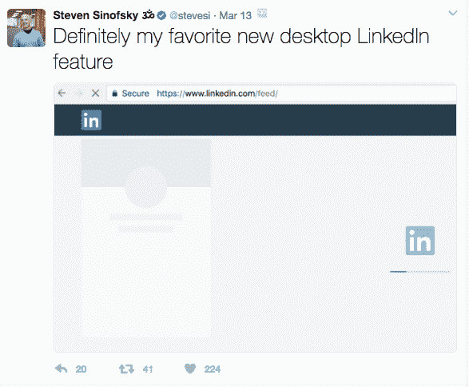

# 内容交付网络世界中的不满和混乱 

> 原文：<https://web.archive.org/web/https://techcrunch.com/2017/06/01/discontent-and-disruption-in-the-world-of-content-delivery-networks/>

摩哂陀·拉姆辛哈尼撰稿人

[Mahendra Ramsinghani](https://web.archive.org/web/20230110185439/https://www.linkedin.com/in/mahendraram)

是的创始人

[Secure Octane Investments](www.secureoctane.com)

，投资云基础设施和安全初创公司。不投资的时候，他就忙着写博客，写书。他的第三本书《坚韧的创始人》将于 2022 年出版。

More posts by this contributor

随着内容交付网络(CDN)市场领导者如 [Akamai](https://web.archive.org/web/20230110185439/https://www.akamai.com/) 和 [Cloudflare](https://web.archive.org/web/20230110185439/https://www.cloudflare.com/) 努力应对技术转变，一些创新者如 [Teridion](https://web.archive.org/web/20230110185439/https://www.teridion.com/) 、 [Signal Sciences](https://web.archive.org/web/20230110185439/https://www.signalsciences.com/) 和 [Section.io](https://web.archive.org/web/20230110185439/http://www.section.io/) (我是其中的投资者)正在取得快速进步。

CDN 市场目前估计为 50 亿美元，预计到 2019 年将超过 100 亿美元。在市场快速增长的同时，巨头们能学会跳舞吗？创业公司如何瞄准传统的巨人？像 [StackPath](https://web.archive.org/web/20230110185439/https://www.stackpath.com/) 这样的新来者旨在通过提供“安全第一”的 CDN 来赢得竞争，在#CloudBleed 之后，这可以成为一种营销优势。最重要的是，房间里的大象——亚马逊 CloudFront——将如何践踏所有的独角兽？

## 回顾:CDNs 简史

CDNs 的第一波浪潮始于大约 20 年前的 1998 年 Akamai。cdn 旨在加速网络内容。在带宽受限的世界里，交付速度受到多种因素的影响，包括页面内容和流量的有效路由。经历大量网络流量的网络公司需要一种可靠、快速的机制来确保不间断的服务。Akamai 承诺了这一切，甚至更多。

Akamai 上市不到一年，就上市了，苹果电脑成为了它的标志客户。当时，苹果公司占其 120 万美元总收入的 45%。[风头网络](https://web.archive.org/web/20230110185439/https://www.limelight.com/)是 Akamai 的快速追随者，于 2001 年推出。它于 2007 年上市，但一直未能赶上 Akamai。2016 年，Akamai 的收入为 23 亿美元，市值超过 100 亿美元。(2016 年，风头网络公司的收入为 1.7 亿美元，市值为 2.9 亿美元。私人股本公司，请注意。)

随着时间的推移，网站变得更加动态和臃肿，我们进入了 SaaS /应用时代。然后，云计算和移动性的转变改变了内容交付和消费的方式。CDNs 开始缓解 DDOS 攻击。再加上日益增长的安全需求，CDN 的世界正在慢慢地但肯定地被打破。

亚马逊在 2008 年推出了自己的 CDN，CloudFront。Cloudflare 大约在 2009 年开始提供内容交付、安全性和分析。2011 年，Fastly 启动了新一轮 5000 万美元的融资。StackPath 单轮融资 1.8 亿美元，扰乱 CDN 市场。其首席执行官兰斯·克罗斯比是个坏蛋，他创立了 SoftLayer，并以 20 亿美元的价格将其卖给了 IBM。有了这种退出方式，兰斯更容易筹集到 1.8 亿美元的战争资金。

| 公司 | 开始年份 | 筹集的资本 | 投资者 |
| 云耀斑 | 2009 年 7 月 | 1.82 亿美元 | NEA，联合广场投资公司，富达 |
| 快速地 | 2011 年 3 月 | 1.79 亿美元 | Battery Ventures，August Capital，Iconiq，Sapphire Ventures |
| 堆栈路径 | 2015 | 1.8 亿美元 | 亲密的伙伴 |

这些新来者给 Akamai 制造了麻烦，侵蚀了它的利润，不断压低价格。akamai 2016 年的媒体交付解决方案收入同比下降 9%。随着 CDNs 供需曲线的移动，客户享受到了 20-40%的价格下降。

## 应对变化

随着我们进入新的应用/开发运维驱动的世界，开发人员将推动下一代 CDN 的消费。动态微服务、持续集成/持续交付(CI/CD)以及性能和安全性仍然是重中之重。

让我们来看看一些技术转变:

**臃肿的网页:**我们胖了，越来越胖。据 httparchive.org[报道，在过去的五年里，每个网页的平均字节增长了 3 倍，达到 2.4 兆字节。](https://web.archive.org/web/20230110185439/http://httparchive.org/)

Akamai 的一项研究显示，在两年 的时间里，台式机的网页加载时间增加了 63.8%，从 7.2 秒(2013 年)增加到 11.8 秒(2015 年)。当谈到动态内容，定制以增强用户体验，所有的赌注都关闭了。前微软视窗部门总裁史蒂文·辛诺夫斯基最近在推特上称 LinkedIn 的慢加载时间是他“最喜欢的新功能”

**视频的增长:**随着 cdn 试图提供臃肿的页面，内容的类型已经发生了变化。对视频/直播/动态应用内容的需求持续增长。到 2020 年，视频有望增长 4 倍，届时思科预计 82%的 IP 流量将是视频流量。从 2015 年到 2020 年，繁忙时段互联网流量( 晚上 7 点到 11 点 )的视频消费预计将增长近 5 倍。动态内容和带宽峰值是新的 CDN 游戏，远离静态缓存内容。

**移动消费增长:**到 2020 年，预计约 30%的流量将来自智能手机。移动网站的平均加载时间要糟糕得多——3G 连接的平均加载时间为 19 秒。在 2016 年 9 月的一项名为“[对移动速度的需求](https://web.archive.org/web/20230110185439/https://www.doubleclickbygoogle.com/articles/mobile-speed-matters/)”的研究中，谷歌发现，如果页面加载时间超过三秒，53%的移动网站访问就会被放弃。该数据基于对超过 10，000 个移动网络域名的分析，表明移动网站在 5 秒内加载的移动广告收入是那些网站在 19 秒内加载的移动广告收入的两倍。

因此，出版商被鼓励加快速度。我们都知道亚马逊网页加载时间的[一秒钟的延迟可能会烧掉 16 亿美元的销售额。加速移动内容是 cdn 的一大难题。](https://web.archive.org/web/20230110185439/https://www.fastcompany.com/1825005/how-one-second-could-cost-amazon-16-billion-sales)

未来不太远的是游戏、VR/AR 和物联网公司。这是一个变化的时代——而且变得越来越混乱。这种技术变革迫使 cdn 在处理动态内容的同时提高速度。

优化不同网络路径(ISP、3G、移动)上的流量路由，平衡负载/峰值需求并确保安全性现在是 cdn 的期望。虽然传统 cdn 反应缓慢，但一些新贵正在解决流量优化、下一代 WAF 和 DevOps 友好型 cdn 的问题。

**路由优化:**互联网流量的路由由古老的边界网关协议(BGP)决定，该协议不考虑数据路由的时间因素。它只查看两个网络之间的跳数。但是跳数最少的路由拥塞了怎么办？还是协议选择了一条物理上更长的路由？

例如，一个数据包可能从旧金山经过巴西到达洛杉矶。如果有一条多跳但更快的路由会怎么样？BGP 在可靠性方面做得非常好。这是构建互联网的基础技术，但从延迟(延迟、抖动和图像冻结)的角度来看，BGP 不是最佳的。

[Teridion](https://web.archive.org/web/20230110185439/https://www.teridion.com/) 就像“互联网流量的 Waze ”,使用第三方云优化流量路线。其平台有助于做出实时分组路由决策，以避免拥塞路径。与 cdn 不同，其解决方案可按需扩展，不受上游通信、预配置 pop、地理位置或云提供商的限制。因此，调配要快得多。由于没有数据缓存，因此不存在 SSL 证书管理、安全性和合规性问题。它延伸到云交付服务的每一个最终用户。

Teridion 的首席执行官克里斯·基恩(Chris Keene)说，“当你增加更多加速选项时，每个选项都有其自身的安全影响和可能的权衡。有些公司不想共享 SSL 证书，放弃了他们王国的钥匙。cdn 对这类公司没什么作用。”

企业文件同步和共享(EFSS)新贵 Egnyte 击败了一些文件共享公司巨头，如 Box、Citrix、谷歌和微软。它比 Box 快 30 %,对于较大的 4GB 文件快 60%。

在 IDC 对文件共享和存储供应商同步性能的研究中，Egnyte 是获得高分的顶级供应商之一。Egnyte 的联合创始人克里斯·拉希里(Kris Lahiri)说:“IDC 速度测试考察了本地客户端和云之间‘同步’内容的时间。这是双向的，因此端点上的任何更改都需要尽快同步。我们使用了强大的网络套接字连接、智能客户端和 Teridion 的网络加速。IDC 观察到的结果反映了所有这些不同的优化。”

与传统的 CDN 路径不同，Egnyte 创建了自己的 pop，并与 Teridion 合作，以不断优化的方式动态优化路由。在这种情况下，不需要 SSL 卸载，这减少了潜在的攻击面。

[451 Research](https://web.archive.org/web/20230110185439/https://451research.com/analyst-team/analyst/Peter+Christy)的 Peter Christy 指出，Teridion 是聪明的非显而易见的技术，对于任何 CDN 来说，复制它都需要时间和努力。“即便如此，它最初也可能是次等的。然后将需要时间和精力来操作、维护和改进这样的产品。”虽然优化路由是 CDN 的创新领域之一，但安全是另一个热门领域。

## 内容+安全=更好的 CDN

CDNs 通过提供 DDoS 保护进军安全领域。一个站点可能会因为大量的请求而关闭。有了面向流量的 CDN，可以在线分析和清理网络流量模式。最近，cdn 开始提供 Web 应用防火墙(WAF)和 bot 缓解。企业客户现在依靠 cdn 来管理网络安全。Akamai 的云安全解决方案 2016 年收入同比增长 43%。

虽然 cdn 的目标是提高安全性，但 cdn 本身也容易受到攻击。在他的博客文章中，大卫·赫伯斯写了几个 CDN 安全挑战，包括动态内容攻击、基于 SSL 的攻击和直接 IP 攻击。最近的 Cloudbleed 事件表明，基础架构的复杂性是有代价的。451 Research 的 Peter Christy 说:“Cloudbleed 很可怕，因为它泄露了一些 Cloudflare 客户的私人信息。我敢肯定，大多数人都认为这是不可能的。”

Cloudbleed 和最近的 AWS S3 问题都是很好的老“错误”——复杂系统之间的长期交互，经常被忽视。Cloudbleed 和 heart bleed(2014 年的一个错误)就是本应被屏蔽的客户数据被泄露的例子。

在另一项研究中，16 个 cdn 在模拟的[转发环路攻击](https://web.archive.org/web/20230110185439/https://www.kb.cert.org/vuls/id/938151)中失败。在这里，任何 CDN 的恶意客户都可以在 CDN 内部创建转发循环。转发循环会导致 cdn 重复处理一个客户端请求，从而有效地发起针对 cdn 的 DoS 攻击。

到目前为止，针对网站的 DDoS 攻击是众所周知的，但这是第一次一个客户对 CDN 本身发起 DoS 攻击。注册一个 CDN 并获得一个免费帐户通常很容易。发起前循环攻击并不太难。

Andrew Petersen， [Signal Sciences](https://web.archive.org/web/20230110185439/https://www.signalsciences.com/) 的首席执行官，正在为 DevOps 世界构建结合了安全性和可用性的下一代网络访问防火墙(WAF)。Andrew 和他的团队在 Etsy 经历过这些挑战后，采取了自下而上的方法。

“cdn 无法部署在内部应用上。由于必须使用多种安全工具，快速管理变得更加困难。如果我们退一步讲，CDNs 的主要关注点是速度。从哲学和技术上来说，这造成了性能的损失。

Signal Sciences 的联合创始人赞·莱基在他的博客文章中指出了 cdn 可能难以解决的六大挑战。由于成本和体系结构的限制，开发环境不太可能具有与生产环境相同的配置。

由于这些环境不匹配，基于 CDN 的 WAF 经常会在生产中触发假阳性，这在开发中是完全不可再现的。这种级别的故障调试令人沮丧，因为对 CDN 控制台的访问仅限于运营团队。实际上，基于 CDN 的 WAF 对那些追求 DevOps 的人来说不是很友好。

## 从集中到分散:云成为边缘

市场研究出版物 [Bizety](https://web.archive.org/web/20230110185439/https://www.bizety.com/) 的主编 Ernie Regalado 说:“边缘安全作为一种商业模式已经起飞，并且是行业中增长最快的部分。像 [Cloudflare](https://web.archive.org/web/20230110185439/https://www.cloudflare.com/) 、 [Incapsula](https://web.archive.org/web/20230110185439/https://www.incapsula.com/) 和[distilt Networks](https://web.archive.org/web/20230110185439/https://www.distilnetworks.com/)这样的公司正在推动提供 DDoS 缓解、WAF 和 Bot 缓解。”Fastly 的首席安全官 Window Snyder 也表达了同样的观点，“我们可以看到数据/流量模式，了解漏洞，并可以增强边缘安全性，以特定的方式进一步保护我们的客户。”

在这种典型的创新者困境中，新来者可以从头开始，而现有者可以凭借自己的优势开展工作。 [Fastly 最近宣布了一轮 5000 万美元的融资](https://web.archive.org/web/20230110185439/https://techcrunch.com/2017/05/23/marching-to-pied-pipers-fictional-tune-fastly-raises-50-million/)，声称年运营率为 1 亿美元。然而，如果另一个“边缘 CDN”堆栈路径继续其战争路径，快速可能会变得缓慢。StackPath 在 25 个城市拥有 45 个 pop，通过五次收购(包括 MaxCDN 和 Highwinds)快速发展，提供集成的加速和安全性。

现代的 CDN 应该做得更多(图片提供:StackPath)

StackPath 生态系统开发副总裁 James Leaverton 表示:“传统 cdn 尚未准备好向在线视频和物联网转变。他们有弗兰肯斯坦平台——一个用户可能需要登录十几个不同的门户网站。他们拥有针对 CDN 进行了优化的老化基础设施，但不是为适应或扩展而构建的。这就是我们这样的公司存在的原因。StackPath 平台是对由太多交付和安全解决方案造成的分散问题的综合响应。”

## DevOps 友好的 CDN

随着开发人员成为一些初创公司的主要关注点，一个位于科罗拉多州的 DevOps 友好型 CDN， [Section.io](https://web.archive.org/web/20230110185439/https://www.section.io/) ，正在缓慢但稳步地扎根。(披露:我是 Section.io 的投资者，通过[安全辛烷](https://web.archive.org/web/20230110185439/http://www.secureoctane.com/)种子基金。)

在 Techstars Ventures 的支持下，Section.io 首席执行官 Stewart McGrath 希望为开发者搭建一个平台。开发团队需要新的控制工具和灵活性来准备和测试他们的内容。“在投入生产之前，他们真的不知道网站将如何运行。一旦进入生产阶段，你就需要可见性/指标，”Stewart 说。

为了管理流量，cdn 使用不同类型的反向代理，如 squid 缓存、Nginx 或 Varnish 缓存。在容器化的环境中，您可能有多个反向代理可供选择。在他名为[cdn 正在消亡](https://web.archive.org/web/20230110185439/https://www.section.io/blog/cdns-are-dying/)的博客文章中，Stewart 认为工程师不应该感到在任何时候都被锁在任何一个代理软件栈中。相反，他们应该能够挑选最适合他们网站的工具。

多租户还允许隔离，降低了污染风险。Section.io 旨在将代理软件从网络中分离出来，并采用软件驱动的方法来配置、管理和部署反向代理。“我们相信这是网络应用交付平台的未来。“开发人员可以完全控制反向代理配置，并在测试环境中进行实验，”Stewart 说。

安装、测试、性能和故障排除的简易性改变了开发人员端到端管理其流程的方式。对于传统的 cdn，从长远来看，这将是一个挑战。

随着技术需求的发展，创新者通常能够提供更好的解决方案并拓展某些市场。[Bizety 的 Ernie Regalado 写道](https://web.archive.org/web/20230110185439/https://www.bizety.com/2015/08/15/cdn-market-size-in-2015-and-2019-2/)CDN 市场可能会更大，特别是当饥饿的 CDN 侵入其他技术领域寻求新的收入来源时。他预计，到 2019 年，整个市场将增长至 120 亿美元。

这是由几个市场之间的融合(或冲突)驱动的，例如 CDNs、多协议标签交换(MPLS)、软件定义广域网(SD-WAN)市场和云无线接入网络(RAN)市场。像[卡托网络](https://web.archive.org/web/20230110185439/http://www.catonetworks.com/)、[阿里亚卡](https://web.archive.org/web/20230110185439/http://www.aryaka.com/)和 [Versa 网络](https://web.archive.org/web/20230110185439/http://www.versa-networks.com/)这样的公司已经筹集了大量的资金，并且正在这些领域大步前进。

## 对赢家下注

一方面，像脸书、网飞、潘多拉甚至苹果这样的网络公司已经转向管理他们自己的内容交付。遗留 cdn 除了发展别无选择。巨型阿卡迈应该担心从西雅图吹来的冷锋吗？根据 Datanyze 对 CDN 市场的研究， AWS CloudFront 正在从市场底部崛起，并在 Alexa 前 100 万个域中领先，而 Akamai 在前 100 个域中表现强劲。

|  | Akamai 域的数量 | AWS CloudFront 域的数量 |
| Alexa 百强 | 20 | 8 |
| Alexa Top 1000 | 182 | 79 |
| Alexa 前 10 万 | 3004 | 6275 |
| Alexa Top 100 万 | 8,738 | 35,902 |

与此同时，亚马逊稳步前进，在 2015 年添加了 AWS WAF，在 2016 年添加了 AWS Shield (DDoS 缓解)。这场战斗如何收场仍有待观察。Ernie Regalado 说:“AWS 是集中式云计算服务的主要提供商。Akamai 是边缘服务的领导者，包括交付、安全和流媒体。随着处理、数据和业务逻辑向边缘移动，Akamai 拥有优势，甚至可以扰乱 AWS。”

Cloudflare、StackPath 和 Fastly 已经筹集了足够的资金。谁会被收购或上市还有待观察。我的直觉是，Lance 的目标是 StackPath 的首次公开募股——他不太可能满足于任何更低的目标，尤其是知道他上次退出是 20 亿美元的结果。这可能会给 Cloudflare 和 Fastly 带来一些心痛。像 Distil Networks、Section.io、Teridion 和 Signal Sciences 这样的年轻的土耳其人可以筹集很多资金，成为独立的公司。

随着网络与“软件驱动的一切”融合，电信运营商和服务提供商可能会采取一些行动。无论风向如何，那些令人羡慕的灵活者/创新者将会胜出。