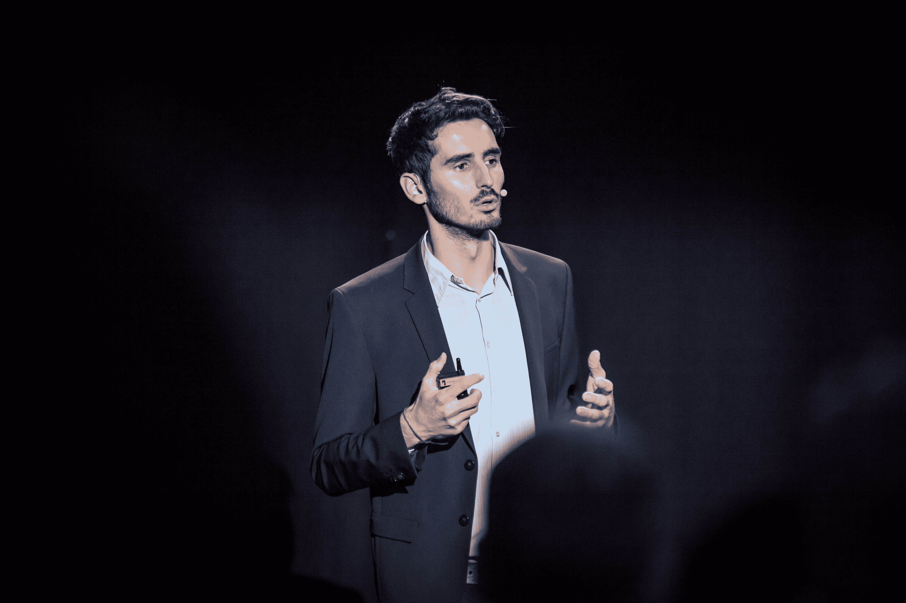

# 在 Disrupt Berlin TechCrunch 了解索诺汽车公司对电动汽车的展望

> 原文：<https://web.archive.org/web/https://techcrunch.com/2018/09/13/discover-sono-motors-vision-of-the-electric-car-at-disrupt-berlin/>

# 在柏林车展上探索索诺汽车公司对电动汽车的愿景

新的汽车制造商不断涌现。但是德国公司[索诺汽车](https://web.archive.org/web/20221208211224/https://sonomotors.com/)并没有创造另一家类似特斯拉的公司，而是致力于一种全新的东西——太阳能汽车。这就是为什么我很兴奋地宣布公司的联合创始人兼首席执行官[劳林·哈恩](https://web.archive.org/web/20221208211224/https://www.crunchbase.com/person/laurin-hahn)将加入我们在 [TechCrunch Disrupt Berlin](https://web.archive.org/web/20221208211224/https://techcrunch.com/events/disrupt-berlin-2018/tickets) 的活动。

索诺汽车公司多年来一直致力于其第一款汽车 Sion。该公司现在有几辆原型车在路上，并正在完善其制造流程，以便将这些汽车运送给预订的客户。

该公司首先将重点放在紧凑型汽车上，推出 Sion。这辆车看起来更像大众高尔夫，而不是奔驰 E 级。考虑到太阳能汽车不是普通的汽车，这很有意义。

汽车行业的人会告诉你，汽车在 90%或 95%的时间里都是停着的。虽然很难找到确切的数字，但你不会每天都去公路旅行，这是事实。

许多人开车去上班。这通常是一个快速骑行，你只需要在早上和晚上你的车。锡永很适合这个。航程 250 公里(155 英里)，通常可以来回行驶相当多的距离。

每天，你都可以使用太阳能电池板增加 30 公里的续航里程。这可能足够让你永远不用给你的车充电了。但是如果电量不足，你仍然可以像其他电动汽车一样给你的汽车充电。

许多人已经有了一辆大型汽车，可以在周末和更长的时间里出行。在这种情况下，Sion 可以成为您出差和日常驾驶的第二辆好车。对于公共交通选择不多的中等城市来说，这可能很有用。

索诺汽车公司从第一天起就知道，汽车制造商也需要成为一家服务公司。你可以和其他用户分享你的车，并获得报酬。

还有许多其他雄心勃勃的功能，我没有在这里列出。很明显，哈恩将在扰乱柏林的舞台上讲述一个有趣的故事。从零开始建立一个汽车制造商听起来也是一个疯狂的想法。

TechCrunch 将重返柏林，与来自欧洲和世界其他地方的最优秀、最聪明的技术人才进行交流。除了炉边聊天和小组讨论，新的创业公司将参加欧洲战场创业公司，赢得梦寐以求的奖杯。

[拿起您的票，扰乱柏林](https://web.archive.org/web/20221208211224/https://techcrunch.com/events/disrupt-berlin-2018/tickets "Grab your ticket")聆听索诺汽车公司的故事。会议将于 11 月 29 日至 30 日举行。

