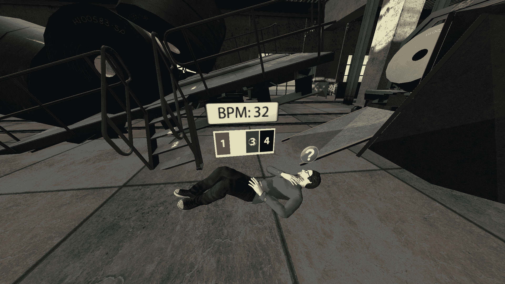
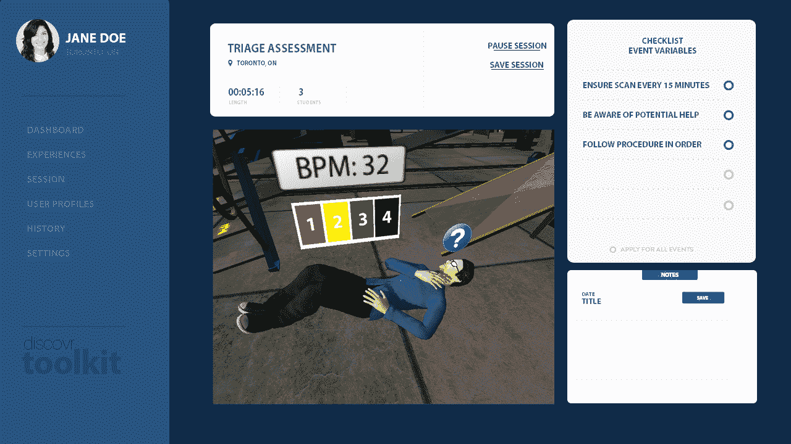

# Discovr Labs 将虚拟现实带入课堂，让教师看到学生看到的内容 

> 原文：<https://web.archive.org/web/https://techcrunch.com/2015/09/21/discovr-labs-brings-virtual-reality-to-the-classroom-lets-teachers-see-what-students-see/>

# Discovr 实验室将虚拟现实带入课堂，让教师看到学生看到的东西

作为消费者，我们倾向于关注虚拟现实将如何在我们的家中工作——它允许的新类型的游戏，疯狂的 360 度电影体验，等等。

然而，虚拟现实的一些最大潜力不是在家里，而是在教室里。见鬼，你可以把 VR 作为学习工具的潜力浓缩成三个字:[魔法。该死的。校车。](https://web.archive.org/web/20221210022318/https://en.wikipedia.org/wiki/The_Magic_School_Bus_(TV_series))想想在不可能的地方，由一名教练带领的集体经历，然后嘭:这一切都合情合理。

Discovr Labs，一家 Disrupt SF 战地 2015 公司，正在采取第一步将其带入课堂。

[discover Labs](https://web.archive.org/web/20221210022318/http://discovrlearning.com/)已经建立了一个界面和技术来帮助教师使用 vr 作为教学工具。在学生戴上耳机后，Discovr 允许教师选择学生正在与哪个模块进行交互，并准确地看到学生看到的内容；从耳机到全方位可视界面，一切都是无线传输的。

学生可能会在他们的耳机中看到这样的东西:

老师会在他们的监视器上看到这样的内容:

Discovr 首先关注特定的高技能行业的课程计划，即医疗保健和药物治疗。他们请来了领域专家，帮助他们针对客户要求的主题建立课程，然后将这些课程授权给学校和企业。

Discovr 首席执行官乔希·马尔多纳多(Josh Maldonado)向我介绍了这样一种体验:一款应用程序旨在帮助培训医院工作人员如何根据受伤的严重程度以及呼吸频率和肢体语言等更微妙的线索来优先考虑住院病人。

在我戴上三星 Galaxy Gear VR 后，一系列患者在我的视野中出现了快速开火。我不得不迅速判断每一个人的状况，从 1 到 4(4 是最严重的)对他们进行排序，方法是看一眼漂浮在病人附近的适当数字，然后点击设备的内置触摸板。

与此同时，马尔多纳多能够实时帮助我；我看到的一切，他都看到了，用 Galaxy Gear VR 传送从我的耳机到他的笔记本电脑的一切。

目前，Discovr 专注于本地体验，所有的学生和老师在同一个房间里。展望未来，他们设想远程体验，学生和他们的老师可以在虚拟现实体验中走到一起，而不管他们的物理位置。

Discovr Labs 由马尔多纳多在加拿大多伦多创立；到目前为止，他们只筹集了一小笔种子资金，投资来自 Rothernberg Ventures 的虚拟现实加速器。