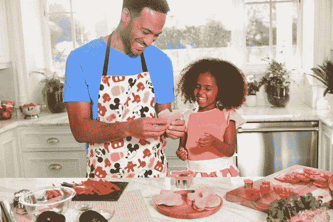

# 迪士尼数字将推出面向千禧一代的超高端视频应用，以吸引被 YouTube TechCrunch 炒掉的广告客户

> 原文：<https://web.archive.org/web/https://techcrunch.com/2018/05/01/disney-digital-to-launch-an-over-the-top-video-app-for-millennials-as-it-woos-advertisers-burned-by-youtube/>

在迪士尼的网飞竞争对手 2019 年推出之前，该公司的数字部门将在今年夏天的某个时候推出一款针对千禧一代的免费视频应用。该公司表示，这款广告支持的应用程序来自迪士尼的编辑品牌“哦，我的迪士尼”，将提供迪士尼社交内容和其他来自“哦，我的迪士尼”的短片视频节目，以及迪士尼数字网络的编辑声音和制造商创作者及合作伙伴。

对广告商来说，他们将有办法接触到迪士尼的千禧一代观众，而不用担心最近几个月困扰 YouTube 的问题。

这一消息是在今天上午迪士尼数字网络在纽约举行的 NewFronts 演示会上宣布的，迪士尼通过新的“品牌安全”属性瞄准年轻人口的能力是一大焦点。传达的信息很明确:在围绕 YouTube 不当内容的争议之后——这导致[几个大品牌冻结了它们的 YouTube 广告](https://web.archive.org/web/20221207181007/https://techcrunch.com/2017/11/27/youtube-faces-brand-freeze-over-ads-and-obscene-comments-on-videos-of-kids/)——迪士尼将其数字网络平台定位为一个安全的替代方案。

DDN 于 2017 年推出，作为服务于千禧一代和 Z 世代观众的数字财产的家园。今天的网络由编辑网站组成，如 Oh My Disney、Disney Style、Babble 等。其受众加起来有 13 亿粉丝。

“我们知道，我们的客户和广告商正在寻找独特、引人注目、品牌安全和多样化的方式来大规模接触观众，”迪士尼|ABC 广告销售和营销总监 Rita Ferro 表示。“迪士尼数字网络仅在去年一年就为广告商创造了业绩，证明我们正在满足这些需求，”她说。

该公司希望千禧一代和 Z 'ers 一代也想购买迪士尼服装和其他产品，因为该品牌通过新的流媒体视频应用程序获得了动力。为了迎合这些年轻的购物者，哦，我的迪士尼正在迪士尼商店和在线商店迪士尼电子商务网站上获得自己的[系列产品](https://web.archive.org/web/20221207181007/https://www.shopdisney.com/collections/oh-my-disney-collection)——如马克杯、Ariel 紧身裤和美人鱼毛巾。

除了新的视频应用程序，DDN 还宣布了其最新品牌“迪士尼美食”(Disney Eats)，这将庆祝迪士尼公园提供的食物——其中一些已经发展了自己的狂热追随者，如[多尔·皮普斯](https://web.archive.org/web/20221207181007/http://www.disneytouristblog.com/dole-whip/)——以及其他迪士尼主题的食谱。该社区将展示来自食品影响者和其他 DDN 编辑声音的内容和视频，还将探索烹饪产品的世界。该品牌将专注于有孩子的家庭(T4)。

迪士尼 Eats 与 Tastemade 合作制作原创视频系列，将迪士尼知识产权引入 Tastemade 品牌。

DDN 还推出了一系列新的系列和其他数字节目，包括新的迪士尼 Eats x Tastemade 内容，新的“哦，我的迪士尼”播客，回归俱乐部米老鼠，以及其他跨迪士尼风格的节目(一个 [Facebook 观看秀](https://web.archive.org/web/20221207181007/https://www.facebook.com/designingdisneystyle/videos/406188583177025/))、Babble 和迪士尼家庭。

当然，还有一些新的“星球大战”内容，通过“粉丝的星球大战季节”跨平台活动。这以一部新的纪录片《我们的星球大战故事》拉开序幕，该片突出了影迷们令人印象深刻的壮举。接下来是“星球大战影迷奖”(之前称为“星球大战影迷电影奖”)，以及在一场特别的“星球大战秀”上颁发获奖者。