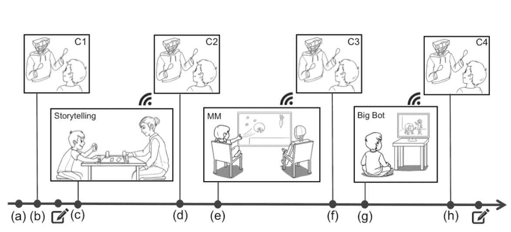
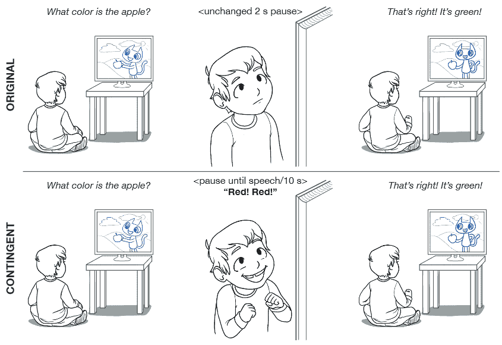

# 迪士尼实验旨在让孩子与机器人的互动更加自然 

> 原文：<https://web.archive.org/web/https://techcrunch.com/2017/06/26/disney-experiments-look-to-make-kid-robot-interactions-more-natural/>

迟早，我们的孩子将由机器人抚养，因此，作为机器人和儿童相关商品的供应商，迪士尼自然希望走在这一趋势的前面。其研究部门的三项研究旨在了解和改善儿童如何与机器人和其他相当智能的机器交谈或互动。

这三项研究作为一个整体同时进行，每一部分分别记录在今天发布的论文中。研究中的孩子们(大约 80 人)进行了一系列通常与讲故事和口语互动相关的简短活动，实验人员仔细记录了他们的进展。

 首先，他们被介绍给一个名为 Piper 的机器人(自然，他们是单独参加实验的)，这个机器人由另一个房间的操纵木偶的人远程控制(“巫师”)，但有一组记录的反应，这些反应来自不同的实验条件。这个想法是，机器人应该利用它所知道的来告知它说什么和它如何说，但还不清楚这应该如何工作，特别是对孩子。[正如研究人员所说](https://web.archive.org/web/20221025221953/https://www.disneyresearch.com/publication/persistent-memory-in-repeated-child-robot-conversations/):

> 随着人机对话面临长期互动的挑战，理解如何利用之前的对话来培养关系感是关键，因为机器人是否记得我们说过的话，以及它们如何和何时暴露这种记忆，将有助于我们对它们的感觉。

打招呼后，孩子们参加了一个合作讲故事的活动，这是他们自己的实验。研究人员这样描述这一活动背后的原因:

> 尽管最近取得了进展，但人工智能在识别儿童语音和理解自然语言语义方面仍不完善。不完善的语音识别和自然语言理解意味着机器人可能不会以语义连贯的方式对儿童做出反应。由于这些阻碍因素，流畅的儿童-机器人协作讲故事是否可行，或者是否被儿童视为有价值，仍然是一个悬而未决的问题。

一名实验者，本质上是坐在一个理论上的合作人工智能中，向两人即兴创作的故事中添加角色——有些情况下是根据故事的背景(“他们在洞穴中发现了一只小猫”)，有些情况下是随机的(“给故事添加一只小猫”)。我们的目标是了解哪些孩子更投入，以及每个孩子何时更适合使用某个应用程序或设备。

更小的孩子和男孩在得到上下文的补充时会绊倒，大概是因为他们需要一些思考来理解和整合——所以在与他们互动时可能会反应过度。

[接下来是另一项活动(与机器人的合作游戏)，之后是类似的互动和类似的不同反应。](https://web.archive.org/web/20221025221953/https://beta.techcrunch.com/wp-content/uploads/2017/06/collabstory.png)

接下来是第三个实验，最好总结为“如果爱探险的朵拉能听到你回答她的问题，会发生什么？”

【T2

> 随着儿童开始在允许互动的系统(如平板电脑和视频游戏系统)上观看更多的电视节目，有不同的机会让他们参与进来…我们进行了三项研究，以检查准确的节目响应时间、重复未回答的问题以及提供关于儿童响应可能性的反馈的影响。

不是仅仅等待几秒钟，在此期间孩子可能会说什么，也可能不会说什么，而是等待(最多 10 秒钟)回应，然后继续，或者提示他们再次回答。等待和提示肯定会提高回复率，但是当反馈包括在内时，效果并不明显，例如指出一个错误的答案。

完成这项活动后，孩子们再次来到派珀旁边进行另一次聊天，然后对机器人的友好程度、聪明程度等进行评分。

研究人员在 Piper 身上发现，年龄较大的孩子更喜欢，也更容易对机器人更像人类的反应做出反应，这些反应会记住以前的互动或选择——这表明这种基本的社会功能对建立融洽关系很重要。

所有这些都很重要，实际上不是因为让机器人抚养我们的孩子，而是因为让所有人机交互更加自然——而不是过度或令人毛骨悚然。没有人希望他们的 Alexa 或 Google Home 说“你愿意听上周当你感到沮丧、独自在家做披萨时听的同一份播放列表吗？”但是有可能！

这些论文还表明，这种工作非常适用于像语言治疗这样的情况，在这种情况下，孩子们经常参与这样的游戏，以提高他们的理解或措辞。不难想象更广泛的应用。一个更温暖、更模糊、上下文感知的协作人工智能可能有很多好处，这些早期实验只是实现这一目标的开始。