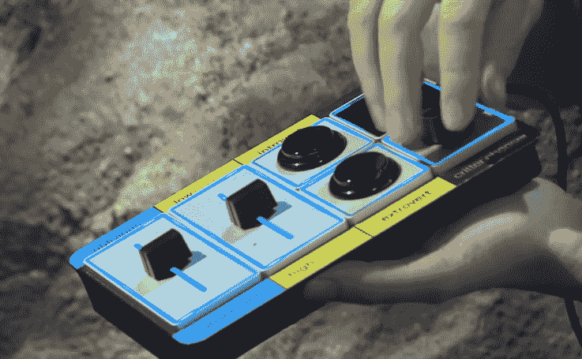

# 迪士尼已经开始在公园里安置自主的、个性化的机器人 

> 原文：<https://web.archive.org/web/https://techcrunch.com/2018/02/08/disney-has-begun-populating-its-parks-with-autonomous-personality-driven-robots/>

让迪士尼乐园变得栩栩如生的过程最容易用电子动画人物来概括。自 60 年代以来，这些液压、气动和现在的电动玩具一直是迪斯尼乐园的固定设备。从那以后，控制系统、机芯架构和编程都取得了巨大的进步。最先进的电子动画人物，如迪斯尼世界的纳美人河之旅中的纳美人萨满，都是简单明了的机器人。而且是非常复杂的。

但不是公园里的每个电子动物都可以是连接到庞大主系统的简单气动装置，或者是高度先进和复杂的机器人杰作。这就是 Vyloo 的由来。

Vyloo 最初是一个帮助公园增加更多互动元素的项目，是三个独立舱中的小型外星生物，使它们能够自主。它们有情绪，通过非语言的手势和暗示与客人互动，并由一个完全机载的系统提供动力，该系统可以快速调整并自行完成任务。

“我们提出了一个项目，试图让小型自主电子动物具有生命。迪士尼高级 R&D 幻想工程师 Leslie Evans 说:“我们对创造一些能够真正回应游客并与之互动的小家伙的想法非常感兴趣。她和 R&D 幻想工程师亚历克西斯·维兰德开始了这个项目，目标是创造一些自主的东西，但也在客人中创造了一种感觉像真正情感关系的反应。他们需要有一个“性格谱”，然后有一套工具，允许他们在对客人释放这些属性之前上下调节这些属性。

“我认为，这很大程度上是出于开始将动画电子人视为演员的愿望，所以能够说我们希望这些角色害羞，我们希望他们外向，试图根据个性来定义他们，然后将所有这些转化为我们需要的技术工具，使角色栩栩如生,”埃文斯说。

我第一次看到 Vyloo，当时被非正式地称为“微小生命”，是在一年前和一个女孩编码组在[巡回演出时。当时，他们看起来相当相似，如果更“简单”。基本单位是一根圆木，上面有三个小生物，现在被称为 Vyloo。这些生物配备了传感器和摄像头，允许它们运行的辅助设备完全包含在它们的身体或原木结构中。这使得 Vyloo 非常模块化。这与公园里的大多数机器人不同，它们需要连接外部辅助系统来控制或操纵它们。](https://web.archive.org/web/20230208175315/https://techcrunch.com/2017/12/22/girls-who-code-gets-a-disney-imagineering-boost/)

这个项目已经到了能够向像 GWC 班这样的小组演示的地步，这时幻想工程中经常发生的意外发现发生了。

“我们部门的一个人一直在做《银河护卫队——任务:突围》!他说，“嘿，伙计们，你们真的需要来 R&D 看看这些生物。“我认为这将是第一个场景的完美之作，在收藏家的收藏室排队，”埃文斯说。

[YouTube https://youtu.be/HfbUU6iJ-Xs]

幻想工程正在试验的东西和公园里放的东西之间的这种相互作用是使该单位成为如此独特的机器人实验室的原因之一。很多时候，像 Kinect 传感器这样的现成部件被抓取并适合该任务，其他时候，特定的部件、组件甚至材料都必须被发明和制造。无论正在被克服的技术障碍总是在为故事服务，但是它们可能被使用的方式并不总是在一开始就被知道。

拥有可以轻松放置在公园各处的自主机器人单元，以创建更丰富、更具互动性的环境，这是目标的一半，它与任务突破场景配合得很好，该场景以收藏家纳奇收集的生物和物品为特色。但这只是项目目标的一部分。

“我们的角色现在给出了非常完美的表演，但他们真的是一个循环，因为他们没有真正回应客人，所以让角色下来，这样他们就知道客人在那里，实际上做出了适当的回应，”维兰德说。“保持角色是我们在这里努力实现的一个重要部分，因此朝着那个方向前进是其中的一个重要部分。我们如何让我们的角色在与客人在一起的那一刻更发自内心？”

为此，Vyloo 最初被编程为一系列它们可以采取的运动和动作——挤压和伸展，抬起头，转动脖子。这些动作然后被交给一个程序，该程序通过跟踪客人是否在看他们来接收信号，当他们盯着笼子时，听客人对 Vyloo 说话，并在他们移动时跟随他们的目光。

下一阶段，也是任务突破测试的全部内容，是学习客人如何与生物互动。

“当我们在公园里观察它们的时候，当其中一只动物看着你的时候，真的有一种魔力。“它让客人能够以一种前所未见的新方式玩我们的电子动画，我认为人们与这些家伙一起玩的反应非常积极，非常令人兴奋，”埃文斯说。

而那些互动包括了很多团队做梦都没想到的东西。

“最让我吃惊的是……客人们做着这些亲吻的表情，并不停地向他们伸出舌头。亚历克西斯说:“这就像是在说，哦，我甚至没有想到这一点。”他们正在进行我从未想过的互动，这也是我们这样做的部分原因。太棒了。我们一直看到的一件事是人们和他们一起玩，和他们互动。那就好玩了，然后他们走一步离开，它就一直看着他们。你看到他们停下来，然后往回走，他们就像，'哦，我的上帝。'"

"当灯泡熄灭时，感觉真的很棒……孩子们比成年人更快理解它，"他补充道。

为了调整这些反应，该团队创造了一种类固醇游戏控制器，具有旋钮和滑块，允许他们调整他们的“态度”和意识。他们可能很活跃，也可能很冷静；互动多或少；亢奋或困倦。一旦调音完成，它们又会被释放到客人身上。

在进一步协同的时刻，Vyloo 实际上在第二部银河护卫队电影中结束了，就在 Milano 坠毁在 Berhert 星球上之后。银河护卫队电影公司的导演詹姆斯·古恩在幻想工程公司看到了原型，非常喜欢它们，并最终给它们起了名字。

“当我们在幻想工程研发总部看到原型时，我们都被震撼了。如此神奇的作品。不过，对于银河护卫队世界来说，这些颜色有点太柔和了，所以我们调整了设计，让它们更加艳丽，以符合守护者的审美。然后我要给它们起名字！我喜欢 Vyloos，最想做的就是养一只作为宠物！”

这一切都是从一个亮黄色的木偶开始的，Evans 形容这个木偶“非常简单”,用多余的毛皮和木棒制成，但仍然说它“很可爱”。

> “在木偶方面，我们与一位极具天赋的木偶师合作，他以一种不可低估的方式赋予了这个项目生命。他是成功的关键。我们花了几个小时研究这个东西，我们会说，“如果你真的很害羞，但你也有点好奇，你怎么打招呼？“我们会记录下我们对木偶做的所有这些动作。很多时候，我们以这种非常相似的方式开始。这有助于我们快速定义一系列创意意图。
> 
> 突然间，我们有了所有这些不同性格的片段。他们会怎么打招呼？他们如何感到惊讶？如果你离开他们，他们会怎么做？由此，我们开始梳理，“这是一大堆数据。我们如何把它简化成一个原型系统，来展示这些简单互动的力量？”打招呼，当你离开时会发生什么，当你受到惊吓时会发生什么，如果你周围有电子动物，我对我的朋友会有什么感觉？
> 
> 我们做了大量的工作，定义了一个很大的范围，然后从那里开始缩减。“对于这第一个最小可行的产品，我们真正需要的关键材料是什么？这是一种我们在第一遍中就推出的电子动画产品？”

从那时起，情感速记被放入一组尽可能简单的手势中，以限制生物的复杂性。其中最有效的一种是研究小组称之为“挤压和拉伸”的动作——将头部压入身体挤压或伸长脖子伸展。这个简单的动作取代了人类使用的许多情感暗示，如眉毛或面部肌肉。

一旦 Vyloo 进入队列，还需要进行一些改变，以补偿环境的响度、顾客的相对注意力或注意力缺失等。

与每一个幻想工程项目一样，Vyloo 和随后出现的生物的主要目标是为迪士尼各个公园的游客增加快乐因素。作为其中的一个组成部分，迪士尼正在建造的机器人需要变得更加互动，能够近距离观看，具有令人信服的情感和交流交流。

迪士尼机器人的未来充满了情感背景、自主性和互动性。它非常注重机器人的情商，而不是追求纯粹的效率。但与此同时，它需要制造能够经受住数百万游客难以置信的审查的机器人，足够健壮，能够在数年内每天 14 小时近乎完美的正常运行时间。

正是这种独特的学科融合，所有这些学科都由一种自负的“不惜一切代价”的心态所驱动，使它成为世界上最令人兴奋的机器人实验室之一。Vyloo 相对低调地加入了公园的景点，但它们预示着迪士尼粉丝将会看到大量很酷的东西，以及机器人行业关于情感和互动在提高效率和与机器人共存方面的力量的一些整体学习。