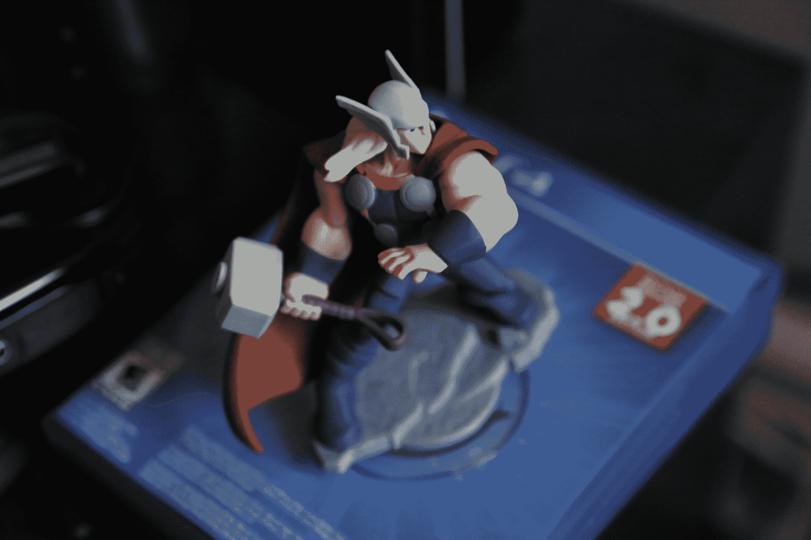
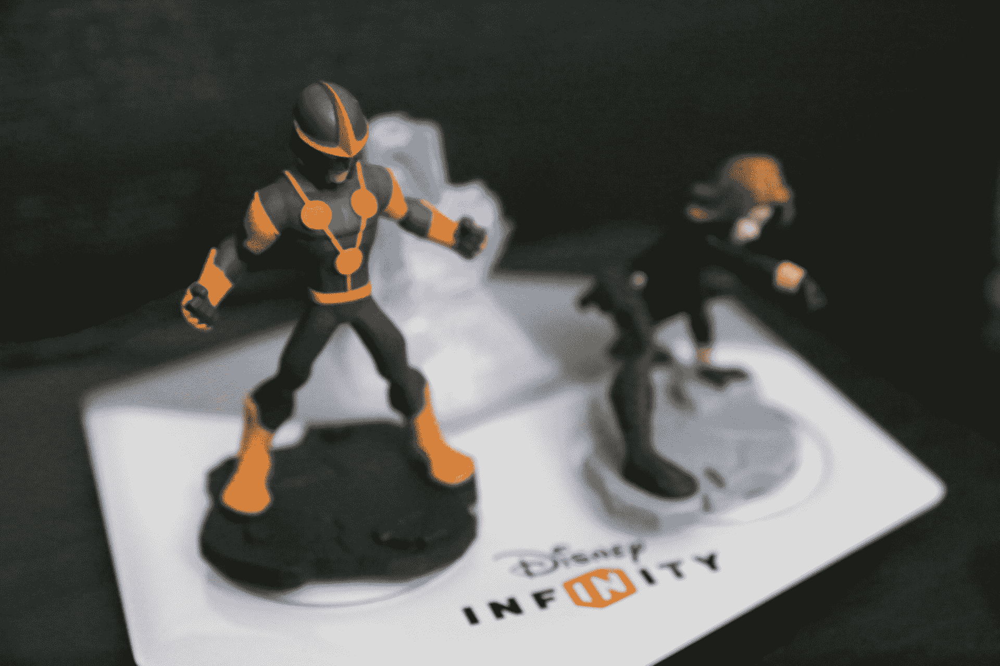
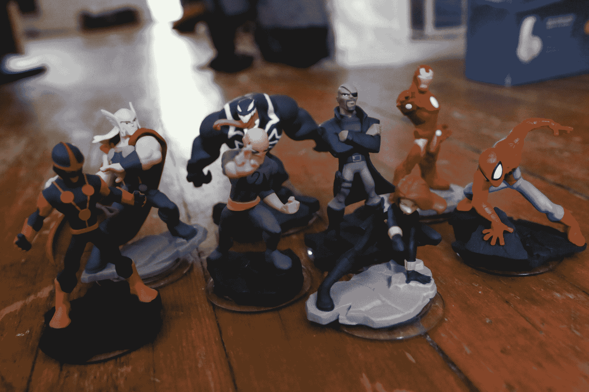

# 迪士尼无限:漫威超级英雄暗示了一个无限扩张的世界

> 原文：<https://web.archive.org/web/https://techcrunch.com/2014/09/23/disney-infinity-marvel-super-heroes-review/>

迪士尼可能已经打造了完美的游戏-[Infinity](https://web.archive.org/web/20221007141622/https://infinity.disney.com/)，它的“玩具人生”系列于 2010 年首次亮相，并于 2013 年首次作为可玩游戏发布。随着今天《迪士尼无限:漫威超级英雄》的发布，这款游戏正在进入第二代，它还为所有原始系列收藏品引入了 2.0 版本的功能，以及新的迷你游戏和升级到《我的世界》和小行星风格的玩具箱模式。这个新版本更加明显地表明，无限可能是视频游戏的完美，至少就迪士尼公司及其大批粉丝而言是这样。

首先，我播放《迪士尼无限:漫威超级英雄》的评论版的时间远远超过了公平评价的要求。此外，我的女朋友热情地和我一起玩，我们可以在沙发上并肩享受当地的合作。迪士尼在漫威宇宙的故事和角色方面也做得很好，这在很大程度上要归功于乔·奎萨达和布莱恩·迈克尔·本迪斯导演的故事和游戏内容。作为一个狂热的漫画读者和漫威直接推出的当前电影和电视节目的粉丝，我觉得这是那个世界的一个有凝聚力的部分，尽管有简化的情节元素来帮助它适用于广泛的观众，可能合理地包括年幼的儿童。

漫威超级英雄提供了与乐高系列视频游戏相同的本质上重复但基本上有趣的游戏享受。事实上，不可能看不到基于积木的旅行者故事游戏系列的影响，同样，天空人的模型显然无处不在。迪士尼无限实际上主要是模仿，玩具箱元素借用了《我的世界》的开放世界创作元素，以及《小小大星球》的视觉游戏设计组件。但是，说它是由最初在其他地方看到的部分拼凑而成并不影响它的成就:Infinity 将这些部分结合起来，创造了一个完全原创的产品，比任何基于上述更狭隘愿景的游戏都要成功。

对于迪士尼来说，特许经营权代表着一艘可以移动的船，可以装载任何他们需要的东西。我与迪士尼 Infinity 执行制片人约翰·维格诺奇(John Vignocchi)谈论了这款游戏，讲述了我自己的享受，并说我有一份来自漫威宇宙的角色请求列表，我希望看到 Infinity 人物，这导致维格诺奇假设我有孩子。我纠正他说，事实上，我只是一个没有孩子的三十多岁的人，花了太多时间思考漫威宇宙经典的复杂性，他回答说，实际上，这就是游戏的魅力所在。

就其吸引力而言，Vignocchi 将 Infinity 称为一款近乎完美的“四象限”游戏。这意味着它既有年轻人也有老年人，包括父母、单身成年人、男人、女人和孩子。鉴于迪士尼将 Infinity 视为围绕其各种电影、电视剧和其他创意资产简化和集中游戏开发工作的一种方式，这种广泛的吸引力非常方便。

“我们玩游戏的孩子和十几岁的孩子一样多，我们玩游戏的非父母成年人也一样多，像你我这样没有非核心游戏玩家的孩子的人和我们玩游戏的人一样多，我们玩游戏的 35 岁以上成年人的父母也一样多，他们可能有孩子，但不一定和他们的孩子一起玩游戏，”Vignocchi 引用他们自己的内部调查解释道。“我们也有大约 55%的男性和 45%的女性，这对电子游戏来说是一个惊人的数字。”

至于迪士尼 Infinity 与其他游戏的不同之处，包括动视(Activision)的《玩具人生》(toys to life)先驱 Skylanders，Vignocchi 表示，他们首先为玩家在世界上的投资提供了更多的可扩展性和重玩价值，这一点从 Infinity 1.0 版本的所有角色都获得了扩展的属性和可升级的技能树可以看出。

“我们在这个领域与其他竞争产品的另一个区别是，迪士尼拥有如此丰富的知识产权，我们在角色方面的优势非常明显，”他补充道。这引出了一个问题，作为一个超级书呆子，我一直想问:我们什么时候能看到迪士尼收购卢卡斯影业成为无限系列的素材？我什么时候可以去买汉·索罗或卢克·天行者，并在他们自己的游戏中使用他们？

“Infinity 是华特·迪士尼公司旗下任何东西的不断增长的平台，所以无论是迪士尼、皮克斯、美国广播公司、迪士尼频道、迪士尼公园、ESPN 还是卢卡斯影业，可能性都是无限的。不过，可以肯定地说，随着时间的推移，互动游戏领域的平台将成为一股不可忽视的*力量*(我发誓你能听到斜体部分的内容)。”

回顾一下，可以说迪士尼已经推出了一款非常令人愉快的游戏，具有足够的可重复性和扩展性，任何漫威粉丝都知道并喜欢其中的角色，无论他们是铁杆漫画迷还是新电影的偶然崇拜者。此外，迪士尼在这一概念上进行了长期投资 Infinity 模型对他们来说是附加的，让该公司专注于开发一个单一的综合引擎，而不是为它想要创建的每个新的视频游戏搭售与新的签约开发商打交道。

因此，虽然迪士尼承认，一旦你拥有了原版游戏，就可以通过出售单个玩具作为附加配件来获益，但这些玩具也会随着时间的推移而演变，所以对玩家来说也有长期的好处。反正我是要买玩具的；我还不如买长的。