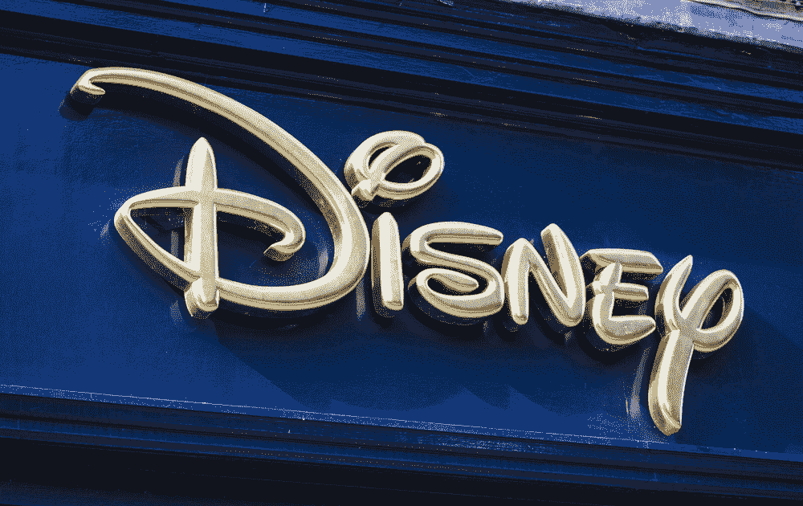

# 迪士尼将于 2019 年放弃网飞，推出自己的流媒体服务 

> 原文：<https://web.archive.org/web/https://techcrunch.com/2017/08/08/disney-is-ditching-netflix-in-2019-to-launch-its-own-streaming-service/>

# 迪士尼将在 2019 年放弃网飞，推出自己的流媒体服务

如果你刚刚习惯了迪斯尼的所有新东西冲击网飞，这是一个坏消息:那笔交易即将出局。

迪士尼刚刚宣布计划在 2019 年终止与网飞的分销协议，而是选择在同一年的某个时候推出自己的流媒体服务。

这一宣布是一些收购消息的一部分:迪士尼公司将支付 15.8 亿美元收购 BAMTech 公司 42%的股份，这是一家存在于美国职业棒球大联盟旗下的公司，除了去年以 10 亿美元收购的 33%的股份。这使得迪士尼获得了 BAMTech 的多数控股权。

与此同时，迪士尼还将在明年初推出一项独立的 ESPN 品牌流媒体服务。它将被包装成 ESPN 应用程序的重建版本，并托管来自 MLB、NHL、MLS 和各种大学体育网络的流。