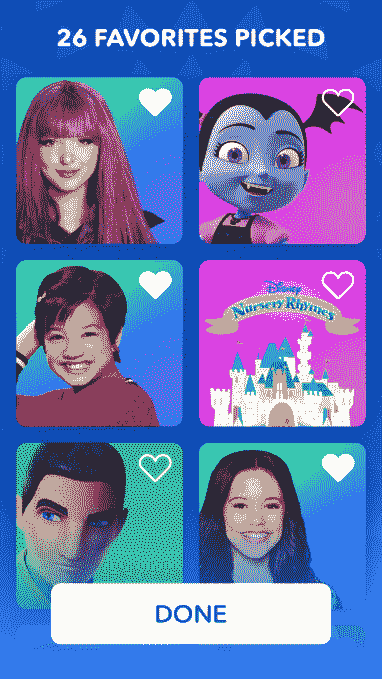
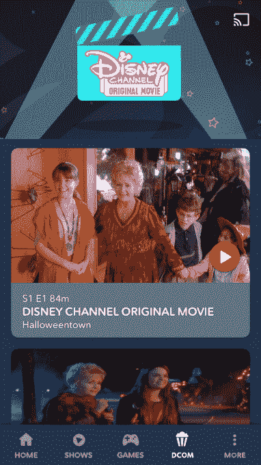
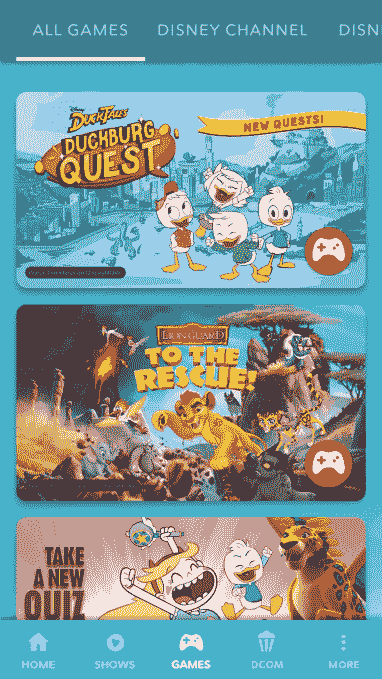

# 迪士尼发布了 DisneyNow，这是一款结合了直播电视、点播、游戏和音乐的新应用

> 原文：<https://web.archive.org/web/https://techcrunch.com/2017/09/29/disney-releases-disneynow-a-new-app-that-combines-live-tv-on-demand-games-and-music/>

迪士尼的[流媒体服务](https://web.archive.org/web/20230327142536/https://techcrunch.com/2017/09/07/disneys-streaming-service-will-exclusively-get-marvel-and-star-wars-movies/)可能还需要几年时间，但随着 [DisneyNow](https://web.archive.org/web/20230327142536/http://disneynow.go.com/) 的发布，该公司本周推出了一款新的应用程序，用于流媒体迪士尼系列、迪士尼频道电影、直播电视和音乐。该应用旨在将迪士尼现有的“观看”流媒体应用整合为一个，包括迪士尼频道、迪士尼 XD、迪士尼少年和迪士尼电台。

该公司表示，这套针对 2 至 14 岁儿童的电视应用程序自 2012 年以来已被下载超过 4000 万次。在某种程度上，将它们作为单独的财产是有意义的——毕竟，一个 2 岁的孩子想看的东西将与一个十几岁的孩子非常不同。

但是时代在变。虽然每个酒店在线性电视上拥有自己的空间很有意义，但在我们的设备上安装多个应用程序来访问来自单个提供商的内容更麻烦。

为了解决这个问题，迪士尼在新的 DisneyNow 应用程序中添加了个性化功能，因此孩子们(或父母)可以根据他们的编程兴趣定制应用程序。此外，如果父母想让应用程序专注于适合学龄前儿童的节目，他们可以启用“迪士尼青少年专用”模式。

新应用的有趣之处还在于，它让你了解迪士尼即将推出的流媒体服务可能会如何运作。

例如，在 DisneyNow，每个用户都可以为自己建立一个个人资料，并从 180 多个迪士尼表情符号头像角色姿势中进行选择，以与他们的帐户相关联。然后，孩子们可以通过选择他们最喜欢的角色和节目来自定义他们的设置，然后接收关于接下来看什么的建议。

该应用程序还会记住用户离开的地方，以便他们下次登录时可以继续观看。

就像迪士尼即将推出的流媒体服务计划一样，DisneyNow 应用程序提供了内容的组合——不仅仅是节目和电影。也有游戏、音乐和特别表演。

该应用程序将包括观看直播、线性电视频道的能力，以及来自其网络的点播、当季电视节目，如:“安迪·麦克”(Andi Mack)、“乌鸦之家”(Raven's Home)、“Bizaardvark”(Bizaardvark)、“夹在中间”(Stuck in the Middle)、“纠结:系列”(Tangled:The Series)；小迪士尼的《吸血鬼》、《阿瓦洛的埃琳娜》、《米奇和跑车赛车手》、《狮子护卫队》、《小狗伙伴》和《PJ 面具》；以及迪士尼 XD 的《鸭子传奇》、《星球大战反叛者》、《行走的恶作剧》、《机甲 X4》、《米洛墨菲定律》。

还将提供精选的迪士尼频道电视电影，从 100 多个标题中挑选，以及 60 多个以迪士尼角色为特色的游戏，如“DuckTales”冒险游戏“Duckburg Quest”，“the Flight of the Jaquins”中的阿瓦洛公主艾琳娜和“Descendants 2 Wicked Style”活动中的反派小孩。

迪士尼表示，它将每月向该平台发布新游戏。

迪士尼电台的表演和演播室的出现也将被添加到这个应用程序中，包括赛琳娜·戈麦斯、爱莉安娜·格兰德和卡米拉·卡贝洛等人的表演。

该应用程序通过赞助、传统或互动电视广告和抽奖获得广告支持，因为使用它不需要订阅费。

然而，迪士尼现在不是一个过度的流媒体服务，就像迪士尼计划在 2019 年发布的那样，也不会包括任何影院电影，像皮克斯、漫威或星球大战等大品牌的电影。这些都是留给迪士尼在网飞的大竞争对手的。(不过，它确实有漫威和星球大战的部分，这是他们的电视卡通系列。)

[gallery ids="1549063，1549062，1549061，1549060，1549059，1549058，1549057，1549056，1549055，1549054"]

虽然迪士尼乐园中的一些内容现在可以免费观看，但要观看完整的阵容，用户需要使用受支持的有线电视、卫星电视或数字节目分销商提供的付费电视凭据进行认证。

对脐带切割者来说，好消息是 DisneyNow 确实可以与你的 YouTube 电视、PlayStation Vue、DirecTV Now 或 Hulu 凭证兼容。

当然，你可以通过这些流媒体应用程序来观看迪士尼，但最好为孩子们安装 DisneyNow 应用程序，这样他们就不必在成人节目中磕磕绊绊地寻找他们最喜欢的节目。

DisneyNow 在 [iOS](https://web.archive.org/web/20230327142536/https://itunes.apple.com/app/id529997671?mt=8) 、 [Apple TV](https://web.archive.org/web/20230327142536/https://itunes.apple.com/app/id529997671?mt=8) 、 [Android](https://web.archive.org/web/20230327142536/https://play.google.com/store/apps/details?id=com.disney.datg.videoplatforms.android.watchdc) 、 [Fire 平板电脑](https://web.archive.org/web/20230327142536/https://www.amazon.com/gp/mas/dl/android?p=com.disney.datg.videoplatforms.android.amazon.kindle.watchdc)和 Roku 上免费下载。Fire TV、Android TV 和网络版将于明年推出。