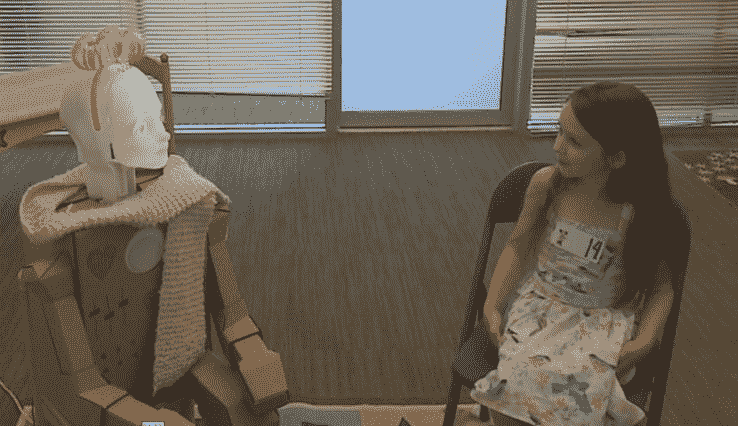

# 迪士尼研究让机器人为孩子们匹配语言风格 

> 原文：<https://web.archive.org/web/https://techcrunch.com/2017/03/06/disney-research-has-robots-matching-verbal-styles-with-kids/>

迪士尼研究所的机器人专家正在研究如何通过研究[言语模式如何影响与一个模仿玩伴言语的令人毛骨悚然的拟人机器人的互动](https://web.archive.org/web/20221025222649/https://www.disneyresearch.com/publication/creating-prosodic-synchrony-for-a-robot-co-player-in-a-speech-controlled-game/)来提高人机交互的质量。

这是一个很自然的研究方向:计算机生成的语音和交互模式是如此的呆板，以至于人们对它们的期望很低。但是成对的人——例如，互相玩耍的孩子——在言语上合拍(在“韵律同步”中)往往更投入，在他们所做的事情上更成功。

在这项研究中，研究小组将孩子们与一个机器人配对，让他们玩一个小的平台游戏，其中一个玩家让角色走，另一个让角色跳。他们创建的系统会听孩子的声音，并提取一些基本属性:响度、单词长度和频率(即速度或节奏)。

 例如，一个孩子可能反应很快，但拖长了“juuump”，而另一个孩子犹豫了一下，但快速大声地说“go”。

一旦有问题的孩子被描述出来，机器人就会从一堆略有不同的声音文件中，以不同的速度和语调选择它的声音反应。在一种形式中，它选择了与孩子最相似的风格；在另一个例子中，它基本上选择了任何风格*除了*小孩的。正如该文件所总结的:

> 每个孩子玩多个游戏级别，包括机器人的同步和非同步版本，条件的顺序在孩子之间平衡。结果显示了同步的并矢性质及其深远的影响。

玩同步版游戏的孩子表现更好，得分更高，即使同步在中途被关闭。当他们玩非同步版本时，他们得分较低，参与较少。进一步分析，这种差异确实只影响到年龄较大的孩子，这表明这种合作方面是通过社会互动习得的技能。

与现实世界互动的语气相匹配可能意味着把我们赶出去的机器人和我们不介意与之聊天的机器人之间的区别。想到未来的玩具或家用机器人在对不同的人说话时可能会采用不同的语气和语言模式，这可能有点令人毛骨悚然——“哦，帕特里夏提问时，Siri 就像那样”——但这也可能对机器人走出恐怖谷有很大帮助。

但不是他们在实验中用的那个。说真的。

这项研究由迪士尼研究所、卡内基梅隆大学和达拉斯德克萨斯大学合作完成，将在维也纳举行的人类机器人互动会议上展示。