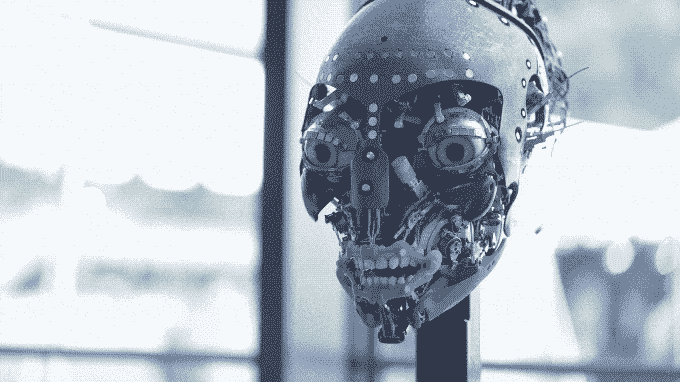

# 迪士尼向我们展示了其化身机器人的内部工作原理，这简直令人难以置信 

> 原文：<https://web.archive.org/web/https://techcrunch.com/2017/07/17/disney-showed-us-the-inner-workings-of-its-avatar-robot-and-its-just-incredible/>

# 迪士尼向我们展示了其化身机器人的内部工作原理，这简直令人难以置信

早在五月底，迪士尼在其动物王国公园内开设了一个阿凡达主题区(潘多拉:阿凡达世界)。鉴于它只开放了几个星期，大多数人还没有进去过——但是如果你去了，帮自己一个忙，花时间去看看纳威河之旅。游乐设施的尽头是一个电子动画纳威人(阿凡达的蓝色人形种族)，这无疑是有史以来最优秀的电子动画制作人之一。

在今天下午波士顿的 TechCrunch 会议:机器人活动中，我们看到了里面发生的事情。

当它被密封起来的时候，纳威萨满看起来是这样的:

但是拉开面具，一个不可思议的、美丽复杂的机器人阵列就在下面:

几十年来，迪士尼一直在用电子动画技术铺平新的道路(Tiki Room 的鸟类和与林肯同名的机器人总统的伟大时刻分别可以追溯到 1963 年和 1964 年)，但纳美人萨满在表现力、运动流畅性和震撼心灵的能力方面将事物提升到了一个全新的水平。

很好奇当所有东西都在一起，而你在车上时，整个东西看起来是什么样的？这是: