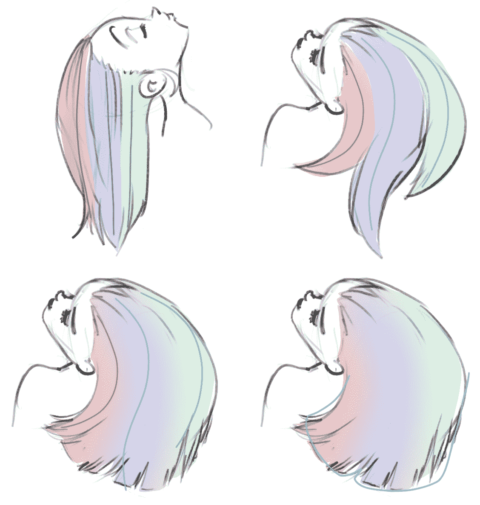

# 迪士尼科技消除糟糕的 CG 发型

> 原文：<https://web.archive.org/web/https://techcrunch.com/2018/07/13/disney-tech-smooths-out-bad-cg-hair-days/>

在头发的 3D 模拟方面，迪士尼无疑是世界上的领导者——在某种程度上，这是一种利基人才，但如果你制作像*纠结*这样的电影，头发基本上是主角，这很有用。[该公司的一项新研究](https://web.archive.org/web/20230324103453/https://www.disneyresearch.com/publication/haircontrol-a-tracking-solution-for-directable-hair-simulation/)让动画师更容易让头发跟随他们的艺术意图，同时也逼真地移动。

迪士尼研究旨在解决的问题是动画师在让角色的头发按照场景要求做时不得不做出的妥协。虽然头发最终会以辉煌的高清晰度和详细的物理渲染，但在合成场景时这样做的计算成本太高。

帐篷里的年轻战士应该把头发向上梳还是向下梳？当她快速转头以吸引注意力时，它应该飞出去了吗？还是应该保持重压以使观众不会分心？尝试这些东西的各种组合会消耗掉几个小时的渲染时间。所以，像任何聪明的艺术家一样，他们先画出草图:

“艺术家通常求助于较低分辨率的模拟，在那里迭代更快，手动编辑也是可能的，”描述新系统的论文写道。但不幸的是，以这种方式确定的参数值只能作为全分辨率模拟的初步猜测，当使用相同的参数时，全分辨率模拟的行为往往与其粗略的对应行为非常不同

研究人员提出的解决方案基本上是使用“初始猜测”来通知一个高分辨率的模拟，只需几根头发。这些“导向”头发充当原始模拟的反馈，从而更好地了解其余部分在完全渲染时的行为。

导向头发将导致头发聚集在右上角，而褪色的亲和力或基于轮廓的导向(下图，左，右)将允许更自然的运动(如果需要)。

因为它们只有几个，它们更好的模拟特性可以在最短的时间内调整和重新调整。因此，艺术家可以微调马尾辫或刘海上的气流，以创造出想要的效果，而不必相信最终产品会是这样。

当然，这对于工程师来说不是一件小事，论文的大部分内容描述了团队创建的方案，以确保不会因为高清晰度和低清晰度头发系统的相互作用而出现怪异。

现在还为时过早:它并不意味着模拟更复杂的头发运动，如扭曲，他们希望添加更好的方法来分散散装头发与特殊导向头发的亲和力(如右图所示)。但是毫无疑问，一旦它开始发展，肯定会有动画师迫不及待地想要得到它。