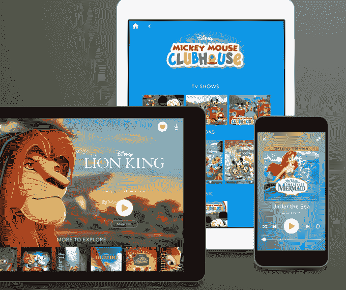

# 迪士尼生活，迪士尼新的电影、电视、音乐等流媒体服务，上线

> 原文：<https://web.archive.org/web/https://techcrunch.com/2015/11/23/disneylife-disneys-new-streaming-service-for-movies-tv-music-and-more-goes-live/>

迪士尼现在已经进入了基于订阅的流媒体服务市场，推出了 [DisneyLife](https://web.archive.org/web/20230405063155/https://disneylife.com/) ，这是一项类似于网飞的服务，允许多达 6 人的家庭通过苹果的 AirPlay 或谷歌 Chromecast 在线观看迪士尼电影、电视节目，甚至音乐、有声读物和电子书。但是在你抱太大希望之前，迪士尼粉丝们，请注意这项服务目前只在英国可用，以后会扩展到其他欧洲市场。

该公司[首次宣布](https://web.archive.org/web/20230405063155/https://techcrunch.com/2015/10/21/disney-to-launch-a-subscription-streaming-service-in-europe-hints-that-marvel-star-wars-services-could-follow-in-u-s/)其打算在 10 月推出流媒体服务，当时指出迪士尼通过这种独特的数字产品的目标是通过直接接触消费者，而不是通过中间人，更好地控制迪士尼的内容及其分发。

这意味着迪士尼正在重新思考如何管理其庞大图书馆的数字版权，今天的图书馆不仅包括迪士尼品牌本身，还包括皮克斯、漫威和星球大战。

在美国，迪士尼的大部分电影和电视图书馆已经与其他交易捆绑在一起——例如，网飞[获得了](https://web.archive.org/web/20230405063155/http://variety.com/2015/digital/global/disney-to-launch-subscription-streaming-service-in-u-k-1201623079/)明年开始的迪士尼影院上映权[，据报道](https://web.archive.org/web/20230405063155/http://mediadecoder.blogs.nytimes.com/2012/12/04/netflix-bests-starz-in-bid-for-disney-movies/?_r=0)[正在谈判](https://web.archive.org/web/20230405063155/http://www.wsj.com/articles/disney-in-talks-to-license-star-wars-films-to-netflix-in-latin-america-1442506385)拉丁美洲《星球大战》电影的流媒体播放权，等等。然而，迪士尼并没有排除未来将类似的流媒体服务引入美国的可能性。

事实上，早些时候的建议是漫威或星球大战主题的服务可能正在进行中，因为迪士尼生活的平台是内部建立的，现在可以重新利用。

与此同时，英国用户将成为新流媒体平台的第一批试用者。在收取每月 9.99 英镑的订阅费之前，迪士尼生活将允许任何人免费测试这项服务一个月。

虽然在许多方面，这项新服务很像迪士尼版的网飞，但它的内容选择不仅仅局限于电影和电视，这使它有别于今天的许多超顶级产品。

包括数百部电影，包括迪士尼和皮克斯的电影；超过 5，000 首歌曲，包括热门电影《冰雪奇缘》、《小美人鱼》、《玩具总动员》等；2，000 多集电视节目；以及一个大型的迪士尼图书图书馆(有声和电子书)。

此外，用户可以每月下载一个免费的迪士尼应用程序。这个月，应用程序将是“汽车 2 世界大奖赛阅读和比赛。”

此外，与今天的许多流媒体服务不同，迪士尼生活的用户可以将视频下载到他们的移动设备上离线观看，视频将在有限的时间内存储，然后自动删除。

在新服务支持多少设备方面，迪士尼也相当慷慨，允许家庭注册最多 10 台设备，将内容下载到所有 10 台设备，并同时在最多 4 台设备上播放内容。

家长也可以设定家长控制，按日期或时间限制使用。

迪士尼计划稍后将这项服务扩展到英国以外的其他欧洲国家，包括法国、西班牙、意大利和德国。然而，该服务现在有英语、法语、德语、意大利语和西班牙语版本，暗示其计划很快在英国市场之外推出，就像之前承诺的那样。