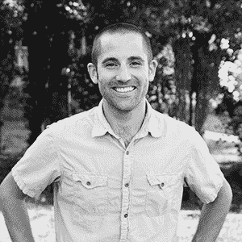
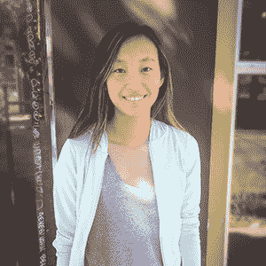

# PointShop.space 赢得 Disrupt SF 2016 黑客马拉松大奖

> 原文：<https://web.archive.org/web/https://techcrunch.com/2016/09/11/disrupt-hackathon-winner/>

昨天，近 1000 名热切的参与者聚集在 48 号码头，参加通宵黑客马拉松，以旧金山海湾大桥寒冷而雾蒙蒙的景色(就好像还有其他种类的一样)开始破坏。

这支由开发人员、编码人员、机器人专家、工程师和全能黑客组成的大军分成了 144 个团队，在 24 小时的能量饮料和肾上腺素刺激的灵感旋风中负责设计和开发项目。

今天早上，各队上台向我们的评委小组展示了他们在睡眠不足情况下的创新。在上午和下午早些时候，我们看到了一些令人印象深刻的作品，但遗憾的是，只有一个团队可以将 5000 美元的大奖带回家。

## 获胜者:PointShop.space

头奖由 [PointShop.space 应用](https://web.archive.org/web/20230313122943/https://techcrunch.com/2016/09/11/pointshop-hack-uses-ar-to-aid-gadget-buying/)获得，该应用利用增强现实技术，通过简单地将手机摄像头与现实世界的产品对齐，来帮助消费者获得基于云的购物上下文信息。

## 亚军#1:支持集体

Support Collective 使不同的公司能够将资源结合在一起，提供电子邮件票证历史记录。利用这些信息，参与公司能够从其他客户那里学习。

## 亚军#2:安全路线

> [安全路线获得第三名](https://web.archive.org/web/20230313122943/https://www.facebook.com/techcrunch/videos/10154644836267952/)
> 
> 安全路线在 http://tcrn.ch/2cRrFSM 的 Disrupt SF 黑客马拉松中获得第三名
> 
> 由 [TechCrunch](https://web.archive.org/web/20230313122943/https://www.facebook.com/techcrunch/) 于 2016 年 9 月 11 日周日发布

顾名思义，安全路线旨在为用户提供一条到达目的地的更安全的路径。该应用程序利用谷歌地图、谷歌地点和 Crimemapping.com API 来帮助确定从 A 点到 B 点的最佳方式，即使这意味着在这个过程中路线会变长。

## 《士师记》

对于今年的黑客马拉松，我们很幸运地邀请到了一群才华横溢的行业资深人士，他们在从风险投资到天体物理学等领域都很有经验。如果你正在参与，你应该看看你将向谁展示。

## 瑞安·布罗沙尔

[Ryan Broshar](https://web.archive.org/web/20230313122943/https://twitter.com/rbroshar) 是与 Target 合作的 [Techstars 零售加速器](https://web.archive.org/web/20230313122943/http://www.techstars.com/programs/retail-program/)的总经理，也是位于明尼阿波利斯的早期科技风险投资公司 [Matchstick Ventures](https://web.archive.org/web/20230313122943/http://www.matchstickventures.com/) 的创始人兼总经理。

## 约翰·梅拉斯·基里亚兹

[约翰·梅拉斯-基里亚兹](https://web.archive.org/web/20230313122943/https://twitter.com/jmelaskyriazi)是[星火资本](https://web.archive.org/web/20230313122943/http://sparkcapital.com/)的高级合伙人。John 对人工智能和机器学习领域感兴趣，作为一家公司，Spark Capital 投资了许多专注于人工智能/人工智能的公司，包括 Cruise Automation 和 Sift Science。

在加入 Spark 之前，John 离开了斯坦福大学的一个博士项目，帮助运行 StartX，这是一个隶属于斯坦福大学的创业加速器项目。约翰获得了斯坦福大学的工程物理学士学位和材料科学工程硕士学位。

## 杰夫·奎瑟

[Jeff Queisser](https://web.archive.org/web/20230313122943/https://twitter.com/jq) 是 [Box](https://web.archive.org/web/20230313122943/https://www.box.com/) 的联合创始人兼 SVP 工程师，负责 Box 的核心技术、架构和基础设施。他在 10 岁时出售了他的第一个软件，后来成立了 Q-Squared，这是一家位于西雅图的成功的 IT 咨询公司。

## 克里斯·里尔

作为金丝雀公司的联合创始人和首席技术官，克里斯·里尔从七岁起就开始摆弄电脑。

在[金丝雀](https://web.archive.org/web/20230313122943/https://canary.is/)，克里斯正在开发一种最简单的方法，让人们与自己的家庭和家人保持联系。他监管公司的技术战略和合作伙伴关系，同时与团队合作推动创新和未来的产品开发。

Chris 拥有从软件工程师转型为首席技术官的经验，他明白为什么这对于一个人如何在如此快节奏、不断发展的技术领域确立自己的领导者地位至关重要。

Chris 对机器人技术充满热情，是第一机器人计划的前参与者和热心支持者，这是一个向学生推广科学和技术的国际组织。

## 米哈尔·塞加洛夫

Michal Segalov 于 2007 年加入谷歌，是一名软件工程经理。在她目前的职位上，Michal 致力于 Play 应用发现，为 Play 的 10 亿多用户提供出色的体验。

Michal 参与发起了 [Mind The Gap](https://web.archive.org/web/20230313122943/http://mindthegapproject.eu/) ，这个项目旨在鼓励高中女生选择计算机科学和数学作为她们的高中专业。该计划在全球范围内扩展，现已进入第八个年头，迄今已有超过 10，000 名参与者。Michal 拥有 Technion 的计算机科学学士学位和特拉维夫大学的计算机科学硕士学位。

## 邦妮·舒尔金

Bonnie 毕业于威廉姆斯学院，获得了计算机科学和天体物理学学位，从事过各种工作，包括:在一所女子高中教授物理，在一家天文馆管理教育项目，为一档科学广播节目撰稿，在软件行业工作了 14 年。

她目前在 [Hackbright Academy](https://web.archive.org/web/20230313122943/https://hackbrightacademy.com/) 担任讲师，将她对教学的热爱和对编程的热爱结合在一起。邦妮喜欢各种音乐，在业余时间，她正在学习竖式低音提琴。

## 赵薇

小房子爱好者、认证瑜伽教练和机器人工程师，[艾米丽·赵](https://web.archive.org/web/20230313122943/https://twitter.com/ezhao)目前在 [Airbnb](https://web.archive.org/web/20230313122943/https://www.airbnb.com/) 每周五天扮演这些角色中的一个。

这位土生土长的芝加哥人毕业于 EECS 的麻省理工学院，在媒体实验室、谷歌和脸书短暂工作过，之后在 Dropbox 工作了很长时间，直到它不再是一家真正的初创公司。她之前曾在产品和业务运营部门任职。