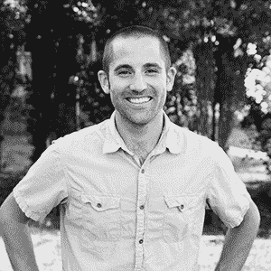
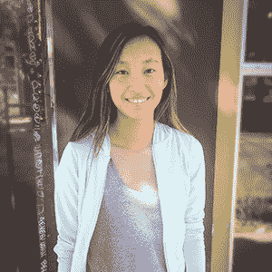
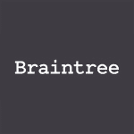
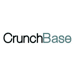
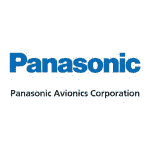
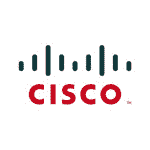
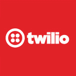

# 宣布 Disrupt SF 黑客马拉松的最后一批门票，以及司仪、评委和 API 研讨会 

> 原文：<https://web.archive.org/web/https://techcrunch.com/2016/09/07/disrupt-sf-hackathon-last-batch-of-tickets-plus-mcs-judges-api-workshops/>

Disrupt SF Hackathon 将于 9 月 9 日周六中午开始，你仍有机会获得一张门票。此外，我们很高兴宣布此次活动的黑客大师、评委和 API 研讨会。

## 黑客大师

[杰弗瑞·班尼特](https://web.archive.org/web/20221003000239/https://twitter.com/meandmybadself)和[雷什玛·希尔纳尼](https://web.archive.org/web/20221003000239/https://twitter.com/ReshmaKhilnani)再次扮演黑客大师的角色，目前正在练习切断超过一分钟的演示。

## 《士师记》

对于今年的黑客马拉松，我们有幸邀请到了一群才华横溢的行业资深人士，他们在从风险投资到天体物理学等领域都有丰富的经验。如果你正在参与，你应该看看你将向谁展示。

## 瑞安·布罗沙尔

[Ryan Broshar](https://web.archive.org/web/20221003000239/https://twitter.com/rbroshar) 是与 Target 合作的 [Techstars 零售加速器](https://web.archive.org/web/20221003000239/http://www.techstars.com/programs/retail-program/)的董事总经理，也是位于明尼阿波利斯的早期科技风险投资公司 [Matchstick Ventures](https://web.archive.org/web/20221003000239/http://www.matchstickventures.com/) 的创始人兼董事总经理。

## 约翰·梅拉斯·基里亚兹

[约翰·梅拉斯-基里亚兹](https://web.archive.org/web/20221003000239/https://twitter.com/jmelaskyriazi)是[星火资本](https://web.archive.org/web/20221003000239/http://sparkcapital.com/)的高级合伙人。John 对人工智能和机器学习领域感兴趣，作为一家公司，Spark Capital 投资了许多专注于人工智能/人工智能的公司，包括 Cruise Automation 和 Sift Science。

在加入 Spark 之前，John 离开了斯坦福大学的一个博士项目，帮助运行 StartX，这是一个隶属于斯坦福大学的创业加速器项目。约翰获得了斯坦福大学的工程物理学士学位和材料科学工程硕士学位。

## 杰夫·奎瑟

[Jeff Queisser](https://web.archive.org/web/20221003000239/https://twitter.com/jq) 是 [Box](https://web.archive.org/web/20221003000239/https://www.box.com/) 的联合创始人兼 SVP 工程师，负责 Box 的核心技术、架构和基础设施。他在 10 岁时出售了他的第一个软件，后来成立了 Q-Squared，这是一家位于西雅图的成功的 IT 咨询公司。

## 克里斯·里尔

作为金丝雀公司的联合创始人和首席技术官，克里斯·里尔从七岁起就开始摆弄电脑。

在[金丝雀](https://web.archive.org/web/20221003000239/https://canary.is/)，克里斯正在开发一种最简单的方法，让人们与自己的家庭和家人保持联系。他监管公司的技术战略和合作伙伴关系，同时与团队合作推动创新和未来的产品开发。

Chris 拥有从软件工程师转型为首席技术官的经验，他明白为什么这对于一个人如何在如此快节奏、不断发展的技术领域确立自己的领导者地位至关重要。

Chris 对机器人技术充满热情，是第一机器人计划的前参与者和热心支持者，这是一个向学生推广科学和技术的国际组织。

## 米哈尔·塞加洛夫

Michal Segalov 于 2007 年加入谷歌，是一名软件工程经理。在她目前的职位上，Michal 致力于 Play 应用发现，为 Play 的 10 亿多用户提供出色的体验。

Michal 参与发起了 [Mind The Gap](https://web.archive.org/web/20221003000239/http://mindthegapproject.eu/) ，这个项目旨在鼓励高中女生选择计算机科学和数学作为她们的高中专业。该计划在全球范围内扩展，现已进入第八个年头，迄今已有超过 10，000 名参与者。Michal 拥有 Technion 的计算机科学学士学位和特拉维夫大学的计算机科学硕士学位。

## 邦妮·舒尔金

Bonnie 毕业于威廉姆斯学院，获得了计算机科学和天体物理学学位，从事过各种工作，包括:在一所女子高中教授物理，在一家天文馆管理教育项目，为一档科学广播节目撰稿，在软件行业工作了 14 年。

她目前在 [Hackbright Academy](https://web.archive.org/web/20221003000239/https://hackbrightacademy.com/) 担任讲师，将她对教学的热爱和对编程的热爱结合在一起。邦妮喜欢各种音乐，在业余时间，她正在学习竖式低音提琴。

## 赵薇

小房子爱好者、认证瑜伽教练和机器人工程师，[艾米丽·赵](https://web.archive.org/web/20221003000239/https://twitter.com/ezhao)目前在 [Airbnb](https://web.archive.org/web/20221003000239/https://www.airbnb.com/) 每周五天扮演这些角色中的一个。

这位土生土长的芝加哥人毕业于 EECS 的麻省理工学院，在媒体实验室、谷歌和脸书短暂工作过，之后在 Dropbox 工作了很长时间，直到它不再是一家真正的初创公司。她之前曾在产品和业务运营部门任职。

* * *

## API 研讨会

除了竞赛之外，还可以参加各自公司举办的 API 研讨会。

 **布伦特里–下午 2:00**

本次研讨会将涵盖通过 Braintree 收款的基础知识。它将介绍如何获得沙箱、获取 API 凭证以及设置客户机 SDK 和服务器 SDK。

**CrunchBase–下午 2:00**

CrunchBase 是世界上使用最广泛的公司、投资者和个人数据库。在 API 研讨会上，我们将向您展示如何将 CrunchBase API 集成到您的应用程序中。

## 

 **松下——下午 3 点**

介绍松下航空电子设备，概述 API 和测试环境。

**思科–下午 3 点**

了解思科 Spark 以及 Spark APIs 的潜力。这些 RESTful APIs 允许您发送消息、创建房间、管理人员等等！

**Twilio–下午 3:30**

介绍如何使用您已经掌握的编程语言和 Twilio API 将电话、消息和视频添加到您的电脑中。