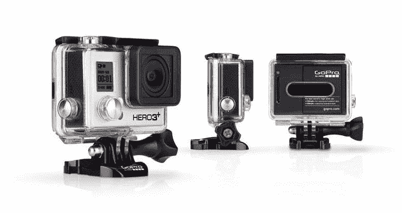

# 扰乱旧金山社交竞赛#3:自拍扰乱 

> 原文：<https://web.archive.org/web/https://techcrunch.com/2014/09/10/disrupt-sf-social-contest-3-selfie-disrupt/>

# 扰乱旧金山社交竞赛#3:自拍扰乱

你有勇气以创新的名义打破规则吗？彻底打破现状？你想看到技术做得更好吗？你真的真的很会自拍吗？我们想看看“扰乱”对我们的读者到底意味着什么。这就是为什么我们为您创建了一个由三部分组成的社交媒体竞赛，向我们展示您的创造力。

今天是[扰乱三藩市](https://web.archive.org/web/20221006140148/https://beta.techcrunch.com/events/disrupt-sf-2014/event-home/)的第三天，我们希望你给我们展示你最有创意的自拍照。这场比赛的获胜者将获得一台 [GoPro HERO 3 黑色版](https://web.archive.org/web/20221006140148/http://shop.gopro.com/cameras/hero3plus-black-edition/CHDHX-302-master.html)，这是 GoPro 最新最令人垂涎的型号，具有 4K 视频分辨率，1200 万张照片，每秒 30 帧，内置 Wi-Fi，SuperView 和自动弱光模式。

  

因为你的自拍值得出现在 12MP SuperView 中。

**指导方针很简单:**

1.发你最有创意的自拍。

2.贴上标签#TCDisrupt，这样我们就能找到你。

3.今天下午启动战场开始前 30 分钟将选出一名获胜者。我们会转发你的照片，并邀请你上台拍照。而你未来的自拍可以用 [GoPro HERO 3 黑版](https://web.archive.org/web/20221006140148/http://shop.gopro.com/cameras/hero3plus-black-edition/CHDHX-302-master.html)抓拍。

4.如果你是媒体的一员，你就赢不了。这个比赛只对扰乱旧金山的参加者开放。

祝你好运！