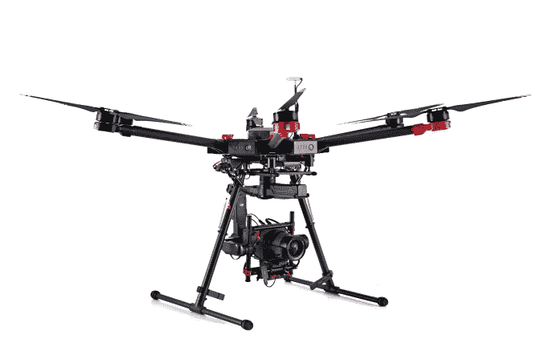

# DJI 收购瑞典标志性相机公司 TechCrunch 的多数股权

> 原文：<https://web.archive.org/web/https://techcrunch.com/2017/01/05/dji-acquires-hasselblad-the-iconic-swedish-camera-company/>

# DJI 收购瑞典标志性相机公司哈苏的多数股权

去年，DJI 收购了瑞典标志性相机公司哈苏的少数股份。两家公司还宣布了一项合作伙伴关系，将在高端相机无人机上合作，这将结合 DJI 的无人机航空技术和哈苏的相机。

现在[夜光景观](https://web.archive.org/web/20230129213457/https://luminous-landscape.com/hasselblad-acquired-dji/)报道称，多名业内人士告诉 TechCrunch，DJI 已经收购了哈苏，不是直接收购，而是收购这家相机公司的多数股权。这笔交易是时代的标志。

哈苏成立于 1941 年，曾以制造市场上最先进的相机而闻名。他们的相机甚至在整个 60 年代被美国国家航空航天局使用，这意味着他们的技术被用于创造阿波罗任务中那些标志性的月球照片。DJI 是一家私人控股、风险投资支持的新兴硬件领域——消费类和商用无人机——的领导者。

虽然哈苏的相机被认为是市场上最好的相机之一，但它们的价格非常昂贵，一台单反相机的价格从几千美元到 4 万多美元不等。现在，关于 DJI 将如何使用，甚至可能如何制造哈苏相机的问题越来越多。

DJI 会离开哈苏的业务，像一个独立的子公司一样运营，但继续确保其相机可以轻松地与 DJI 的无人机平台集成吗？或者 DJI 会使用哈苏技术来完全取代像 Phantom 和 Mavic 这样的消费级无人机中使用的摄像头吗？不管怎样，这笔交易似乎对两家公司都是双赢。

DJI 的相机实际上非常好，可能是同类中最好的，但它们一直没有得到专业摄影师钟爱的公司的认可。这笔交易为他们提供了品牌遗产，同时也让他们获得了一些世界上最好的(尽管是小众的)相机技术。

不管他们喜不喜欢，哈苏只专注于超高端相机的做法并没有得到回报。该公司近年来步履维艰，所有权已多次易手，最近一次是 2011 年被欧洲私募股权公司 Ventizz 收购。现在，他们在 DJI 有一个强大的母公司，在中国和美国都是一个发电站，由于其规模，具有显著的制造优势。

尽管直接与两家公司合作的业内人士已经证实了这笔交易，但 DJI 一如既往地拒绝提供任何进一步的细节。该公司的一名发言人表示:“我们没有关于 DJI 与哈苏合作的进一步消息。我们将继续携手合作，为全球创作者提供世界级的影像技术。”