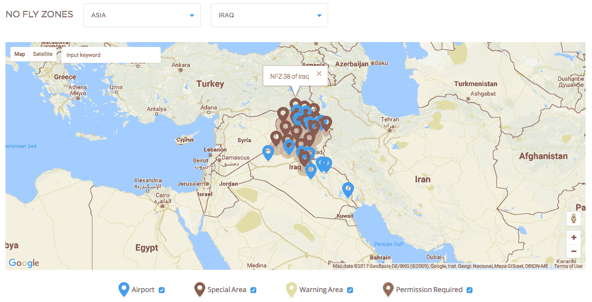
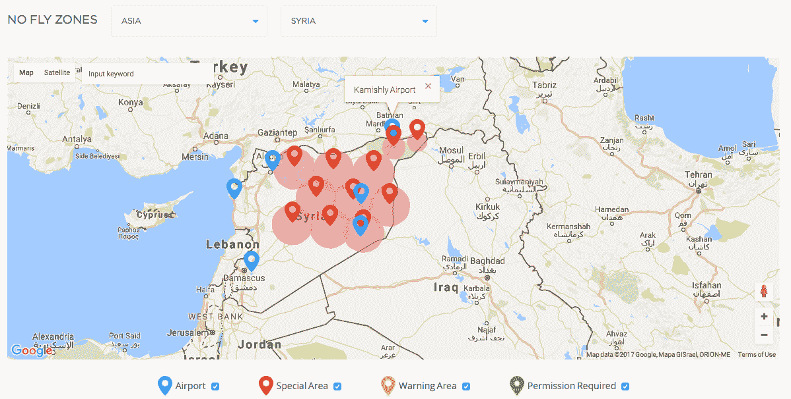

# DJI 将伊拉克和叙利亚的大部分地区加入其无人机禁飞区名单

> 原文：<https://web.archive.org/web/https://techcrunch.com/2017/04/26/dji-adds-much-of-iraq-and-syria-to-its-list-of-no-fly-zones-for-its-drones/>

# DJI 将伊拉克和叙利亚的大部分地区加入其无人机禁飞区名单

无人机制造商 DJI 更新了他们的软件，将叙利亚和伊拉克的大片地区变成禁飞区。DJI 通常会阻止用户在军事基地和机场等敏感区域上空驾驶无人机，但其新的禁飞区覆盖范围更广，包括两国北半部的大部分地区(包括摩苏尔市)，根据 DJI 的地图。

DJI 的围棋程序和《T4》进行了更新，最早由 Register 报道。

恐怖组织一直在使用小型商用无人机向伊拉克目标投掷爆炸物，作为世界上最大的无人机公司之一，DJI 经常在关于此类袭击的文章中被提及。例如，10 月份,[纽约时报](https://web.archive.org/web/20230306193251/https://www.nytimes.com/2016/10/12/world/middleeast/iraq-drones-isis.html??mtrref=undefined)暗示 DJI 的产品可能已经被 ISIS 使用，写道“伊斯兰国正在使用更简单的商用无人机，比如 DJI 幻影，可以在亚马逊上购买。”

五角大楼尚未公布 ISIS 和其他组织使用的无人机品牌，但今年 1 月，特遣部队打击行动指挥官布雷特·西尔维娅上校在国防部简报会上表示，ISIS 拥有“美国任何 13 岁孩子都拥有的能力。他可以上网购买某种类型的无人机，然后把它挂起来。”

然而，DJI 声称它的幻影无人机很难处理爆炸载荷的重量。该公司还表示，阻止伊拉克和叙利亚的所有幽灵航班以遏制 ISIS 将损害人道主义援助任务。

值得注意的是 [DJI 可以做动态地理围栏](https://web.archive.org/web/20230306193251/http://dronelife.com/2015/11/17/dynamic-geofencing-introduced-by-dji/)——即临时禁飞区——以应对事件或安全问题。此外，无人机操作员也有可能绕过 DJI 的地理围栏。

在发给媒体的一份声明中，DJI 没有提到 ISIS，也没有确认它是否因为恐怖袭击而设置了新的地理围栏限制:

> “DJI 制造产品完全是为了和平目的，这是绝大多数飞行员使用产品的方式，我们谴责任何使用我们的无人机给任何人带来伤害的行为。我们的地理围栏系统旨在告知飞行员空域限制，而不是为了执行法律或阻止那些想要滥用我们产品的人。某些对航空安全或国家安全至关重要的区域在我们的地理围栏系统中被标记为受限区域，我们不断调整这些区域，以应对造成特殊限制的临时情况，如野火和重大公共事件。”