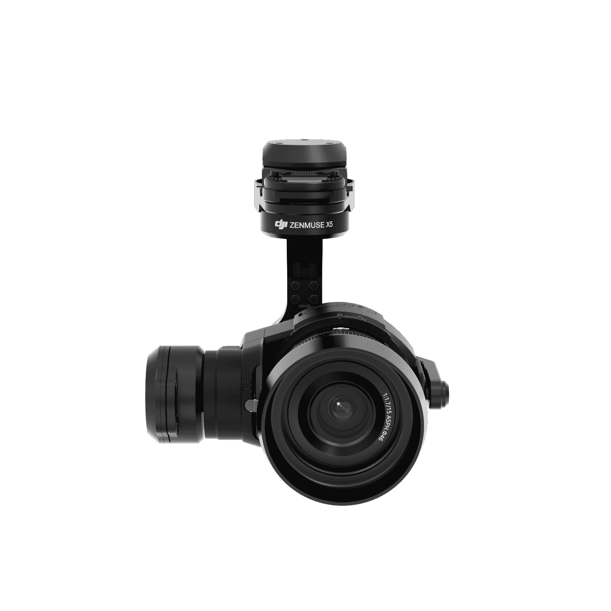

# DJI 宣布为其 Inspire 1 无人机配备两款微型四分之三摄像头

> 原文：<https://web.archive.org/web/https://techcrunch.com/2015/09/10/dji-launches-two-micro-four-thirds-cameras-for-its-inspire-1-drones/>

今天，世界上最大的无人机制造商 DJI 在拉斯维加斯 [InterDrone 会议](https://web.archive.org/web/20230326062126/http://www.interdrone.com/)上宣布了其高端 Inspire 无人机的两款新相机。

Zenmuse X5 和 X5R 是第一款专为航空用途设计的微型四分之三相机，将为无人机飞行员提供 13 站的动态范围、1600 万像素的分辨率和拍摄 24fps 和 30fps 4k 视频的能力，当然还有标准的静态图片。

然而，对专业摄像师来说更重要的是，Zenmuse 相机将支持来自 DJI 本身、松下和奥林巴斯的四种不同的广角镜头。相机将被安装在 DJI 的 Zenmuse 万向架上。

该公司长期以来一直为其阅读飞行幻影和灵感无人机提供内置摄像头。虽然这些相机肯定是可以接受的，但它们并没有提供专业的效果，即使在幻影下面有 GoPro，你仍然会受到 GoPro 的能力和(宽)视野的限制。

一些勇敢的无人机飞行员已经在他们的机器下面安装了他们的数码单反相机或无反光镜相机，但这些相机既不是专门为航空摄影制造的，也不是为特定的无人机制造的。

正如 DJI 航空影像总监 Erich Cheng 在他的 InterDrone 主题演讲中所说，微型四分之三相机的优势在于它提供了比目前标准 DJI 相机大得多的传感器。这使得这款相机的动态范围远远高于 DJI 的标准相机。

该公司今天还宣布，它将为新相机提供一个可选的无线 follow focus 系统，其中包括一个用于 Inspire 遥控器的硬件插件。

DJI 将生产两个版本的 Zenmuse 相机，X5(将首先发布)和 X5R。它们具有相同的传感器和镜头兼容性，但 X5R 还支持万向板顶部的可移动 512GB 固态硬盘，用于记录平均比特率为 1.7Gbps 的无损 4k 视频。除了无损 4k，X5R 还可以同时捕获压缩视频文件，然后保存在 SD 卡上。

“为了达到 Zenmuse X5 和 X5R 制作的视频质量，飞行员过去不得不花费数千美元购买大型复杂的空中设备，”DJI 首席执行官兼创始人 Frank Wang 说。“现在，飞行员只需将 Zenmuse X5 系列相机安装到他们的 Inspire 1 上，穿上他们的道具，进入空中，并在飞行中完全控制他们的镜头。这节省了电影拍摄的宝贵时间，并使工业应用的高质量成像更小、更轻、更易于管理。”

然而，所有这些动力都不会便宜。一台配备 Zenmuse X5 和 DJI 15 毫米 F1.7 镜头(这基本上是这款相机的套件镜头)的 DJI Inspire 1 将花费你 4499 美元。一款独立 X5 售价 2199 美元，将于本月晚些时候发货。X5R 的 Inspire 将于第四季度上市，价格为 7，999 美元(尚未提供独立定价)。显然，这些不是玩具。

[gallery ids="1207915，1207916，1207917，1207758"]