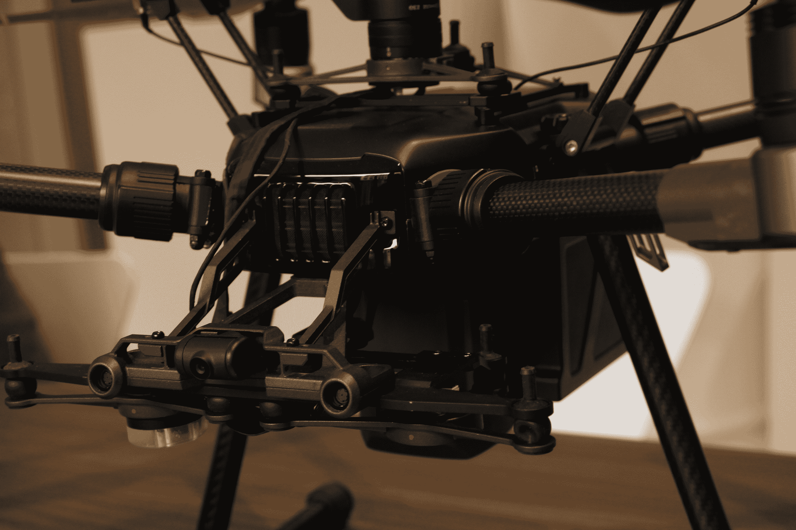
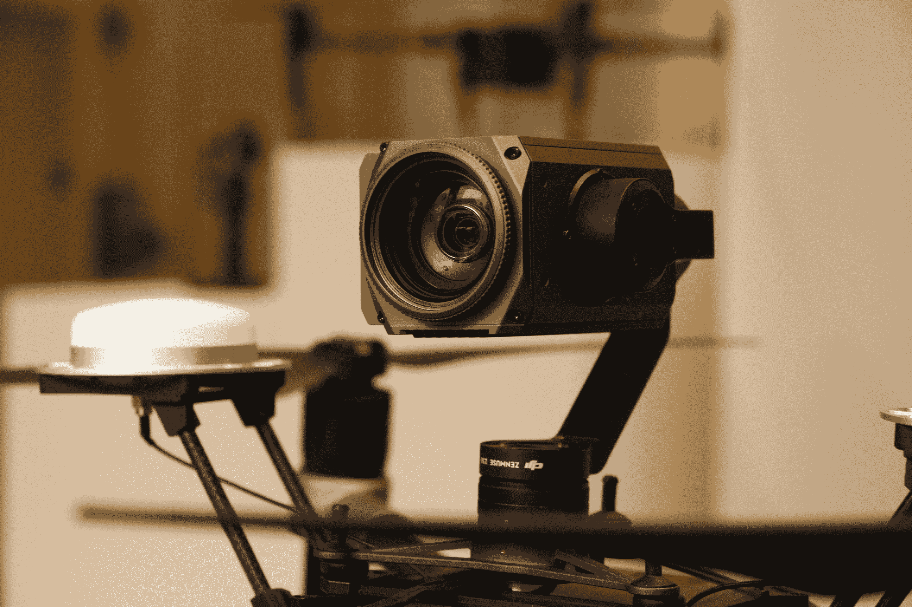

# DJI 借助 Matrice 200 TechCrunch 展望企业应用

> 原文：<https://web.archive.org/web/https://techcrunch.com/2017/02/26/dji-matrice-200/>

对于世界上最大的无人机制造商来说，企业类别是显而易见的。当然，它不像与该公司关系最密切的消费者和电影摄影类别那样性感，但它是一个不断增长的行业，并且可能会随着公司发现 Matrice 200 等产品的更多用途而继续发展。

DJI 的最新无人机于本周末在巴塞罗纳举行的世界移动通信大会上亮相，它是该公司去年底宣布的以电影为重点的 [Inspire 2 型号](https://web.archive.org/web/20221001173443/https://beta.techcrunch.com/2016/11/16/1417200/)的定制版本，运动支架与早期型号的相机兼容，包括 30 倍光学变焦 Zenmuse Z30 和 XT 热像仪。

这两种设备的主要区别之一是防风雨性(防水等级为 IP43)，这对于设计用于应对一些非常恶劣的大气条件的产品来说是一个明显的优势。这是这些设备的一个关键用途:公共安全。无人机在某种程度上是为侦察危险情况而设计的，无论是天气还是火灾——尽管正如我在交谈中与之交谈的 DJI 代表有益地建议的那样，“我不会在沙尘暴中驾驶它。”

访问人类无法或不愿探索的地方是 Matrice 200 拟议功能的一个重要方面，包括近距离检查风力涡轮机和石油钻井平台等物体的能力，以发现基础设施问题并帮助计划维护。

该系统具有四种模式，专为不同的数据收集场景设计，包括聚光灯，其中相机随着无人机的移动锁定一个主题；有趣的盘旋点；三脚架，设计用于导航狭窄位置和主动跟踪移动物体。M200 具有三种不同的配置，根据案件的用途，提供不同的相机有利位置。

定价仍然是 TBD(很大程度上取决于配置)，尽管前述 DJI 代表告诉我，不出所料，它将高于起价 3000 美元的 Inspire 2。定价可能会在这些设备的最终使用方式中发挥作用，无论企业是选择使用员工还是依赖第三方机构来帮助收集数据。

另一方面，一个可接受的价格点可能会大大有助于将这种无人机纳入主流应用方式，DJI 正指望让它们成为各种行业的重要工具。