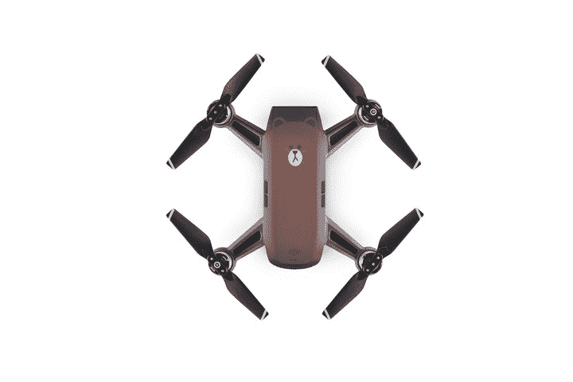

# DJI 发布了一款印有熊脸的 Spark 无人机 

> 原文：<https://web.archive.org/web/https://techcrunch.com/2018/08/06/dji-releases-a-spark-drone-with-a-bear-face-on-it/>

# DJI 发布了一架印有熊脸的 Spark 无人机

我们仍在等待 7 月份 Mavic 2 活动的改期时间，但我猜在你等待的时候会有一些东西。是火花，但有一张熊脸。

老实说，除了我们已经写过的关于 DJI 火花的几千字之外，没有什么可以补充的了。读了这些，但想象一下，也有一个看似无私的熊角色一直盯着你，你已经得到了一个非常接近的 [Line Friends (Brown) l Spark](https://web.archive.org/web/20221025223353/https://store.dji.com/product/spark-line-friends-brown?vid=45481) 。

该产品是这家无人机巨头的第一款“特色无人机”，是与 Line Friends 合作的成果，Line Friends 是一个日本可爱动物朋友系列。从声音来看，棕熊是两家公司推出的众多动物品牌无人机中的第一款。

除此之外，它与标准的 Spark 似乎没有太多区别。

DJI 高级通信经理 Monica Suk 说，“就像我们包里的其他东西一样，无人机正在成为一种生活方式的附属品。我们和 Line Friends 推出的这款特别版。我会将这一理念更进一步，让讲故事和分享变得令人兴奋，成为我们日常生活的一部分。”

好消息是，它的价格和标准的 Spark 一样，都是 399 美元。