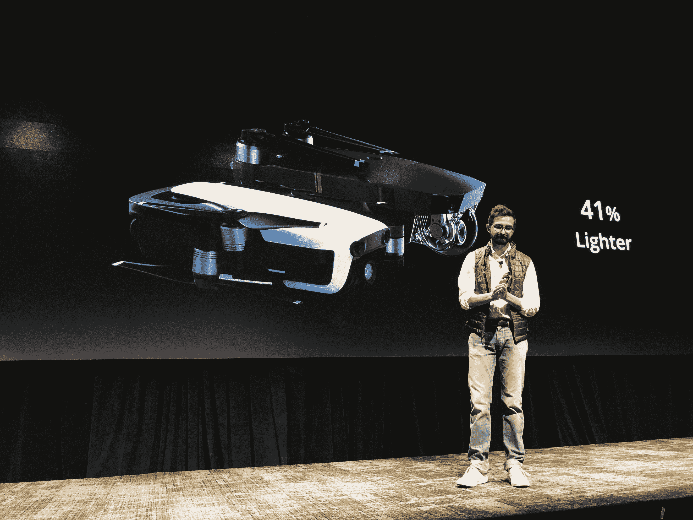

# DJI 售价 799 美元的智能手机大小的 Mavic Air 无人机于 1 月 28 日开始发货

> 原文：<https://web.archive.org/web/https://techcrunch.com/2018/01/23/dji-unveils-the-mavic-air-portable-folding-drone/>

DJI 在保密无人机方面做得并不出色。和上几款设备一样， [Mavic Air 在今天的官方发布会之前泄露了](https://web.archive.org/web/20230307142250/https://techcrunch.com/2018/01/22/djis-latest-drone-leaks-ahead-of-launch/)。这款无人机或多或少符合我们的预期，介于 Mavic Pro 和 Spark 之间，完善了该公司目前以消费者为中心的四轴飞行器系列。

DJI 表示，Air“又回到了绘图板”，它可以折叠起来，小到足以装进口袋。事实上，它非常便携，以至于该公司的北美总监在今天的活动中，竟然将两架“智能手机大小”的无人机塞进了他的背心口袋。“它的大小大约是 Pro 的一半，重量大约是其前身的 41%。

船上有一个 4K 相机，安装在一个三轴万向节的顶部。剧照由 1200 万像素的车载摄像头拍摄，能够在弱光下拍摄。HDR 也参与其中，在光线不均匀的地方拍摄出更好的照片。该公司为该系统添加了几项摄影软件改进，包括将 3200 万像素的相机照片拼接在一起的能力。

万向架和无人机一样，是从地面向上设计的。该系统实际上直接嵌入系统中，使无人机的占地面积更小。还有 8GB 的内部存储，因此用户可以保存照片和视频，而无需添加 microSD 卡。

Air 也是自 GoPro 毫不客气退出太空以来，该系列发布的首款无人机。该公司的 Karma 产品是 Mavic Pro 最直接的竞争对手。事实上，该产品诞生于 GoPro 和 DJI 之间的合作关系，最终以失败告终。

去年底，GoPro 的无人机梦想也破灭了，部分原因是推出时功能有限，以及该公司缺乏制造自己的飞行器的经验，导致无人机从天上掉下来。

Air 具有主动跟踪功能，这是 Karma 非常缺乏的功能，它可以让无人机在拍摄对象移动时跟随他们，从而可以在没有额外工作人员的帮助下拍摄动作视频。与此同时，新的小行星和回旋镖功能，只需按一下按钮，就可以拍摄编程的全景照片。

Mavic Pro 的开始有点不顺利，发布时受到运输延迟的困扰。然而，最终，该产品证明了无人机巨头的成功，最终导致了去年 5 月手掌大小的模型的发布。该设备是 DJI 第一款引入手势控制的设备，该公司将该设备定位为一种自拍无人机。

我们在自己的测试中遇到了一些麻烦，最终导致我们的生产商在 Spark 的一个刀片上划开了一个手指。手势控制也时好时坏，使产品向真正的消费者迈出了有趣的一步，但并没有完全实现。希望 Air 将通过公认的第一代产品来纠正这些问题。

Spark 的手势控制系统已经更新为智能捕捉系统。将手掌指向空中将使无人机离开地面，倾斜手掌将在飞行中控制它。在今天的活动中的一个快速演示中，该系统似乎比其前身更复杂，但当我们在一个控制较少的环境中测试时，我们会看到肯定的。

当你准备结束一次飞行时，你把你的手放在一起，让它回家，然后向下指，让它着陆。该功能在 19 英尺的范围内有效。使用智能手机控制系统颠簸高达 262 英尺，加上遥控器可以将颠簸提升到令人印象深刻的 2.5 英里。在“运动”模式下，它的时速可达 42.5 英里。

该无人机充电后能够飞行长达 21 分钟。板上有一个 USB-C 端口用于充电，比其前辈的 microUSB 更上一层楼。还有一系列新的安全和跟踪功能被塞进无人机小得多的机身。

由于七个车载摄像头能够进行三向跟踪，位置跟踪得到了改善。与此同时，一个新的机载通风系统在飞行时推动空气穿过无人机的身体。

Y 与它的前辈相比，你的避障能力也有所提高(诚然， [在我们第一次与 Pro 一起尝试时表现不佳](https://web.archive.org/web/20230307142250/https://techcrunch.com/2016/11/04/dji-mavic-pro-0-birdhouse-1/) )。据该公司称，新系统能够在高达每小时 22 英里的风速下运行。

Air 的起价为 799 美元，介于 399 美元的 Spark 和 999 美元的 Pro 之间。还有一个 999 美元的组合包，包括两个额外的电池和螺旋桨，一个充电集线器和一个旅行包。新无人机从今天开始在 DJI 的网站上接受预购。它将于下周 1 月 28 日开始发货。它有白色、黑色和红色。

DJI 称 Mavic Pro 是“有史以来最畅销的无人机”，鉴于该公司在市场上的主导地位，似乎没有什么理由怀疑这里的限定条件。当然，虽然无人机的拥有量一直在上升，但这些设备还没有达到该公司梦想的那种无处不在的产品。

Pro 和 Spark 在尺寸、可用性和定价方面都代表着实现这一目标的重要一步。Air 将整个画面推得更远了一点，看起来确实代表了硬件方面的一些关键进步。该产品建立在其前辈取得的许多关键进步的基础上，实现了更小的足迹。

对于专业甚至业余摄影师来说，799 美元是一个很好的价格点，他们希望用武库中的另一个关键工具来提升他们的游戏。至于消费者，我很高兴在未来几天里带着这个东西在某个领域转一圈，看看该公司在绝地风格的手势控制方面取得了什么样的进步，希望在这个过程中不会伤害我们的视频制作人的手。

[gallery ids="1589953，1589954，1589955，1589956，1589957，1589958，1589959，1589952，1589951"]

但是，即使增加了对消费者友好的控制的关注，799 至 999 美元的价格点对于大多数非专业人士来说仍然是相当高的(公认的酷)玩具。