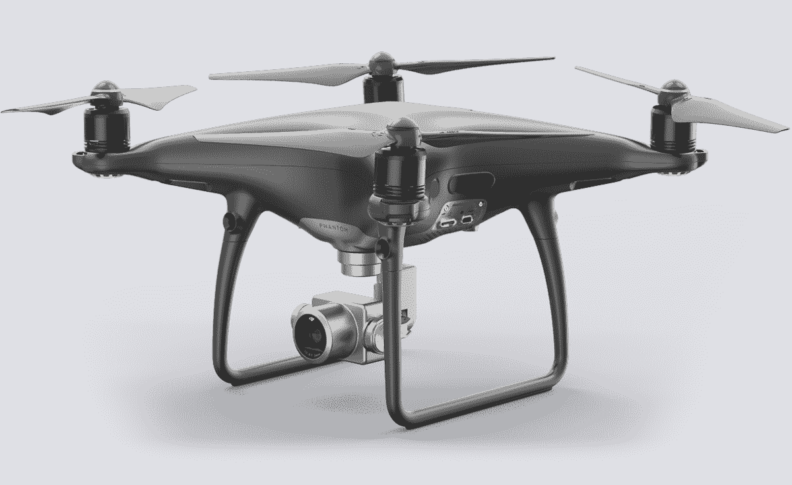

# DJI 的 Mavic Pro 和 Phantom 4 Pro 无人机获得新的外观和功能 

> 原文：<https://web.archive.org/web/https://techcrunch.com/2017/08/31/djis-mavic-pro-and-phantom-4-pro-drones-get-new-looks-and-features/>

# DJI 的 Mavic Pro 和 Phantom 4 Pro 无人机获得了新的外观和功能

DJI 升级了其 Mavic Pro 和 Phantom 4 Pro 无人机硬件，并为其最小的消费无人机微小的 DJI Spark 添加了新的软件功能。在 2017 年 IFA 展会上，DJI 展示了新的 Mavic Pro Platinum，每次充电的飞行时间增加了约 11%，噪音降低了 60%。它还获得了白金油漆工作。Phantom 4 Pro 黑曜石有一个哑光灰色的表面(这不是我所期望的所谓的“黑曜石”)。

DJI 能够实现 Mavic Pro Platinum 升级的方式是通过新的电子速度控制器和全新的螺旋桨。现有的 Mavic Pro 所有者可以单独获得新螺旋桨的一些好处，这是向后兼容的。这让我不那么羡慕了，因为我已经有了一台 Mavic Pro。

Phantom 4 Pro 黑曜石基本上完全是一种颜色变化，尽管它有一个新的镁，电镀万向节，据说可以防止指纹。

最后，DJI Spark 获得了球体模式，允许 Spark 用户制作具有鱼眼效果的全景图像，他们可以直接分享到社交媒体网站。这将通过 DJI GO 4 移动智能手机应用程序推送的固件更新来实现。

新款 Mavic Pro Platinum 的零售价为 1099 美元，Phantom 4 Pro 曜石的售价为 1499 美元，两者都将于 9 月发货。