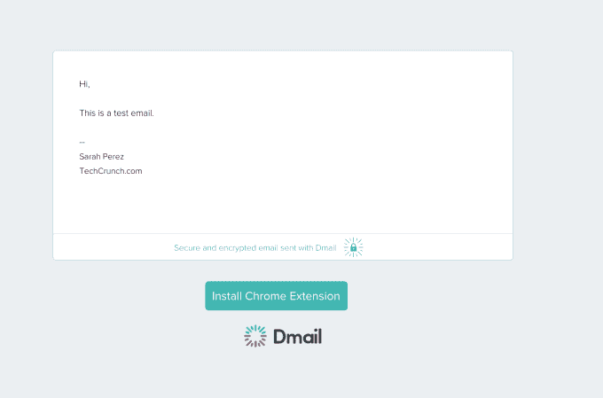
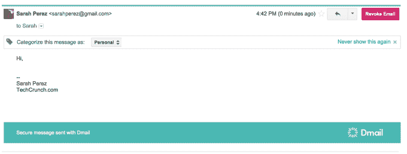

# Dmail 让你的 Gmail 邮件自毁

> 原文：<https://web.archive.org/web/https://techcrunch.com/2015/07/23/dmail-makes-your-gmail-messages-self-destruct/>

你有没有后悔发了一封邮件，希望可以收回？或者，你可能担心通过电子邮件发送机密信息——尤其是在看到大规模电子邮件黑客攻击可能造成的损害之后，就像去年索尼影业遭受的攻击？一项名为 [Dmail](https://web.archive.org/web/20230326083316/https://mail.delicious.com/) 的新“自毁”电子邮件服务旨在通过引入一种工具来消除这些担忧，这种工具可以让你更好地控制通过 Gmail 发送的邮件。

有了 Dmail，你可以随时撤销对任何电子邮件的访问，而且在即将发布的版本中，你还可以阻止收件人将你的邮件转发给他人。

这项新服务的想法来自社交书签服务 [Delicious](https://web.archive.org/web/20230326083316/https://www.crunchbase.com/organization/delicious) 背后的团队。作为一个长期的网络主食， [Delicious 被它的前所有者](https://web.archive.org/web/20230326083316/http://dealbook.nytimes.com/2014/05/08/delicious-social-site-is-sold-by-youtube-founders/?_php=true&_type=blogs&_r=0)，YouTube 的联合创始人查德·赫利和陈士骏卖给了科技投资和咨询公司 [Science，Inc](https://web.archive.org/web/20230326083316/https://www.crunchbase.com/organization/science) 。由 MySpace 前总裁迈克·琼斯运营。

除了 Delicious，Science 还通过其科学媒体集团投资了许多成长型初创公司，如 FameBit 和 Hello Society，并孵化和投资了其他公司，如 DogVacay、HomeHero、Dollar Shave Club 等。

## Dmail 的工作原理

当然，撤销电子邮件的功能已经存在一段时间了——但是那些早期的实现还有很多不足之处。例如，使用 Exchange Server [的公司中的 Microsoft Outlook 用户可以撤回电子邮件](https://web.archive.org/web/20230326083316/https://support.office.com/en-in/article/Recall-or-replace-an-email-message-that-you-sent-81c1ae4a-1ea3-4355-b05f-91785773ac15)，但它不适用于公司外部的地址。与此同时，Gmail 自己的“取消发送”功能——最近从 Gmail 实验室毕业的[——允许你通过配置点击“发送”后的秒数来取消已发送的电子邮件，你可以点击“取消发送”链接将你的邮件带回草稿。](https://web.archive.org/web/20230326083316/http://googleappsupdates.blogspot.com/2015/06/undo-send-for-gmail-on-web.html)

然而，Gmail 的撤销发送选项被限制为最多 30 秒。使用 Dmail，您可以随时销毁已发送的电子邮件。

该产品通过谷歌 Chrome 网络浏览器扩展的方式工作，只有你，作为电子邮件发送者，必须安装它。

[gallery ids="1186908，1186907，1186906，1186905，1186910"]

加载后，Gmail“撰写”界面中会有一个新选项，允许您使用拨动开关来关闭和打开 Dmail 服务。启用后，您可以指定在发送电子邮件之前，是希望在一小时、一天、一周还是“从不”销毁电子邮件即使您选择了“从不”选项，您也可以稍后进入您发送的邮件，然后单击“撤销电子邮件”按钮，以删除所有收件人对该电子邮件的访问权限。

Dmail 的巧妙之处在于，与其他一些安全信息产品不同，收件人不需要自己使用这项服务就可以工作。如果他们没有安装扩展，他们会收到一封电子邮件，说明:“*此安全邮件是使用 Dmail 发送的。要查看此消息，只需单击下面的按钮。*

点击附带的“查看邮件”按钮会将他们重定向到一个 web 视图，他们可以在那里阅读您的电子邮件。

然而，如果他们*确实*安装了扩展，他们可以直接在 Gmail 中阅读你的邮件。

此外，在发件人撤销电子邮件后，安装了该扩展的收件人将看到一条消息，内容为:*“此消息已被销毁，不再可用。”*没有扩展名的用户仍然可以进入电子邮件并点击“查看消息”按钮，但他们会在随后的网络视图中看到类似的“消息不可用”提示。

该公司称，Dmails 是用标准的 256 位加密算法加密的。负责 Dmail 产品的 Eric Kuhn 解释说，当用户发送一封 Dmail 时，邮件的正文会在用户的机器上进行加密。该电子邮件的加密副本被发送到由 Dmail 控制的数据存储中。他说:“电子邮件的收件人会收到数据存储的位置以及查看解密邮件的密钥。

Gmail 和 Dmail 服务器都不会同时收到解密密钥和加密邮件。只有收件人和发件人才能清楚地阅读电子邮件，”库恩补充道。

该产品由 Delicious 的七人团队开发，今年大部分时间都在开发中，过去几个月一直在进行私下测试，首先是在 Delicious 内部，然后是 Delicious 用户。

虽然它目前只支持 Gmail，但长期目标是扩展到其他平台，包括谷歌应用程序。此外，Dmail iOS 应用程序将于 8 月推出，随后将推出 Android 版本。这些应用程序将允许用户直接从智能手机上撰写和阅读邮件。

最终，该团队计划使 Dmail 成为一项免费增值服务，其中一些方面将对个人免费，而高级用户和企业将为其他功能付费。

Delicious 可能收费的一个功能是将“自毁”功能扩展到文档。

“我喜欢这个想法，让某人访问 PDF 文件或文档，然后能够撤销查看权限，”琼斯说。“在我们的业务中，我们总是看到这种情况，”他说，指的是科学作为创业资助者的地位。“我们可能有一个敏感的财务文件或投资者资料，我们真的只想打开一次，然后撤销访问权限，没有简单的方法可以做到这一点。”

文档控制已经在开发中，琼斯说他希望这个功能能在今年冬天之前推出。

同时，Gmail 和 Chrome 用户可以从[这里](https://web.archive.org/web/20230326083316/https://chrome.google.com/webstore/detail/dmail/fblelgmhengcpjogkpmmhjghbcelaake/related?ref=producthunt)开始自己尝试 Dmail。