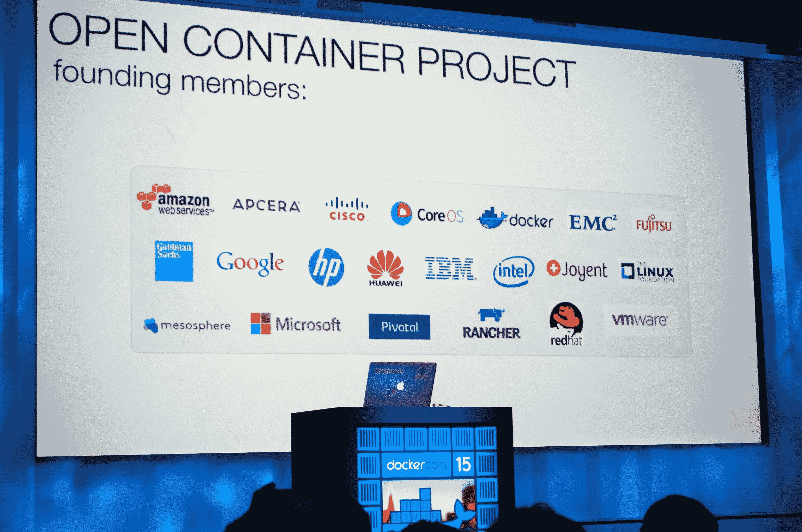
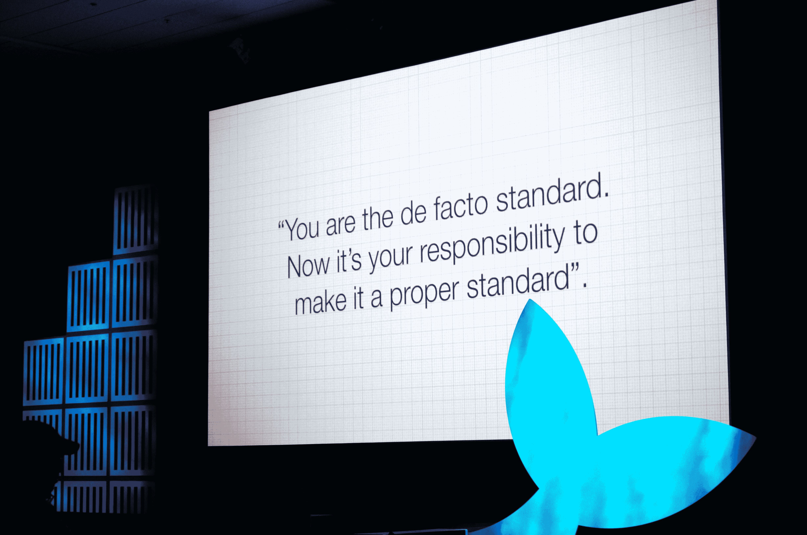

# Docker、CoreOS、Google、微软、亚马逊和其他公司一起开发通用容器标准

> 原文：<https://web.archive.org/web/https://techcrunch.com/2015/06/22/docker-coreos-google-microsoft-amazon-and-others-agree-to-develop-common-container-standard/>

在 Linux 基金会的帮助下，Docker、CoreOS、谷歌、微软和亚马逊正在为 T2 的软件容器新标准 T3 而努力。这个联盟的其他成员包括 Apcera、Cisco、EMC、Fujitsu Limited、Goldman Sachs、HP、华为、IBM、Intel、Joyent、Mesosphere、Pivotal、Rancher Labs、Red Hat 和 VMware——也就是说，几乎所有人都与建设繁荣的容器生态系统有利害关系。

Docker 可能已经成为容器的同义词，但它不是唯一的容器格式，也不是每个人都同意它应该成为标准格式。去年 12 月，CoreOS 宣布推出自己的容器运行时( [rkt](https://web.archive.org/web/20230404215523/https://coreos.com/blog/rocket) )和格式(appc)，该项目得到了谷歌、红帽和 VMware 等主要公司的支持。

当时，Docker 和 CoreOS 看起来像是在碰撞，拥有更多的容器格式不太可能有助于整个生态系统。

然而，现在这两家公司将与其他利益相关者合作开发[开放容器项目](https://web.archive.org/web/20230404215523/http://www.opencontainers.org/) (OCP)，该项目将位于 Linux 基金会之下。OCP 是一个非盈利组织，它“被特许建立软件容器的通用标准”

Docker 容器格式和[运行时](https://web.archive.org/web/20230404215523/http://runc.io/)将形成新标准的基础，Docker 正在贡献其图像格式和运行时引擎的草案规范和代码，以启动该项目。

这里的主要思想是，开发人员应该能够将他们的应用程序打包在一个容器中，并相信它可以在任何运行时运行，无论是 Docker、CoreOS 的 rkt，还是像 [Kurma](https://web.archive.org/web/20230404215523/https://github.com/apcera/kurma) 或 Jetpack 这样的项目。该标准应该是厂商中立的，开发应该公开进行。

CoreOS 创始人兼首席执行官 Alex Polvi 写道:“随着开放容器项目的宣布，Docker 告诉世界，他们对这一讨论持开放态度。”“今天，Docker 是容器的事实上的图像格式，因此它是作为标准的一个很好的起点。我们仍然认为现有的 Docker 格式存在许多技术问题，但拥有一个中立的席位将有助于解决整个行业的这些问题。”

对 Docker 来说，这也意味着放弃一些控制权。“在收到来自社区、合作伙伴和客户的反馈后，我们认为现在是创建一个通用标准的时候了，该标准将确保整个生态系统的兼容性并鼓励创新，”Docker 开源倡议的创始人和创建者所罗门·海克斯(Solomon Hykes)在今天的一份声明中表示。

“正是因为这个原因，我们将我们的容器格式和运行时贡献给了标准。我们相信，两年后，Docker 容器运行时代码和技术已经成熟，它们将从 Docker 项目之外的独立治理中受益。Docker 的优势一直是让社区联合起来，避免分裂。”

我还问了谷歌云平台产品经理克雷格·麦克卢奇(Craig McLuckie)对这一新举措的看法。他认为这只会让容器生态系统变得更强大。“这创建了一个开放的社区来驱动容器规范的未来版本；McLuckie 告诉我:“容器规范本身还没有确定，首要任务是将 AppC 中推广的许多想法引入到获得巨大成功的 Docker 生态系统中。

“这将确保创新确实发生，并且以一种让所有人受益的方式发生，并且不受特定供应商的约束。”他还认为，这种单一的标准将使构建容器打包软件的公司的生活更容易，因为他们将能够针对一种单一的格式，然后可以在多种生态系统和环境中使用。“它还为运行时环境中的创新提供了灵活性，因为那里的任何新举措都可以直接受益于现有的工具生态系统，”他指出。

值得注意的是，从长远来看，Docker 的商业模式并不局限于容器格式，而是构建管理容器部署的工具。虽然该公司显然对引领软件容器的未来感兴趣，但它的主要兴趣是围绕这一想法建立一个充满活力的生态系统。从长远来看，让一个广泛的公司联盟参与创建一个单一的集装箱标准将使它能够完成这一使命。