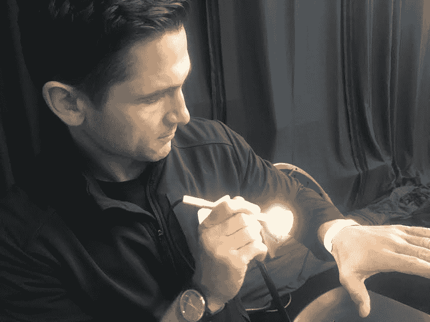

# 黑兹尔医生使用人工智能来尝试确定您是否患有皮肤癌技术危机

> 原文：<https://web.archive.org/web/https://techcrunch.com/2017/09/17/doctor-hazel-uses-ai-to-try-to-determine-if-you-have-skin-cancer/>

# 医生黑兹尔使用人工智能来尝试确定您是否患有皮肤癌

【Hazel 医生在 [TechCrunch Disrupt 的 SF 2017 hackathon](https://web.archive.org/web/20221225111342/https://techcrunch.com/event-info/disrupt-sf-2017/disrupt-sf-2017-hackathon/) 度过了最后 24 小时，致力于一个有趣的想法，即使用人工智能来检测癌性葡萄胎。

软件工程师迈克·博罗兹丁几天前向他的朋友兼英特尔软件创新者彼得·马同事提出了利用人工智能来确定鼹鼠是否患有癌症的想法。该团队很快在亚马逊花了 30 美元买了一台高性能内窥镜相机，建立了一个网站并开始工作。

黑兹尔医生的工作方式是首先登录网站，上传你所关注的痣，然后在几秒钟内得到结果。如果人工智能认为您患的是癌症，它会建议您去看医生进行进一步检查。

该团队在我突然开发的一个奇怪的红色斑块上试用了该系统，并以 74%的置信度确定这是一个非癌性葡萄胎。不过，马和博罗兹丁提醒说，这个系统只运行了一天，可能没有足够的信息，所以我以后还是会检查一下。

请注意，已经有许多用于诊断皮肤病的应用程序，如 FirstDerm 和 SkinVision。这些方法通常是先对有问题的皮肤区域拍照，支付一定的费用将其提交给应用程序，然后等待皮肤医生给你回复诊断结果。

显然，现在为时尚早，黑兹尔医生还没有准备好诊断任何人。相反，我们的目标是希望让人们自愿说出他们奇怪的皮肤状况，以帮助改善这个系统。

该平台目前从 8000 个变量中提取数据，以确定四种不同的结果:什么都没有、痣、黑色素瘤或其他类型的癌症。

最终，这家初创公司将拥有一款应用，并可能附带一款图像捕捉设备，该团队可以向医生和医院出售，以帮助他们实时筛选出非癌性痣，从而节省患者和医生的时间、金钱和担忧。

现在的主要障碍是获得帮助 Hazel 医生预测皮肤癌所需的数据，准确率至少达到 90%。“为医学获取人工智能数据有一个巨大的问题。获取数据很痛苦，即使是大型机构的数据。博罗兹丁说，没有人愿意分享。但是惊人的结果是可能的。分享的人越多，系统就变得越精确。"