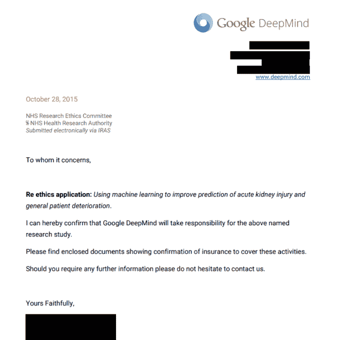

# 文件详细说明了 DeepMind 在 2015 年将人工智能应用于 NHS 数据的计划 

> 原文：<https://web.archive.org/web/https://techcrunch.com/2017/08/31/documents-detail-deepminds-plan-to-apply-ai-to-nhs-data-in-2015/>

关于[有争议的](https://web.archive.org/web/20221212063444/https://www.newscientist.com/article/2086454-revealed-google-ai-has-access-to-huge-haul-of-nhs-patient-data/) 2015 年谷歌 DeepMind 和英国国民健康服务信托基金之间的患者数据共享安排的更多细节已经浮出水面，该安排描绘了一幅与两人关于他们打算使用 160 万公民医疗记录的公开叙事形成鲜明对比的画面。

DeepMind 和皇家免费 NHS 信托基金在 2015 年 9 月签署了他们最初的[信息共享协议](https://web.archive.org/web/20221212063444/https://drive.google.com/file/d/0BwQ4esYYFC04NFVTRW12TTFFRFE/view)(ISA)——表面上是为了联合开发一款名为 Streams 的临床任务管理应用程序，用于使用 NHS 算法早期检测急性肾脏疾病。

患者的完全可识别的医疗记录正在与谷歌所有的公司共享，既没有征求他们的同意，也没有告知他们的数据将被交给商业实体。

事实上，这一安排是在签约五个月后才向公众公布的——而几个月前，患者数据已经开始流动。

直到 2016 年 4 月, [New Scientist](https://web.archive.org/web/20221212063444/https://www.newscientist.com/article/2086454-revealed-google-ai-has-access-to-huge-haul-of-nhs-patient-data/) 记者获得并发布了两人之间的 [ISA](https://web.archive.org/web/20221212063444/https://drive.google.com/file/d/0BwQ4esYYFC04NFVTRW12TTFFRFE/view) ,这才充实了任何真正的细节——通过信息自由请求，首次披露了针对单一疾病的应用程序共享了多少医疗数据。

这导致英国数据保护监管机构对这一安排的合法性展开调查。随着公众对医疗记录合作背后的范围和意图的压力越来越大，两人坚持他们的立场，即病人数据没有被用于训练人工智能。

他们还声称，他们不需要寻求患者的同意来共享他们的医疗记录，因为由此产生的应用程序将用于直接的患者护理——这一声称的法律基础后来被 ICO 推翻，ICO 于 7 月结束了长达一年多的调查。

然而，一系列新发布的文件显示，将人工智能应用于患者数据实际上是 DeepMind 与皇家自由合作的最初几个月的目标——其意图是利用信托基金授予的对公共资助医疗数据的广泛访问和控制，同时开发自己的人工智能模型。

2016 年 2 月，DeepMind 在其网站上公开宣布合作时的一份常见问题说明中写道:“不，人工智能不是我们今天宣布的早期试点的一部分。现在确定人工智能在这里的应用还为时过早，但这肯定是我们对未来感到兴奋的事情。”

对其计划的描述中忽略了一个事实，即它已经从 NHS 健康研究权威研究伦理委员会获得了有利的伦理意见，以对相同的基础 NHS 患者数据进行为期两年的人工智能研究。

## DeepMind 的意图一直是应用人工智能

最新[发布的文件](https://web.archive.org/web/20221212063444/https://www.whatdotheyknow.com/request/410881/response/1001252/attach/2/1718%20FOI%20011%20HRA%20response%20and%20documentation.pdf)，通过健康数据隐私倡导组织 [medConfidential](https://web.archive.org/web/20221212063444/https://medconfidential.org/) 提交的 FOI 获得，显示 DeepMind 在 2015 年 10 月使用皇家免费患者数据为一个人工智能研究项目提出了伦理申请——其声明的目的是“使用机器学习来改善对急性肾损伤和一般患者恶化的预测”。

更早的时候，在 2015 年 5 月，该公司获得了一家保险公司的确认，以覆盖其对该研究项目的潜在责任——随后它注意到在其项目申请中已经到位。

NHS 道德委员会在 2015 年 11 月批准了 DeepMind 的人工智能研究项目申请——这个为期两年的人工智能研究项目计划于 2015 年 12 月开始，到 2017 年 12 月结束。

根据其标准协议，已获批准的研究项目的[简要概述](https://web.archive.org/web/20221212063444/http://www.hra.nhs.uk/news/research-summaries/using-machine-learning-to-improve-prediction-of-aki-deterioration/)此前已在健康研究管理局的网站上公布，但 FOI 披露了有关该研究范围的更多细节 DeepMind 的申请总结如下:

> 通过结合经典的统计方法和尖端的机器学习算法(例如，“无监督和半监督学习”)，该研究项目将创建改进的数据分析技术
> 和对谁可能患有 AKI[急性肾损伤]的预测，更准确地识别发生的病例，并更好地提醒医生他们的存在。

DeepMind 的应用程序声称，它通过 Streams 应用程序部署的现有 NHS 算法“似乎”缺失并错误分类了一些 AKI 病例，并产生了假阳性——并继续暗示:“问题不在于 DeepMind 制作的工具，而在于算法本身。我们认为我们可以克服这些问题，创造一个更好的系统。”

尽管在 2015 年 10 月编写这款应用时，Streams 应用的用户测试尚未开始——因此不清楚 DeepMind 如何能够如此自信地断言它尚未测试的工具没有“问题”。但据推测，它试图传达皇家自由基金会传递给它的关于(它声称的)“主要限制”的信息。

(需要说明的是:在 TechCrunch 于 2016 年 8 月从皇家免费网站收到的 FOI 回复中，信托告诉我们，第一次 Streams 用户测试是在 2015 年 12 月 12 日至 14 日进行的。它进一步证实:“该应用程序尚未在受控用户测试之外实现。”)

最有趣的是，DeepMind 的人工智能研究应用程序显示，它告诉 NHS 道德委员会，它可以根据与皇家自由基金会的“现有信息共享协议”处理 NHS 的研究数据。

谷歌部门在研究申请中写道:“DeepMind 作为一个数据处理器，根据与负责任的医疗机构(在这种情况下是皇家自由医院 NHS 信托)的现有信息共享协议，提供可识别患者数据的现有服务，将识别和匿名化相关记录。”

事实上，DeepMind 早在 2015 年秋季就采取了积极措施，以获得对皇家免费患者数据的人工智能研究的批准，这与这对夫妇随后向媒体和公众做出的所有断言背道而驰——当时他们声称皇家免费数据没有被用于训练人工智能模型。

例如，这是去年 5 月在信托基金与 DeepMind 共享的数据范围刚刚浮出水面(重点是我的)之后，该出版物被告知的内容:

> DeepMind 证实，**目前没有对它正在接收的数据进行任何机器学习/人工智能处理**，尽管该公司已经明确表示希望在未来这样做。其网站上关于这一雄心的说明写道:“人工智能不是我们今天宣布的早期试点的一部分。**现在确定人工智能在这里的应用还为时过早**，但这肯定是我们对未来感到兴奋的事情。”
> 
> 皇家自由发言人表示，根据信托基金和 DeepMind 之间的现有数据共享协议，该公司不可能将人工智能技术应用于这些数据集和数据流。
> 
> 他证实，这种类型的数据处理需要另一份协议。
> 
> “**这些数据唯一用于直接的病人护理**，”他补充道。"**它没有被用于研究**，或者任何类似的事情."

正如 FOI 明确表示的那样，与皇家自由发言人的说法相反，DeepMind 事实上已经在 2015 年 11 月获得了 NHS 健康研究机构的伦理批准，可以在皇家自由患者数据集上进行人工智能研究——deep mind 控制着用于此目的的 PID(患者可识别数据)的选择和匿名化。

对医疗数据进行研究显然不会构成直接护理患者的行为——这是 DeepMind 和 Royal Free 当时声称依赖 NHS 患者对其数据共享的默示同意的法律基础。因此，在寻求掩盖爆发的关于有多少患者的医疗记录在他们不知情或未同意的情况下被共享的争议时，两人似乎觉得有必要公开强调他们对数据的平行人工智能研究意图。

当被问及对两人的*作案手法*的看法时，德蒙福特大学网络安全教授 Eerke Boiten 博士说:“如果你得到了数据，然后匿名进行研究，声称你没有使用这些数据进行研究是不诚实的。”他的研究兴趣包括数据隐私和伦理。

“作为计算机科学家，他们中的一些人有着罗斯·安德森的血统，他们应该知道不应该相信‘匿名医疗数据’，”他补充道——他指的是一旦敏感的医疗数据被移交给第三方，他们可以使用各种其他数据对身份进行三角测量，重新识别这些数据是多么容易。

医学机密协调员菲尔·布斯(Phil Booth)也对文件披露的内容进行了评论，他告诉我们:“这表明谷歌无视规则。涉案人员一再声称不知情，好像不会用搜索引擎一样。现在看来，他们确实非常清楚所有的规则和合同安排；他们只是故意选择不跟随他们。”

当被要求回应对其故意忽视 NHS 信息治理规则的批评时，DeepMind 的一位女发言人表示，所指的人工智能研究“没有发生”。

“要明确的是，没有任何研究项目发生，也没有任何人工智能应用于该数据集。我们总是说，我们希望在未来进行研究，但我们为皇家自由提供的工作只是一直以来所说的——提供溪流，”她补充说。

她还指出了该公司今年夏天发布的一篇博客文章，此前 ICO 裁定，皇家自由的 2015 年 ISA 违反了英国数据保护法 DeepMind 承认，它“低估了 NHS 有关患者数据的规则的复杂性”，未能充分听取和“对患者、公众和 NHS 整体负责并受其影响”。

它在 7 月份写道:“我们在 2015 年开始工作时犯了一个错误，没有宣传我们的工作，所以我们主动宣布并公布了我们随后与 NHS 合作的合同。”

## “我们没有预见到任何重大的道德…问题”

在 deep mind 2015 年 11 月人工智能研究申请表格的一个部分中，该公司要求“总结研究项目产生的主要道德、法律或管理问题”，该公司写道:“我们没有预见到任何重大的道德、法律或管理问题。”

显然，事后看来，数据共享伙伴关系将很快遇到重大的道德和法律问题。因此，这是世界上最著名的人工智能建筑实体的远见的一个相当大的失败。(尽管如此，值得注意的是，本节中更全面的回应的其余部分已被完全编辑——但 DeepMind 在这里讨论的可能是它认为较次要的问题。)

该申请还透露，该公司打算不在公共数据库中注册人工智能研究——奇怪地声称“没有适合这种工作的数据库”。

在这一节中，申请表包括以下申请人指南:“尽可能鼓励研究登记”，并继续建议登记研究的各种可能的选择——如通过伙伴 NHS 组织；在一个医学研究慈善机构的登记簿上。或者通过开放访问出版商的出版。

DeepMind 没有对这些建议发表更多评论。

当我们问该公司为什么不打算注册人工智能研究时，这位女发言人重申“没有任何研究项目发生”，并补充说:“HRA(健康研究机构)最初申请的[描述](https://web.archive.org/web/20221212063444/http://www.hra.nhs.uk/news/research-summaries/using-machine-learning-to-improve-prediction-of-aki-deterioration/)可在 HRA 网站上公开获得。”

显然，该公司——其母公司谷歌的企业使命声明称，它希望“组织世界的信息”——在现阶段并不急于更广泛地传播其将人工智能应用于 NHS 数据的计划。

FOI 的回应中也对研究规模的细节进行了编辑，因此不可能确定 DeepMind 打算用于人工智能研究的 160 万份医疗记录中有多少，尽管该文件确实证实了儿童的医疗记录将包括在该研究中。

该申请确认，皇家免费 NHS 的患者，如果之前选择不将他们的数据用于任何医学研究，将被排除在人工智能研究之外(这是英国法律的要求)。

如上所述，DeepMind 的应用程序还指定，该公司将处理来自 Royal Free 的完全可识别的患者数据，以开发临床任务管理应用程序流，并识别和匿名化这些数据的子集，以运行其人工智能研究。

这很可能引发额外的问题，即 DeepMind 对患者数据的信任所提供的控制水平是否适合于一个被描述为占据数据处理器次要角色的实体——而皇家自由声称它仍然是数据控制者。

“数据处理器并不决定处理的目的——数据控制器决定,”Boiten 在评论这一点时说。“做人工智能研究”作为一个目的太不具体了，所以我发现在这种情况下不可能将 DeepMind 仅仅视为一个数据处理器，”他补充道。

有一点是清楚的:当 DeepMind 和 Royal 的免费合作被大张旗鼓地公开披露时，他们已经申请并获得了对同一患者数据集进行人工智能研究的伦理批准，这一事实在他们看来并不值得进行详细的公开讨论。当你试图赢得公众的信任，分享他们最敏感的个人数据时，这是一个巨大的失算。

当被问及为什么当时没有向媒体或公众通报该研究项目的存在和状态时，DeepMind 的一位女发言人没有直接回应这个问题，而是重申:“没有任何研究正在进行中。”

DeepMind 和 Royal Free 都声称，尽管在 2015 年 11 月从 NHS 伦理委员会收到了对人工智能研究应用的有利伦理意见，但在人工智能研究继续进行之前，还需要额外的批准。

“来自研究伦理委员会的赞成意见并不代表完全同意。DeepMind 的女发言人告诉我们:“这项工作在没有进一步批准的情况下无法进行。

“AKI 研究申请已经获得健康研究局(HRA)下属的国家研究伦理服务机构的初步伦理批准，正如 HRA 网站[上所述](https://web.archive.org/web/20221212063444/http://www.hra.nhs.uk/news/research-summaries/using-machine-learning-to-improve-prediction-of-aki-deterioration/)。然而，DeepMind 没有进行研究所需的下一步批准——即完全 HRA 批准(以前称为当地研发批准)。

“此外，在进行任何研究之前，DeepMind 和皇家自由基金会还需要一份研究合作协议，”她补充道。

HRA 给 DeepMind 的信确认了其对该研究的赞同意见，信中确实提到:

> 在相关地点开始研究之前，必须获得每个主办组织的管理许可或批准。
> 
> 应根据 NHS 研究管理安排，从参与研究的所有 NHS 组织处获得管理许可(“R&D 批准”)

然而，由于拟议的研究纯粹是在患者数据的数据库上进行的，而不是在 NHS 的任何地点，并且鉴于皇家自由已经与 DeepMind 签署了信息共享协议，尚不清楚他们正在等待什么样的额外外部批准。

两人之间最初的 [ISA](https://web.archive.org/web/20221212063444/https://drive.google.com/file/d/0BwQ4esYYFC04NFVTRW12TTFFRFE/view) (现已解散，并得到 ICO 批准)确实包含了以下段落——授予 DeepMind 匿名化皇家免费患者数据集“用于研究”的能力。虽然这一条款列出了几个机构，其中一个机构还需要批准“正式研究伦理”下的任何项目，但前面提到的 HRA(“国家研究伦理服务”)也包括在这一名单中。

所以，不清楚他们还需要谁的橡皮图章。

## 透明的价值

与此同时，很明显，透明度是医学研究伦理的首选原则——因此 NHS 鼓励那些填写研究申请的人公开注册他们的研究。

本周发布的一份英国政府委托的生命科学战略评论[也强调了透明度在产生和维持公众对健康研究项目的信任方面的重要性——认为这是推进数字创新的重要组成部分。](https://web.archive.org/web/20221212063444/https://beta.techcrunch.com/2017/08/31/building-health-ais-should-be-uk-ambition-says-strategy-review/)

同一篇评论还建议英国政府和 NHS 将培训健康人工智能的所有权从纳税人资助的健康数据集中剥离出来——正是为了避免企业实体进入并剥夺潜在的未来医学见解的资产。

(“[大部分数值是数据](https://web.archive.org/web/20221212063444/https://www.theguardian.com/science/2017/aug/30/uk-needs-to-act-urgently-to-secure-nhs-data-for-british-public-report-warns)，”综述作者、牛津大学医学教授约翰·贝尔爵士断言。在 DeepMind 的案例中，迄今为止已经由多个 NHS 组织免费移交的数据——例如，在[6 月](https://web.archive.org/web/20221212063444/https://beta.techcrunch.com/2017/06/22/deepmind-health-inks-another-5-year-nhs-app-deal-in-face-of-ongoing-controversy/)，另一家与 DeepMind 签署了五年数据共享协议的 NHS 信托公司 Taunton & Somerset 在合同期间没有向该公司支付费用；除非(在不太可能发生的情况下)服务支持每月超过 15，000。因此，DeepMind 本质上是通过访问 NHS 患者的数据而获得“报酬”。)

甚至在 ICO 的最终判决之前，DeepMind 和 Royal Free 之间的原始 ISA 就已经受到了广泛的[批评，因为在如何使用患者数据方面缺乏强大的法律和道德保障](https://web.archive.org/web/20221212063444/https://link.springer.com/article/10.1007%2Fs12553-017-0179-1)。(尽管 DeepMind 的联合创始人穆斯塔法·苏莱曼(Mustafa Suleyman)试图对批评置之不理，称负面头条新闻是“[一个兜售](https://web.archive.org/web/20221212063444/http://www.wired.co.uk/article/deepmind-nhs-data-sharing-streams-app-privacy)特定观点的团体的结果”。)

但在最初的争议爆发后，双方随后废除了该协议，并在 2016 年 11 月[日](https://web.archive.org/web/20221212063444/https://beta.techcrunch.com/2016/11/21/deepmind-health-inks-new-deal-with-uks-nhs-to-deploy-streams-app-in-early-2017/)用第二份数据共享合同取而代之，该合同包括一些额外的信息治理让步——同时还继续共享与之前基本相同数量和类型的可识别皇家免费患者数据。

然后今年 7 月 11 日，如前所述，ICO 裁定最初的 ISA 确实违反了英国隐私法。“患者不会合理地预期他们的信息会被以这种方式使用，该基金会可以也应该对患者更加透明，以了解正在发生的事情，”它在决定中表示。

ICO 还表示，它已要求该信托公司承诺做出改变，以解决监管机构发现的缺点。

在其网站上的一份声明中，该基金会表示接受调查结果，并声称“已经在解决他们所关注的领域方面取得了良好的进展”，并且“正在做更多的工作来让我们的患者了解他们的数据是如何被使用的”。

“我们希望向患者保证，他们的信息一直在我们的控制之下，除了提供患者护理或确保他们的安全之外，从未用于任何其他目的，”皇家自由基金会 7 月份的声明补充道。

皇家自由医院 NHS 信托基金会在回应为本报告向其提出的问题时证实，它知道并参与了 2015 年 DeepMind AI 研究应用。

“需要澄清的是，该应用是为了研究去个性化数据，而不是用于提供 Stream 的个人身份数据，”一位女发言人表示。

“没有任何研究项目已经开始，没有进一步的批准也不可能开始。值得注意的是，涉及去个人化数据的完全批准的研究项目通常不需要患者同意，”她补充说。

在撰写本文时，这位女发言人尚未回答后续问题，这些问题问及为什么在 2016 年，它如此明确地公开否认其患者数据被用于人工智能研究，以及为什么它选择不在当时公开现有的应用程序来进行人工智能研究——或者说，在更早的时候。

这个传奇故事的另一个奇怪的方面涉及到一群“独立评审员”，T2·苏莱曼宣布，该公司在 2016 年 7 月与他们签约，用他的话说就是“检查我们的工作并公布他们的发现”。

他的意图显然是试图在透明度、同意、信息治理和监管最佳实践的[坎坷开始后，重新设定公众对 DeepMind Health initiative 的看法——更广泛的希望是通过允许一些外部眼球进入并四处窥探，提高公众对广告巨头想要人们的医疗数据的信任。](https://web.archive.org/web/20221212063444/https://beta.techcrunch.com/2016/07/20/deepminds-first-nhs-health-app-faces-more-regulatory-bumps/)

奇怪的是，评论者在他们的第一份报告——也是在今年 7 月发表的——中没有提到 DeepMind 对皇家免费数据集的人工智能研究意图。

我们联系了该小组的主席、前议员朱利安·胡珀特，询问 DeepMind 是否告知该小组，它打算在同一数据集上进行人工智能研究。

Huppert 向我们证实，该小组在撰写报告时已经意识到“考虑”使用皇家自由数据的人工智能研究项目，但他声称他不“确切记得”该项目是何时或由谁首次提及的。

“申请和不继续进行的决定都发生在专家组成立之前，”他说，作为对记忆失误的解释。

当被问及为什么该小组认为该项目不值得在第一份年度报告中提及时，他告诉 TechCrunch:“我们更关注 DMH 已经完成和计划完成的工作，而不是他们决定不继续进行的事情。”

“据我所知，从来没有人做过这方面的工作。如果这个项目得以推进，将会有更多的监管措施，这是我们希望看到的，”他补充说。

在他们的报告中，独立审查确实提出了一些关于 DeepMind Health 运营的问题，包括围绕该公司处理健康数据的潜在安全漏洞。

例如，由外部审计师代表外部审计师对 DeepMind Health 的部分关键基础设施进行检查的一份数据中心服务器构建审查报告，确定了它所判断的“中等风险漏洞”，并指出:“存在大量文件，这些文件可以被受审查服务器上的任何用户覆盖。”

“这可能允许恶意用户修改或替换现有文件，以插入恶意内容，这将允许对存储文件的服务器进行攻击，”该审计员补充说。

当被问及鉴于迄今为止的一系列透明度和监管失败，DeepMind Health 将如何努力重新获得 NHS 患者的信任时，这位发言人提供了以下声明:“在过去的 18 个月里，我们做了很多工作来试图建立更高的透明度标准，任命了一个独立的审查人员小组来审查我们的工作，启动了一个患者参与计划，主动公布 NHS 合同，以及[开发工具来更好地审计数据如何用于支持护理](https://web.archive.org/web/20221212063444/https://beta.techcrunch.com/2017/03/09/deepmind-says-no-quick-fix-for-verifying-health-data-access/)。例如，在我们最近与 [Taunton 和 Somerset NHS Trust](https://web.archive.org/web/20221212063444/https://beta.techcrunch.com/2017/06/22/deepmind-health-inks-another-5-year-nhs-app-deal-in-face-of-ongoing-controversy/) 签署的合作伙伴关系中，我们承诺在转移任何患者数据进行处理之前支持公众参与活动。在我们最近在伦敦和曼彻斯特举行的咨询活动中，患者对 DeepMind Health 的工作提供了反馈。”

当被问及是否已告知独立审查人员人工智能研究应用的存在时，这位女发言人拒绝直接回应。相反，她重复了之前的台词:“没有研究项目正在进行中。”