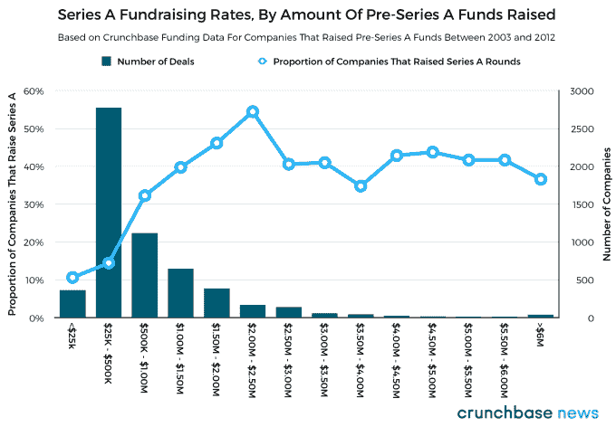
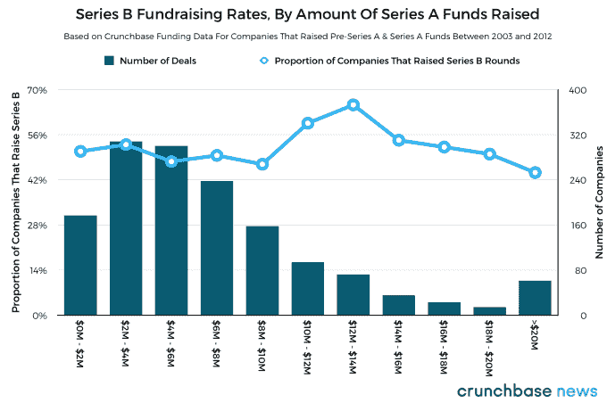

# 你的初创公司筹集了多少资金真的很重要吗？

> 原文：<https://web.archive.org/web/https://techcrunch.com/2017/08/23/does-it-really-matter-how-much-your-startup-raises/>

杰森·罗利是《金融时报》的风险投资和科技记者

[Crunchbase News](https://web.archive.org/web/20221025222419/https://about.crunchbase.com/news/)

.

More posts by this contributor

"创业需要多少钱？"

创业者和风险投资人无时无刻不在面临这个问题，唯一正确的答案——看情况——也是最不令人满意的。对于任何一家成功的创业公司来说，可能需要大量的外部资金，也可能很少。这取决于团队试图建立的业务。

有很多公司在没有外部资金的情况下起步。以芝加哥的[结果健康](https://web.archive.org/web/20221025222419/https://www.crunchbase.com/organization/outcomehealth)为例。截至 2017 年 5 月，自 2006 年成立以来(当时的名称是 Context Media)，它还没有筹集到外部资金。[今年早些时候，其 5 亿美元的“首轮”融资](https://web.archive.org/web/20221025222419/https://www.crunchbase.com/funding-round/b78e12efe4bf4cc79cc55b7726c817c3)——由[高盛](https://web.archive.org/web/20221025222419/https://www.crunchbase.com/organization/goldman-sachs#/entity)牵头，Alphabet 的 [CapitalG](https://web.archive.org/web/20221025222419/https://www.crunchbase.com/organization/google-capital#/entity) 、[普利兹克集团风险投资](https://web.archive.org/web/20221025222419/https://www.crunchbase.com/organization/pritzker-group-venture-capital#/entity)和[普鲁登斯控股](https://web.archive.org/web/20221025222419/https://www.crunchbase.com/organization/prudence-holdings#/entity)——对该公司的估值为[50 亿美元](https://web.archive.org/web/20221025222419/http://www.prnewswire.com/news-releases/outcome-health-raises-financing-at-5-billion-valuation-to-accelerate-growth-and-transform-healthcare-300466035.html)。

Basecamp，原名 37Signals，是另一家没有外部资金支持的创业公司。成立于 1999 年的协作平台提供商在 2006 年获得了发展。然后，该公司利用非传统的交易结构从杰夫·贝索斯获得了 600 万美元的融资。在 2015 年最后一轮私人融资中，总额高达 1.00 美元(没错，1 美元)，首席执行官杰森·弗里德[宣布](https://web.archive.org/web/20221025222419/https://signalvnoise.com/posts/1941-press-release-37signals-valuation-tops-100-billion-after-bold-vc-investment)公司估值为 1000 亿美元——尽管他的舌头非常坚定地插在脸颊上。

但是，对于大多数科技初创公司来说，筹集外部资金是建立可行企业过程中的必要步骤。如果假设一家公司将筹集外部资本，那么一家初创公司筹集多少资金会影响其未来的融资前景吗？如果会，这在什么时候有影响？

## 融资机会最大化的最佳金额

重申一个我们经常提到的观点:借用 16 世纪哲学家托马斯·霍布斯的话来说，大多数创业公司的生活是“孤独、贫穷、肮脏、野蛮和短暂的”只有少数创业公司成功地从种子投资者和天使投资者那里筹集到了初始资金。此外，即使有一点种子资金或天使投资，失败的原因仍然比比皆是。

当然，有许多因素有助于使其通过首轮融资过程。那么一个人在首轮融资前筹集了多少资金是这些因素之一吗？也许吧。

为了回答这个问题，我们从 Crunchbase 的融资数据开始，这些数据来自 5800 多家在 2003 年至 2012 年间进行首轮融资前融资的美国公司。(请参阅本文底部的方法说明，了解我们使用的数据。)然后，我们根据这些公司首轮融资前的规模，将它们放入不同的数据“桶”中，最终找到每个桶中成功筹集 A 轮融资的公司的百分比。结果的可视化可以在下面找到。

在 0 美元到 200 万到 250 万美元之间，每筹集 50 万美元的首轮融资前融资都会略微增加 A 轮融资的可能性，至少对那些在 2003 年至 2012 年期间筹集了首轮融资前资金的公司来说是如此。在 250 万美元之后，从种子、天使和其他首轮前投资者那里筹集更多资金没有边际效益，至少就公司筹集 B 轮资金的机会而言。

顺便说一句，上图显示了首轮融资前融资总额的大致分布。绝大多数公司筹集的资金在 2.5 万美元到 50 万美元之间，这大约是大多数加速器项目的最低投资额。融资总额超过 300 万美元的公司相对较少。

如果在 A 轮融资前筹集的资金至少与 A 轮融资的成功相关，并且可能是一个直接的因果因素，那么这个原则是否也适用于 B 轮融资？让我们找出答案。

## 筹集 B 轮融资机会最大化的最佳金额

通常情况下，种子期融资帮助创始人将单纯的项目和想法转化为全职工作。有了一点资金，企业家就可以花时间构建他们产品或服务的最早版本，并从他们的第一批用户那里获得一些初步的动力。

A 轮公司通常专注于优化(或寻找)商业模式，并调整他们的产品，以更好地服务于现有和潜在的客户。B 系列通常是创业者的产品愿景得以实现、业务开始规模化的阶段。随着资本的大幅增加，有才能的(昂贵的)产品和业务员工的预算也随之增加。

但是，一家公司从天使和种子投资者以及参与 A 轮融资的投资者那里筹集的资金数量是否会影响初创公司筹集 B 轮融资的能力？不完全是。

从最初的大约 5800 家公司筹集了首轮融资前的资金，我们选取了其中近 1500 家公司进行了首轮融资。然后，我们像以前一样执行相同的“分桶”和分析，这一次重点关注以前所有股权融资的总和。

在上面的图表中，我们发现 B 轮融资的成功率保持相对平稳，与平均值只有微小的差异。这表明，出于这样或那样的原因，在 B 轮融资之前筹集的资金数量在大多数情况下不会对公司筹集 B 轮融资的能力产生重大影响。在 1000 万美元到 1600 万美元的 B 轮融资总额中，似乎存在一个“金发女孩地带”，初创公司在筹集 B 轮融资方面相对更成功。然而，公司成功筹集 B 轮融资的比率不会像 A 轮融资那样大幅增加。

## 带走什么

为什么更多的资本有助于一家公司有很大的机会提高他们的 A，但一家公司筹集的 A 轮金额不会对他们的 B 产生太大的影响？

可以这样想:如果一家公司在首轮融资前或首轮融资中筹集的资金太少，创始人就没有足够的时间来打造他们产品或服务的第一个版本，他们也缺乏试验不同商业模式和客户获取策略所需的资源。

当一家公司准备进行 B 轮融资时，关于该公司正在建设什么、如何赚钱以及客户是谁的问题，至少在某种程度上已经有了答案。

那么，一家公司融资多少重要吗？是的，但是它只在一定程度上有关系。在此之后，筹集更多的资金并没有什么实际的好处，但肯定不会有什么坏处。

#### 关于数据的一个注记

我们从一系列符合以下标准的融资开始:

*   公司总部设在美国
*   公司不属于资金动态异常的行业类别。这些包括生命科学(例如药品和医疗器械)、能源(例如清洁能源、太阳能、石化产品提炼和提炼)和某些资本密集型硬件类别，如消费电子产品和网络基础设施。
*   公司有记录在案的首轮融资前融资，我们将其定义为“种子”、“天使”和“可转换债券”等类别的融资。对于可转换票据，我们排除了超过 500 万美元的融资。
*   公司在 2003 年至 2012 年期间筹集了第一轮 pre-A 轮融资，这是“独角兽时代”的核心。这一批公司将有足够的时间来筹集(或未能筹集)A 轮及以后的资金。

使用这些标准，我们能够在 Crunchbase 的数据中找到超过 5，800 家不同公司的 1 万多轮融资。