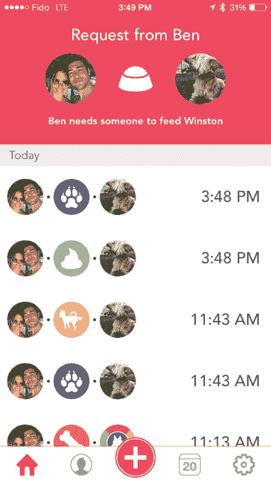

# DogSync 是一款帮助您的家人跟踪喂食 Fido TechCrunch 的应用程序

> 原文：<https://web.archive.org/web/http://techcrunch.com/2015/07/30/dogsync-is-an-app-to-help-your-family-keep-track-of-feeding-fido/>

# DogSync 是一款帮助你的家人跟踪喂狗情况的应用程序

为喜爱宠物的家庭设计的 [DogSync](https://web.archive.org/web/20230129103524/http://dogsyncapp.com/) (我们正在申请专利的 [TC Radio pitch-off](https://web.archive.org/web/20230129103524/https://techcrunch.com/2015/07/24/pitch-your-startup-in-the-tc-radio-pitch-off-on-sirius-xm-7/) 的最近获奖者)是一个任务管理器，帮助家庭沟通和同步任务，如喂食、散步或放出狗。

那么如何同步像遛狗这样的现实生活事件呢？

DogSync 背后的基本前提是，虽然宠物非常可爱，但它们需要很多照顾。当你把整个家庭都牵扯进来时，事情就变得复杂了，因为人们不可避免地会弄不清谁最后遛狗或喂狗了。

为了解决这个问题，DogSync 创建了一个群组订阅源，家庭成员可以在其中添加带时间戳的已完成任务，如早上喂食或下午散步。

家庭中的所有其他成员都可以看到这个任务已经完成，并获得关于该事件的推送通知。当然，如果你不想收到一连串关于你的狗拉屎的提醒，你可以关闭这些通知。

该应用程序还允许你发送任务请求，因此妈妈或爸爸可以向他们的三个孩子发出遛狗的请求。

然而，最有用的功能(至少对竞争家庭来说)可能是一个统计部分，在那里你可以看到哪个家庭成员在过去的一周或一个月里为你的小狗做了最多的事情。

这款应用仍处于测试阶段，拥有约 5000 名活跃用户。DogSync 的联合创始人 Ben Syne 告诉 TechCrunch，在注册并加入团队(该应用程序将一群看护者称为一个团队)的人中，大多数人每天都在使用该应用程序。

该公司正在开发新功能，如将小狗的照片发送给你包中的每个人，并扩大收入模式，专注于将狗主人与服务和产品相匹配。

例如，DogSync 将能够使用您的宠物的生命体征和过去的喂食时间表来确定您何时需要订购狗粮，然后推荐特定的品牌。

DogSync 目前是免费的，可以在 iOS 应用商店下载，Android 版本即将推出。