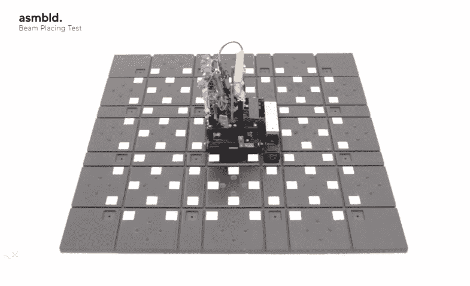

# 室内机器人可以在几分钟内组装一个房间

> 原文：<https://web.archive.org/web/https://techcrunch.com/2015/09/28/dom-indoors-tiny-robots-can-assemble-a-room-in-minutes/>

在布鲁克林一个不太时髦的地区的工业工作区，一家名为 [Asmbld](https://web.archive.org/web/20230227002611/http://asmbld.com/) 的建筑机器人初创公司正在开展一个项目，旨在改变我们在室内空间的生活方式。

来自[经验丰富的机器人专家团队](https://web.archive.org/web/20230227002611/https://techcrunch.com/2014/06/18/doozers-become-real-thanks-to-these-cement-laying-minibuilders/)、[室内多姆](https://web.archive.org/web/20230227002611/http://asmbld.com/dom-indoors)的最新技术是一个机器人系统，可以在几分钟内重新配置任何房间。说真的:

[vimeo 138808618 w=500 h=281]

它看起来像是《终结者》电影和乐高玩具的结合。小砖块从地板上升起，创造出墙壁、桌子和表面，然后以流畅的动作再次下沉。

这是因为所有的建筑材料——足够的 5 英寸瓷砖和铝立柱构成了数千个 6 英寸的立方体——都是扁平包装的，储存在房间的地板下。

[小机器人](https://web.archive.org/web/20230227002611/http://coub.com/view/82kf1)生活在这个隐藏在地板下的 5 英寸空间里，它们在这里一层一层地组装立方体，将它们移动到正确的位置，并将其提升到位。这些机器人由电池供电，所以当它们电量不足时，可以回到充电站(类似于 Roomba)。

“这就像颠倒的 3D 打印，”Asmbld 联合创始人彼得·诺维科夫说。

你想在每周一次的全体会议结束后，把初创公司办公室的会议室改造成休息室吗？完成了。

希望你的一室公寓晚上是卧室，白天是开放的工作空间？这也有可能。

虽然 DOM 室内目前正在小规模测试，但 ASMBLD 正在与一家大型合作空间进行谈判，以在其设施中实施机器人地板。

Asmbld 的机器人工程师布鲁诺·阿劳霍(Bruno Araujo)说:“想象一下一个商业空间，每天使用一次的大型会议室是建筑中最大的空间。“我们可以提高空间的使用效率，从长远来看，这样可以节省大量资金，而不是浪费资源在并非 100%时间都有用的空间上。”

虽然听起来很复杂，但安装过程实际上相当简单。Asmbld 建议用比现有地板高 5 英寸的机器人地板来重新铺设空间，大约需要与传统重新铺设地板相同的时间。

Asmbld 报告称，对于一个 500 平方英尺的房间，安装成本约为 12，000 美元，但当每个后续墙壁配置的劳动力和材料成本为零时，建筑物所有者的节省会很快增加。

如果机器人感觉到它上面的东西比平时重，它会提醒整个系统停止移动，以防止任何安全隐患。如果有什么东西坏了，系统可以精确定位受损机器人的确切位置，这样就可以很容易地将其移除或修复。

从环境的角度来看，可重复使用空间的论点是显而易见的。建筑和拆除垃圾占美国垃圾填埋场总量的 40%，60%的建筑拆除是由于租户要求的变化，而不是物理条件的变化。

当你用 DOM 的机器人取代人类工人时，这还没有考虑到时间和劳动力成本的大量节省。

“当你在建造一栋建筑时，需要协调，你不能让装配工、管道工、电工和所有不同的承包商同时工作，”阿劳霍说。“这些机器人在同一时间做所有的事情，所以当你建造了这个结构，你不只是有墙，你还有电线导管，灯和插座。”

为了让室内的 DOM 在现实生活中可行，塑料瓷砖必须可以与各种材料互换。塑料瓷砖墙是一回事，但桌子和床(如视频所示)显然需要不同的构成。

“我们不指望人们马上开始把它作为日常的重新配置，”诺维科夫说。“但每周或每月的重新配置现在是一件完全可行的事情，它将节省大量资金，使事情变得更有效率。”