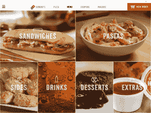
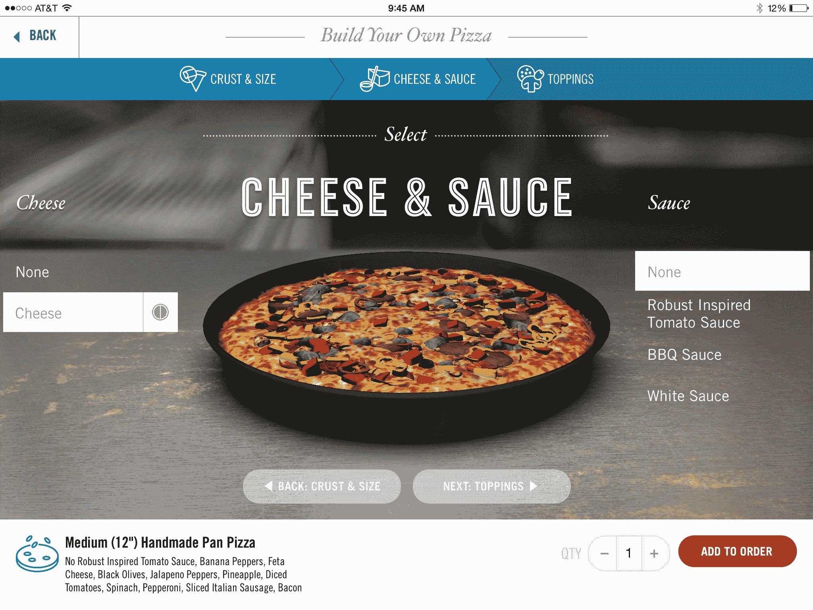

# 达美乐推出了面向 iPad 的披萨订购应用，配备 3D 定制披萨生成器 

> 原文：<https://web.archive.org/web/https://techcrunch.com/2014/04/24/dominos-launches-its-ipad-pizza-ordering-app-with-3d-custom-pizza-builder/>

# 达美乐推出了面向 iPad 的披萨订购应用，带有 3D 定制披萨生成器

在过去的几年里，达美乐比萨已经修改了菜单，扭转了在 T2 的财务状况，在此期间，它还开始提供移动点餐服务。下周一，这家披萨连锁店将发布其 iPad 应用程序，这将允许你在沙发上制作你的披萨并订购外卖。

让这款应用脱颖而出的是 3D 披萨生成器，它使用 OpenGL 为您提供更真实的最终披萨外观视图(当然，与所有食物摄影一样，预览看起来仍然与到达您门口时盒子里的东西有很大不同)。

达美乐比萨首席信息官凯文·瓦斯科尼在一份声明中说:“新的达美乐 iPad 应用程序将订购比萨的体验提升到了一个全新的水平。”。“这是我们自 Domino 的 Tracker 以来推出的最酷的技术，我们很高兴客户能够使用漂亮的定制披萨生成器，让您以全新的方式可视化您的订单。”

就像 Domino 的其他应用程序一样，iPad 应用程序也将具有该公司的全国菜单、优惠券、商店定位器和数字订单跟踪器。它还可以保存你最喜欢的比萨饼，这样你只需点击几下就可以重新排序。

数字订单对达美乐来说是件大事。它现在占该公司在美国总销售额的 40%

新应用将于周一上线。在那之前，你将不得不用传统的方式用你的 iPhone 或 Android 设备订购你的披萨。当然，你也可以出去买一份真正的披萨——只要记住你不能在大多数餐馆玩《泰坦陨落》。

