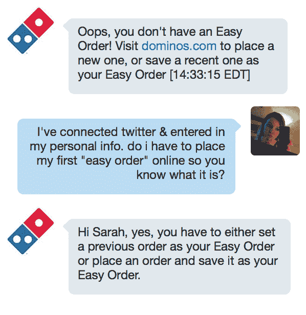
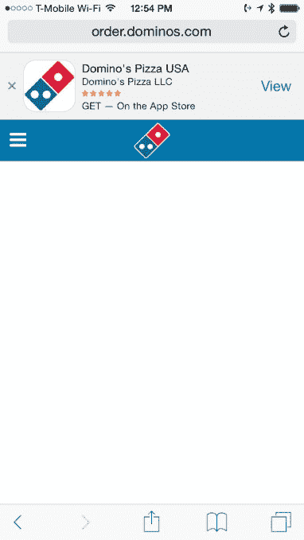
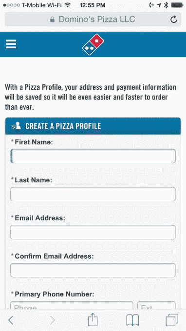
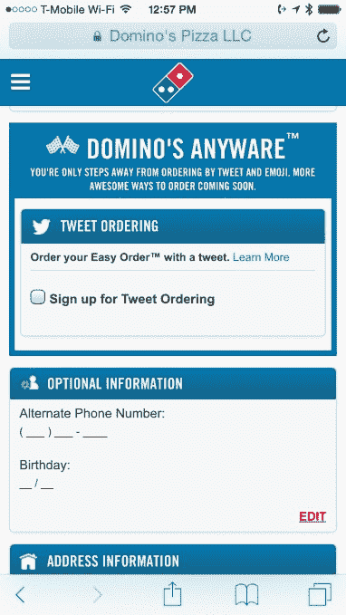
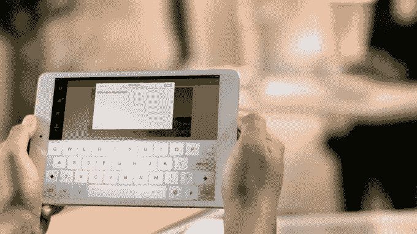

# Domino 的 Tweet-To-Order 系统并不像听起来那么好 

> 原文：<https://web.archive.org/web/https://techcrunch.com/2015/05/20/dominos-tweet-to-order-system-isnt-as-great-as-it-sounds/>

通过推特向达美乐发送 slice 表情符号来订购披萨并不像听起来那么有趣。如果你错过了，在[的“Anyware”计划](https://web.archive.org/web/20230204182620/http://anyware.dominos.com/)的~~营销噱头~~扩张中，达美乐的[本月早些时候宣布](https://web.archive.org/web/20230204182620/http://phx.corporate-ir.net/phoenix.zhtml?c=135383&p=irol-newsArticle&ID=2051892)将很快推出一个“推文下单”系统，允许任何人在 Twitter 上简单地推文披萨表情符号到@dominos Twitter 账户来下单。但是开始需要一些设置，这使得使用 Twitter 订购系统没有你想象的那么高效。

完全披露:事实证明，Domino's 并没有在我的领域提供服务，所以我只能谈论入职流程——但这正是 Domino's 目前的不足之处。一旦你建立了你的账户，建立并配置了你的“披萨档案”,下订单实际上是很容易的一部分。

首先，这个系统最初被描述的方式有问题。如果你阅读了[各种](https://web.archive.org/web/20230204182620/http://money.cnn.com/2015/05/13/news/companies/dominos-twitter/) [新闻](https://web.archive.org/web/20230204182620/http://www.usatoday.com/story/money/2015/05/12/dominos-pizza-tweet-a-pizza-twitter-tweet-to-order-fast-food-restaurants/27175005/)公告，你可能会想(我承认我是这么想的)，从今天开始，你所要做的就是把披萨表情发到达美乐，然后你就可以上路了。事实并非如此。

我首先在美国东部时间今天下午 12:43 分在@dominos 上发布了披萨表情符号，以此来测试这个系统，并等待着看接下来会发生什么。(如果你无法从你的 Twitter 客户端访问表情符号，你也可以使用#easyorder 标签发推文。)

我的猜测是，没有访问过网站或者没有通读过说明(很可能很少有消费者真的会这样做),管理他们 Twitter feed 的达美乐代表会把我识别为新客户，然后通知我接下来的步骤。

实际上，我没有 Domino's 的在线帐户，因为我通常在其他地方订购，所以这使我成为尝试新系统的理想客户。

我想，在我的推文之后，@dominos 可能会通过@reply 或 DM (Twitter 的直接消息功能)将我指向一个特殊的 URL。或者，他们可能会通过 DM 对话主动收集我的个人信息，包括姓名、地址和付款细节。

毕竟，自去年秋天以来， [Twitter 一直在与精选合作伙伴](https://web.archive.org/web/20230204182620/https://blog.twitter.com/2014/testing-a-way-for-you-to-make-purchases-on-twitter)一起测试“购买”按钮——像美国最大的披萨连锁店之一基于 Twitter 的在线订购系统这样具有潜在突破性的东西将会利用这一功能，这是有道理的。

但事实证明，情况并非如此。

相反，整整五分钟，什么都没发生。不是推文，不是 DM。没什么。

我抱怨道，在我的推特上 cc:ing @dominos。

现在多米诺的账户开始运作了，但它并没有帮助我真正开始 Twitter 订单的流程。相反，它只回复了“欢迎使用达美乐的推文订购！”并指示我使用标签或表情符号发微博。

我正要回应说我已经*这么做了，*这时第二条推文出现了。这封显然是由一位真正的支持代表写的，他为这些问题道歉，并告诉我“表情符号推文订单必须使用少于 25 个字符，”但使用#EasyOrder 标签时没有限制。

我的意思是，也许是饥饿在说话，但这真的激怒了我。

Twitter 本身有 140 个字符的字符限制，那么为什么 Domino 的花哨表情符号检测系统只限于 25 个字符呢？(我的第一条推文大概有 40 个字符，不管怎样。)

尽管如此，我还是回复了——用不到 25 个字符写了一个披萨表情符号——最终，事情有了进展。

嗯，算是吧。

通过 DM，达美乐告诉我，我还没有建立一个“简单订单”和访问 Dominos.com。

**嘿，达美乐！如果我想用网络订披萨，我就不会发微博给你了！**

(好吧，那绝对是饥饿在说话。)

在网上，你要通过一系列相当常规的步骤来创建一个 Dominos.com 账户和“披萨档案”，包括向公司提供你的姓名、地址、电子邮件等。不过，我是通过移动网络测试的，因为智能手机用户可能会使用基于表情符号的 Twitter 订购系统。

不幸的是，Dominos.com 的移动网站首先在加载“创建帐户”屏幕时停滞不前。然后，在重新加载网站时，它只是向我显示了一个空白的白色页面，上面有一个弹出广告，指向应用商店中 Domino 的 iOS 应用程序。

哦，订购比萨饼的现代方法太多了，不是吗？

我不得不完全关闭窗口，然后打开一个新的标签，让手机网站工作。之后,“pizza profile”的创建过程相当简单，虽然有点耗时。(顺便说一下，我讨厌让我输入两次电子邮件信息的注册表格。呃。尤其是在移动端！)

现在我已经建立了一个“披萨档案”账户。也就是说，我通过达美乐的网站向他们提供了我的姓名、地址、电子邮件和其他个人信息。网站告诉我，结账时要输入信用卡信息。

我勾选了注册“推特订购”的复选框，并连接了我的推特账户。

你可能认为这足以启动我基于 Twitter 的订单，因为达美乐现在可以将我的 Twitter 账户链接到我的 Dominos.com 网络账户，但事实并非如此。根据@dominos DM 的说法，我没有设置“简单订单”,所以我*仍然*不能在推特上发布我的订单。

事实证明，为了创建一个“简单订单”，他们通知我必须首先通过网站下订单，并将其保存为我的“简单订单”以供将来使用。

换句话说，在 Twitter 上来回折腾了这么久，在我花了这么多时间通过移动网络创建账户之后，通过 Twitter 订购披萨的唯一方法就是首先成为达美乐网站的客户。

呸！

我开始整理订单，然后发现因为我的位置，我只能做外卖。哦好吧。

[gallery ids="1160488，1160489，1160486，1160490，1160483，1160485，1160484"]

据推测，如果达美乐送货到我的位置，我未来的 Twitter 订单会更顺利。一旦我在网上保存了喜欢的订单，下后续订单就像之前描述的那样简单了。最后一步是确认你的 Twitter 订单，必须在 20 分钟内完成，也是通过 DM。确认后，你的披萨就做好了，照常送出去。

不幸的是，许多消费者不会走那么远。面对众多的入职挑战，达美乐错过了无摩擦商务的要点。这是一种耻辱。因为 Twitter + pizza 本应该很棒，结果却是大失所望。

我们正在进入一个按钮式商务的新时代，任何东西都可以按需订购，从优步汽车到管家到饼干、T2 酒、甚至是 T4 的男仆，如果你愿意的话。此外，包括 [Magic](https://web.archive.org/web/20230204182620/https://techcrunch.com/2015/02/23/magic-is-a-startup-that-promises-to-bring-you-anything-if-youre-willing-to-pay-for-it/) 、 [Operator](https://web.archive.org/web/20230204182620/https://techcrunch.com/2015/04/22/the-request-network/#.o0tzqc:gzLB) 、 [Fetch](https://web.archive.org/web/20230204182620/https://techcrunch.com/2015/04/28/fetch-lets-you-buy-book-or-schedule-anything-from-your-apple-watch/#.o0tzqc:T6XN) 和 [GoButler](https://web.archive.org/web/20230204182620/https://techcrunch.com/2015/04/13/gobuttler-nyc/#.o0tzqc:km5n) 在内的一些全新的创业公司现在为消费者提供了一种要求任何他们想要的东西的方式——无论是通过发送电话号码、使用应用程序还是仅仅与他们的苹果智能手表交谈。

多米诺的 Twitter 订购系统本可以在全国范围内将这种按钮式的即时满足趋势商业化，但它忘记了让如此多的替代品成功的原因是它们首先是为移动设备而构建的。账户设置在一个应用程序中进行，或者你只需给一家公司发信息，他们就会帮你解决。他们不会告诉你去网上下单。

这使得 Domino 的 tweet-to-order 系统目前还是一个新事物，而不是您可能希望的电子商务革命。