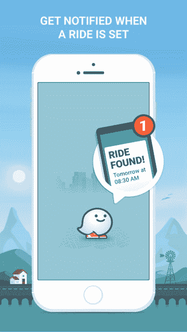
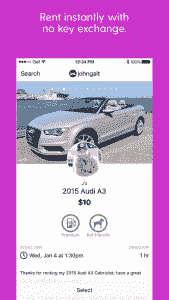

# 搞定优步了吗？以下是一些替代方案 

> 原文：<https://web.archive.org/web/https://techcrunch.com/2017/03/09/done-with-uber-here-are-some-alternatives/>

[https://web.archive.org/web/20221007160603if_/https://www.youtube.com/embed/Eupc71OT8Tc?feature=oembed](https://web.archive.org/web/20221007160603if_/https://www.youtube.com/embed/Eupc71OT8Tc?feature=oembed)

视频

我不得不承认我非常依赖优步。有了低于标准的公共交通系统，拼车应用程序让我在旧金山找路变得容易多了。

除了偶尔的延误或咄咄逼人的司机，服务总体上相当可靠。但像许多用户一样，正如“[删除优步](https://web.archive.org/web/20221007160603/https://beta.techcrunch.com/2017/02/22/the-deleteuber-campaign-returns-following-sexual-harassment-allegations-at-the-company/)”社交媒体运动所证明的那样，关于公司文化的令人沮丧的[故事](https://web.archive.org/web/20221007160603/https://beta.techcrunch.com/tag/uber-harassment/)让我不断重新评估自己的使用情况。

幸运的是，有一些优步的替代品。这里有一些其他的选择。

## 来福车

美国优步最明显的竞争对手是 Lyft，其服务也非常相似。和优步一样，这款应用可以让你叫一辆车，并在地图上看到它有多远。价格是可比的——有时比优步低，有时比它高。虽然它始于旧金山，但该公司正在迅速扩张，现在在 300 个城市都有销售。

Lyft 曾经以在汽车外部展示巨大的粉红色胡子而闻名，现在它采取了一种更微妙的方式，在仪表板上安装粉红色的灯。Lyft 的 UberPOOL 版本是其 Lyft Line 拼车服务，当你有多余的时间时，票价更便宜。

在收购谈判失败后，据说该公司正在谈判额外的 5 亿美元资金。
这款应用在 iTunes 和 Android 上都是免费的。

## Waze 拼车

[【Waze】](https://web.archive.org/web/20221007160603/https://itunes.apple.com/us/app/waze-rider-share-a-carpool-ride-to-home-work/id1091029104?mt=8)谷歌旗下的驾驶方向应用推出了拼车服务，专门为上下班设计。与优步和 Lyft 不同，这项服务的目标不是职业司机，而是希望通过拼车节省一些钱的普通用户。用户可以输入他们想要的目的地，看看是否有其他人正朝他们的方向走去。

该应用程序自动计算票价，表明它与汽油价格相当。然而，因为这些司机不是 Waze 的员工，他们不需要像在优步那样接受背景调查。

所以，骑自行车要自担风险，但是如果你找到一个你喜欢的司机，碰巧在你附近工作，这可能会为你节省很多钱和通勤时间。这款应用在 iTunes 和 Android 上都是免费的

## Getaround 

对于那些有驾照的人来说， [Getaround](https://web.archive.org/web/20221007160603/https://itunes.apple.com/us/app/getaround-instant-car-rental/id412017926?mt=8) 是一种按需租车的方式。从本田到奔驰，这款应用展示了各种类型的汽车，并让你按小时付费。一旦你选定了你的车，就去它所在的车库或停车场。

当车主不打算使用它时，这也是一个额外赚钱的好方法。该服务目前在旧金山、波特兰、芝加哥和华盛顿特区等美国城市提供。该应用程序是免费的，可在 iPhone 和 Android 上使用。