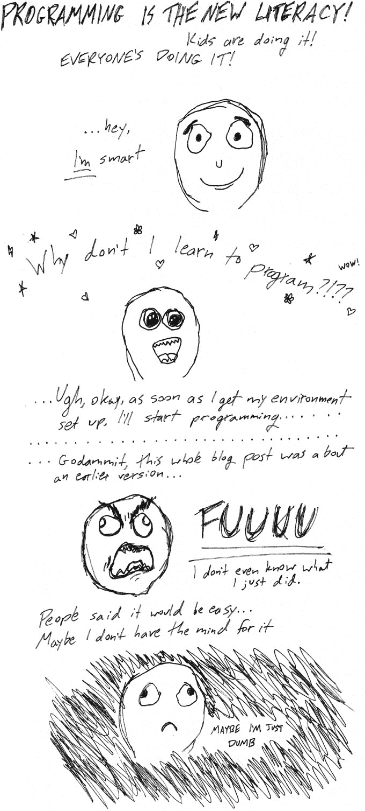
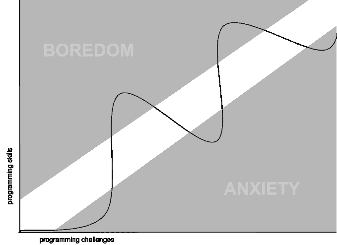

# 不要相信任何告诉你学习编码很容易的人

> 原文：<https://web.archive.org/web/https://techcrunch.com/2014/05/24/dont-believe-anyone-who-tells-you-learning-to-code-is-easy/>

# 不要相信任何告诉你学习编码很容易的人

**编者按:** [*凯特·雷*](https://web.archive.org/web/20221006212612/https://twitter.com/kraykray) *是最近被 WordPress.com 收购的可视化网页制作工具 [scroll kit](https://web.archive.org/web/20221006212612/http://www.scrollkit.com/) 的技术联合创始人。*

我见过的发生在刚开始编程的人身上的最危险的事情之一就是被告知这很容易。

你的大脑是这样做的:

我画的。(比起画画，我更擅长编码。)

大多数编程不需要特殊的大脑，但它比任何人表现出来的都更令人沮丧和混乱。有成千上万热情的博客帖子、课程和应用程序，旨在用一个流畅、明确的学习编码的过程来吸引你。他们很少提到设置环境的单调乏味(相信我，即使是你最好的程序员朋友也不想帮你，因为那太令人沮丧了，没人记得他们是怎么做的)。

他们不会告诉你很多编程技巧是关于开发在 Google 上问正确问题的诀窍，以及知道哪个代码是最好的复制粘贴。他们不会让你知道一个大秘密:没有精通，没有最终水平。感到失落和愚蠢的焦虑不是你学会去征服的，而是你学会与之共存的。

今年冬天我决定学习 iOS。大学毕业后的那个夏天，我自学了编程，所以我对自己掌握一门新语言的能力非常自信。我都忘了这有多难。在克服了对 Xcode 的怨恨之后(*这个“故事板”看起来像是给婴儿看的，这不是真正的编程*)，我开始了一系列对我来说太超前的项目。iOS 原来和 web 开发不一样；所有我认为难的事情都很容易，所有应该容易的事情都很难。我很不耐烦，对自己很恼火。

我忘记的是，程序员最常见的状态是一种不胜任感。作为一名程序员，有无限量的东西要学。你可以成为一种语言或框架的专家，但如果你的工作是高效地构建东西，你将不断地需要学习新的工具，并不断地感到力不从心。做好感觉自己愚蠢的心理准备会有所帮助。

心理学家米哈里·契克森米哈提出了一个很有见地的方法来可视化学习过程(对于任何学科):

改编自《心流:最佳体验心理学》中的一幅图像

我发现我的经验是紧紧跟随这条线，并提出了学习编程的递归方法:

1.  即使你并不总是明白自己在做什么，也要一步一步地遵循教程。我喜欢想象亨特·S·汤普森在他的打字机上抄写大师们的书。你正在感受在你的新语言/框架中事情是如何完成的。这一部分应该很容易，如果无聊的话，因为你只是在做你被告知的事情。[乐观倾向]
2.  重建你刚刚做的东西或者稍微改变一下。尽量不要过多使用教程。意识到你对自己正在做的事情了解得多么少。[恐惧拖拉，减缓你的上升]
3.  试着做一些你真正想做的简单的东西。发现你完全[不知道自己在做什么](https://web.archive.org/web/20221006212612/http://www.ludumdare.com/compo/wp-content/uploads/2013/04/i-have-no-idea-what-im-doing-dog.jpg)。[绝望的海洋]
4.  查找与新项目相关的新教程。(希望你的教程能为你提供越来越多的语言背景知识。)按照步骤来。【轻微的理解感，自我价值的上升】
5.  你自己重建这个东西。[恐惧]
6.  开始一个新项目。[绝望]
7.  重复步骤 1 至 6。

我是教程的忠实粉丝。在这个过程中，我做了一个 app，收集用过的程序员推荐的[最佳教程](https://web.archive.org/web/20221006212612/http://teachyourselftocode.com/)。希望它能缩短你进入学习状态前的徘徊期，帮助你更快地找到好东西。

只要你学会克服挫折，你就会站在山坡上，清楚地看到自己的进步。不理解一切也没关系，即使看不到自己的进步也要相信自己在变好，*不要急*。祝你好运。

*非常感谢[沙特尔沃思基金会](https://web.archive.org/web/20221006212612/http://www.shuttleworthfoundation.org/)，他们惊人的 Flash 赠款促使我走上这条学习新事物的道路，并给我时间从事[自学编码](https://web.archive.org/web/20221006212612/http://teachyourselftocode.com/)。感谢科迪·布朗对这篇文章的帮助。*